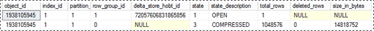

# Columnstore indexes - data loading guidance
Load data into a columnstore index by using the standard SQL bulk loading and trickle insert methods. Loading data into a columnstore index is an essential part of any data warehousing process because it moves data into the index in preparation for analytics.
  
 New to columnstore indexes? Review the terms and concepts in [Columnstore Indexes Guide](../Topic/Columnstore%20Indexes%20Guide.md).  
  
 Need an in-depth discussion? See this [blog post](http://blogs.msdn.com/b/sqlcat/archive/2015/03/11/data-loading-performance-considerations-on-tables-with-clustered-columnstore-index.aspx).  
  
##  <a name="dataload_cci"></a> Bulk load into a clustered columnstore index  
 To bulk load rows into a clustered columnstore index, you can use the bcp command-line tool, Integration Services, or select rows from a staging table.  Bulk loading is the most efficient way to move data into a columnstore index. 
  
   
  
 As the diagram suggests, a bulk load::  
  
1.  Does not pre-sort the data. Data is inserted into rowgroups in the order it is received.  
  
2.  If the batch size is >= 102400, the rows are directly into the compressed rowgroups. It is recommended that you choose a batch size >=102400 for efficient bulk import because you can avoid moving data rows to a delta rowgroups  before the rows are  eventually moved  to compressed rowgroups    by a background thread, Tuple mover (TM).  
  
3.  If the batch size < 102400 or if the remaining rows are < 102400, the rows are loaded into delta rowgroups.  
  
## Bulk loading performance optimizations
 
-   Parallel Load: You can do multiple concurrent bulk imports (bcp or bulk insert) concurrently each loading a separate data file. Unlike rowstore, you don't need to specify TABLOCK because each bulk import thread will load data exclusively into a separate rowgroups (compressed or delta rowgroups) with exclusive lock on it.   Using TABLOCK will force an exclusive lock on the table and you will not be able to import data in parallel.  
  
-   Log Optimization: The bulk load will be minimally logged    both when the data is loaded into compressed rowgroup. No minimal logging when data gets loaded into delta rowgroup with batch size < 102400.  
  
-   Locking Optimization: When loading into compressed rowgroup, the X lock on rowgroup is acquired. However, when bulk loading into delta rowgroup, an X lock is acquired at rowgroup but SQL Server still locks the locks PAGE/EXTENT because X rowgroup lock is not part of locking hierarchy.  
  
If you have or more nonclustered indexes on a columnstore index, there is no locking or logging optimization for the index itself but the optimizations on clustered columnstore index as described above are still there.  
  
## How delta rowgroups work with bulk loads 
 Clustered columnstore indexes collect up to 1,048,576 rows in each delta rowgroup before compressing the rowgroup into the columnstore. This improves the compression of the columnstore index. When a deltastore rowgroup contains 1,048,576 rows, the columnstore index marks the rowgroup as closed. A background process, called the *tuple-mover*, finds each closed rowgroup and compresses it into the columnstore  
  
 For each clustered columnstore index there can be multiple delta rowgroups.
  
-   If a deltastore is locked, [!INCLUDE[ssNoVersion](../a9notintoc/includes/ssnoversion-md.md)] will try to obtain a lock on a different deltastore. If there are no deltastores available, [!INCLUDE[ssNoVersion](../a9notintoc/includes/ssnoversion-md.md)] will create a new deltastore.  
  
-   For a partitioned table, there can be multiple deltastores for each partition.  
  
These scenarios describe when loaded rows go directly to the columnstore or when they go to the deltastore.  
  
In the example, each rowgroup can have 102,400-1,048,576 rows per rowgroup. In practice, the maximum size of a rowgroup can be smaller than 1,048,576 rows when there is memory pressure.  
  
|Rows to Bulk Load|Rows Added to the Compressed Rowgrouo|Rows Added to the Delta Rowgroup|  
|-----------------------|-------------------------------------------|--------------------------------------|  
|102,000|0|102,000|  
|145,000|145,000<br /><br /> Rowgroup size: 145,000|0|  
|1,048,577|1,048,576<br /><br /> Rowgroup size: 1,048,576.|1|  
|2,252,152|2,252,152<br /><br /> Rowgroup sizes: 1,048,576, 1,048,576, 155,000.|0|  
  
 The following example shows the results of loading 1,048,577 rows into a table. The results show that one COMPRESSED rowgroup in the columnstore (as compressed column segments), and 1 row in the deltastore.  
  
```  
SELECT object_id, index_id, partition_number, row_group_id, delta_store_hobt_id, state state_desc, total_rows, deleted_rows, size_in_bytes   
FROM sys.dm_db_column_store_row_group_physical_stats  
```  
  
   
  
## Load from a staging table  
 A common pattern for data load is to load the data into a staging table, do some transformation and then load it into the target table using the following command  
  
```  
INSERT INTO <columnstore index>  SELECT <list of columns> FROM <Staging Table>  
  
```  
  
 This command loads the data into the columnstore index in similar ways to BCP or Bulk Insert but in a single batch. If the number of rows in the staging table < 102400, the rows are loaded into a delta rowgroup otherwise the rows are directly loaded into compressed rowgroup.  One key limitation was that this INSERT operation was single threaded. To load data in parallel, you could create multiple staging table or issue INSERT/SELECT with non-overlapping ranges of rows from the staging table.  This limitation goes away with SQL Server 2016. The command below loads the data from staging table in parallel but you will need to specify TABLOCK  
  
```  
INSERT INTO <columnstore index>  WITH (TABLOCK)  SELECT <list of columns> FROM <Staging Table>  
```  
  
 There are following optimizations available when loading into clustered columnstore index from staging table  
  
-   Log Optimization: Minimally logged    both when the data is loaded into compressed rowgroup. No minimal logging when data gets loaded into delta rowgroup.  
  
-   Locking Optimization: When loading into compressed rowgroup, the X lock on rowgroup is acquired. However, with delta rowgroup, an X lock is acquired at rowgroup but SQL Server still locks the locks PAGE/EXTENT because X rowgroup lock is not part of locking hierarchy.  
  
 If you have or more nonclustered indexes, there is no locking or logging optimization for the index itself but the optimizations on clustered columnstore index as described above are still there  
  
## Load with trickle insert  
 *Trickle insert* refers to the way rows get loaded into the columnstore by using INSERT INTO. Each row is added to a delta rowgroup. Rows that trickle in go directly to a deltastore rowgroup where they accumulate until the rowgroup becomes closed after reaching 1,048,576 rows, or until the columnstore index is rebuilt.  
  
```  
INSERT INTO <table-name> VALUES (<set of values>)  
```  
  
 Note, concurrent threads using INSERT INTO to insert values into a clustered columnstore index can insert rows into the same deltastore rowgroup.  
  
 Once the rowgroup contains 1,048,576 rows, the delta rowgroup us marked closed but  it is still available for queries and update/delete operations but the newly inserted rows go into an existing or newly created deltastore rowgroup. There is a background thread *Tuple Mover (TM)* that compresses the closed delta rowgroups periodically every 5 minutes or so. You can explicitly invoke the following command to compress the closed delta rowgroup  
  
```  
ALTER INDEX <index-name> on <table-name> REORGANIZE  
```  
  
 If you want force a delta rowgroup closed and compressed, you can execute the following command. You may want run this command if you are done loading the rows and don't expect any new rows. By explicitly closing and compressing the delta rowgroup, you can save storage further and improve the analytics query performance. A best practice is to invoke this command if you  don't expect new rows to be inserted.  
  
```  
ALTER INDEX <index-name> on <table-name> REORGANIZE with (COMPRESS_ALL_ROW_GROUPS = ON)  
```  
  
## Load into a partitioned table  
 For partitioned data, [!INCLUDE[ssNoVersion](../a9notintoc/includes/ssnoversion-md.md)] first assigns each row to a partition, and then performs columnstore operations on the data within the partition. Each partition has its own rowgroups and at least one deltastore.  
  
## Load into a nonclustered columnstore index  
 On a rowstore table with a nonclustered columnstore index data, [!INCLUDE[ssNoVersion](../a9notintoc/includes/ssnoversion-md.md)] always inserts data into the base table. The data is never inserted directly into the columnstore index.  
  
## See Also  
 [Columnstore Indexes Guide](../Topic/Columnstore%20Indexes%20Guide.md)   
 [Columnstore Indexes Versioned Feature Summary](../Topic/Columnstore%20Indexes%20Versioned%20Feature%20Summary.md)   
 [Columnstore Indexes Query Performance](../Topic/Columnstore%20Indexes%20Query%20Performance.md)   
 [Get started with Columnstore for real time operational analytics](../relational-databases/indexes/get-started-with-columnstore-for-real-time-operational-analytics.md)   
 [Columnstore Indexes for Data Warehousing](../Topic/Columnstore%20Indexes%20for%20Data%20Warehousing.md)   
 [Columnstore Indexes Defragmentation](../Topic/Columnstore%20Indexes%20Defragmentation.md)  
  
  