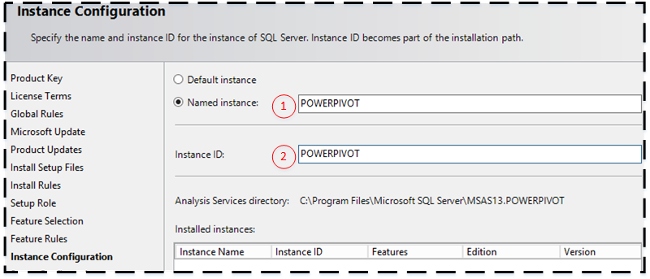
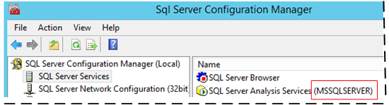
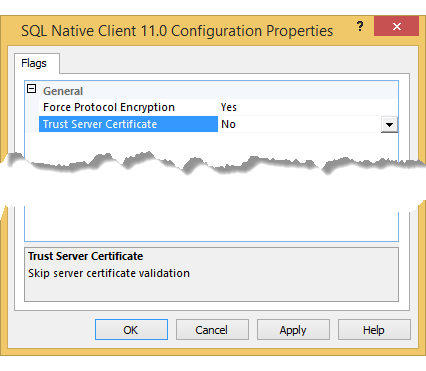

# copy of release notes for MD testing
  This topic describes limitations and issues with [!INCLUDE[ssCurrent](../a9notintoc/includes/sscurrent-md.md)] .    

 **Try it out:**
 
-   [](https://www.microsoft.com/en-us/evalcenter/evaluate-sql-server-2016)  Download SQL Server 2016  from the **[Evaluation Center](https://www.microsoft.com/en-us/evalcenter/evaluate-sql-server-2016)**    

-   Have an Azure account?  Then go **[Here](https://azure.microsoft.com/en-us/services/virtual-machines/sql-server/)** to spin up a Virtual Machine with [!INCLUDE[ssCurrent](../a9notintoc/includes/sscurrent-md.md)]  already installed.    
    
 -   [](https://msdn.microsoft.com/library/mt238290.aspx) To get the latest version of SQL Server Management Studio, see **[Download SQL Server Management Studio (SSMS)](https://msdn.microsoft.com/library/mt238290.aspx)**.   
    
 For information on what's new, see [What's New in SQL Server 2016](../a9retired/what-s-new-in-report-builder-for-sql-server-2016.md).   
    
##  <a name="bkmk_top"></a> In this topic    
    
-   [SQL Server 2016 Release Candidate 3 (RC3)](#bkmk_2016_rc3)    
    
-   [SQL Server 2016 Release Candidate 2 (RC2)](#bkmk_2016_rc2)
    
-   [SQL Server 2016 Release Candidate 1 (RC1)](#bkmk_2016_rc1)    
    
-   [SQL Server 2016 Release Candidate 0 (RC0)](#bkmk_2016_rc0)    
    
-   [SQL Server 2016 Community Technology Preview 3.0 (CTP 3.0)](#bkmk_2016_ctp3_0)    
    
-   [SQL Server 2016 Community Technology Preview 2.0 (CTP 2.0)](#bkmk_2016_ctp2_0)    
    
##  <a name="bkmk_2016_rc3"></a> SQL Server 2016 Release Candidate 3 (RC3)    
    
    
    
###  <a name="bkmk_rc3_docs"></a> Product Documentation (RC3)    
 **Issue and customer impact:** A downloadable version of the SQL Server 2016 documentation is not yet available. When you use Help Library Manager to attempt to **Install content from online**, you will see the SQL Server 2012 and SQL Sever 2014 documentation but there are no options for SQL Server 2016 documentation.    
    
 **Workaround:** Use one of the following:    
    
     
    
-   Use the option **Choose online or local help** and configure help for "I want to use online help".    
    
-   Use the option **Install content from online** and download the SQL Server 2014 Content.    
    
 **F1 Help:** By design when you press F1 in [!INCLUDE[ssManStudioFull](../a9notintoc/includes/ssmanstudiofull-md.md)], the online version of the F1 Help topic is displayed in the browser. This occurs even when you have installed local Help.    
     
**Updating content:**    
In SQL Server Management Studio and Visual Studio, the Help Viewer application may freeze (hang) during the process of adding the documentation. To resolve this issue, do the following. For more information about this issue, see [Visual Studio Help Viewer freezes](https://msdn.microsoft.com/library/mt654096.aspx).    
    
* Open the %LOCALAPPDATA%\Microsoft\HelpViewer2.2\HlpViewer_SSMS16_en-US.settings | HlpViewer_VisualStudio14_en-US.settings file in Notepad and change the date in the following code to some date in the future.    
    
     
```    
     Cache LastRefreshed="12/31/2017 00:00:00"    
```    
    
    
### PolyBase (RC3)    
 PolyBase queries may fail after upgrade from RC1 or previous releases.    
    
 **Issue and customer impact**: After upgrading from SQL Server 2016 RC1 or previous release, PolyBase queries, import and export may fail with the following error: “Internal Query Processor Error: The query processor encountered an unexpected error during the processing of a remote query phase.”    
    
 **Workaround**    
    
-   Uninstall PolyBase. In the **Control Panel**, click **Uninstall a program**, click **Microsoft SQL Server 2016**, click **Remove**. In the Remove SQL Server 2016 wizard select the instance with the failed PolyBase installation and click **Next**. On Features, click **PolyBase Query Service for External Data**. It is not necessary to remove other features that were successfully installed. Complete the steps of Remove SQL Server 2016.    
    
-   Re-install PolyBase. Run setup, and add PolyBase feature on the same SQL Server instance.    
    
 **Applies To**: SQL Server 2016 RC3 when upgrading from RC1 or previous releases.    
    
     
    
##  <a name="bkmk_2016_rc2"></a> SQL Server 2016 Release Candidate 2 (RC2)    
    
-   [Product Documentation (RC2)](#bkmk_rc2_docs)    
    
-   [Database Engine (RC2)](#bkmk_rc2_de)    
    
### PolyBase (RC2)    
 PolyBase queries may fail after upgrade from RC1 or previous releases.    
    
 **Issue and customer impact**: After upgrading from SQL Server 2016 RC1 or previous release, PolyBase queries, import and export may fail with the following error:    
“Internal Query Processor Error: The query processor encountered an unexpected error during the processing of a remote query phase.”    
    
 **Workaround**    
    
-   Uninstall PolyBase. In the **Control Panel**, click **Uninstall a program**, click **Microsoft SQL Server 2016**, click **Remove**. In the Remove SQL Server 2016 wizard select the instance with the failed PolyBase installation and click **Next**. On Features, click **PolyBase Query Service for External Data**. It is not necessary to remove other features that were successfully installed. Complete the steps of Remove SQL Server 2016.    
    
-   Re-install PolyBase. Run setup, and add PolyBase feature on the same SQL Server instance.    
    
 **Applies To**: SQL Server 2016 RC2 when upgrading from RC1 or previous releases.    
    
###  <a name="bkmk_rc2_docs"></a> Product Documentation (RC2)    
 **Issue and customer impact:** A downloadable version of the SQL Server 2016 documentation is not yet available. When you use Help Library Manager to attempt to **Install content from online**, you will see the SQL Server 2012 and SQL Sever 2014 documentation but there are no options for SQL Server 2016 documentation.    
    
 **Workaround:** Use one of the following:    
    
     
    
-   Use the option **Choose online or local help** and configure help for "I want to use online help".    
    
-   Use the option **Install content from online** and download the SQL Server 2014 Content.    
    
###  <a name="bkmk_rc2_de"></a> Database Engine (RC2)    
    
#### PolyBase: adding/removing compute nodes that are named instances to PolyBase scale-out group fails    
 When attempting to add or remove a compute node in a PolyBase scale-out group that is a named instance using exec_sp_polybase_join_group or sp_polybase_leave_group, the stored procedure will fail with this error:    
    
 `Unable to open registry key 'Software\Microsoft\Microsoft SQL Server\<instance_root>\Polybase\Configuration': 5(Access is denied.).`    
    
 **Workaround**    
    
 Grant **read** and **set** access to the following registry keys:    
    
-   HKEY_LOCAL_MACHINE\Software\Microsoft\Microsoft SQL Server\MSSQL13.InstanceName\Polybase\Configuration    
    
-   HKEY_LOCAL_MACHINE\Software\Microsoft\Microsoft SQL Server\MSSQL13.InstanceName\Polybase\Configuration    
    
1.  From a command line or from start screen, type **regedit** and open the **Registry Editor** as Administrator.    
    
2.  Navigate to the registry keys specified above. Follow steps 3-6 for each.    
    
3.  Right click configuration->Permissions->Advanced->Add->Select a principal->Locations.    
    
4.  In locations, select the local machine name.    
    
5.  In ‘Enter the object names to select box’, type **NT Service\MSSQL$\<InstanceName>**. For example, if your instance name is **MSSQL3**, type **NT Service\MSSQL$MSSQL3**. Click **OK**.    
    
6.  Click **show advanced permissions**, and select the following: **Query Value**, **Set Value**, **Enumerate Subkeys**, **Notify**, **Read Control**. Click OK.    
    
#### PolyBase queries may fail on named SQL Server instances    
 After you install, repair, or upgrade to SQL Server 2016 RC2 with PolyBase, and the SQL Server instance is a named instance, PolyBase queries may fail with the following error:    
    
 `Internal Query Processor Error: The query processor encountered an unexpected error during the processing of a remote query phase.`    
    
 The SQL Error log has this text at the time of the query:                         **Failed to attach to shm with name: Global\f96b4b1a3eec4a9d9e747cf8d64a1042. hr: -2147024891, resultcode : 5 - Message: (null)**    
    
 (The SQL Error log is typically found at %Program Files%\Microsoft SQL Server\\<Instance directory\>\MSSQL\Log\ERRORLOG.)    
    
 **Workaround**    
    
 Add the SQL Server Virtual Account to PdwComputeNodeAccess Local Group using these steps.    
    
1.  From a command line or from start screen, type **lusrmgr.msc**. This should open the local users and groups window.    
    
2.  Open Groups, right click PdwComputeNodeAccess->Add to group->Add->Locations.    
    
3.  In locations, select the local machine name.    
    
4.  In **Enter the object names to select box**, type **NT Service\MSSQL$\<InstanceName>**. For example, if your instance name is **MSSQL3**, type **NT Service\MSSQL$MSSQL3**. Click **OK**.    
    
5.  Click **OK** to finish.    
    
     
    
##  <a name="bkmk_2016_rc1"></a> SQL Server 2016 Release Candidate 1 (RC1)    
    
-   [Product Documentation (RC1)](#bkmk_rc1_docs)    
    
-   [Installation and Setup (RC1)](#bkmk_rc1_setup)    
    
-   [Analysis Services (RC1)](#bkmk_rc1_ssas)    
    
-   [Database Engine (RC1)](#bkmk_rc1_de)    
    
-   [Integration Services (RC1)](#bkmk_rc1_is)    
    
-   [Reporting Services (RC1)](#bkmk_rc1_ssrs)    
    
###  <a name="bkmk_rc1_docs"></a> Product Documentation (RC1)    
 **Issue and customer impact:** A downloadable version of the SQL Server 2016 documentation is not yet available. When you use Help Library Manager to attempt to **Install content from online**, you will see the SQL Server 2012 and SQL Sever 2014 documentation but there are no options for SQL Server 2016 documentation.    
    
 **Workaround:** Use one of the following workarounds.    
    
     
    
-   Use the option **Choose online or local help** and configure help for "I want to use online help".    
    
-   Use the option **Install content from online** and download the SQL Server 2014 Content.    
    
###  <a name="bkmk_rc1_setup"></a> Installation and Setup (RC1)    
 **Issue and customer impact:** When you install, repair, or upgrade SQL Server 2016 with PolyBase, and the firewall service (MpsSvc) is disabled, the action fails with the error:      
Creating an instance of the COM component with CLSID {304CE942-6E39-40D8-943A-B913C40C9CD4} from the IClassFactory failed due to the following error: 800706d9 There are no more endpoints available from the endpoint mapper. (Exception from HRESULT: 0x800706D9). This happens on action SQL_PolyBase_Install_ConfigRC_CPU 64, and it appears in a UI error message box. This can also be verified in the setup log at `%Program Files%\Microsoft SQL Server\130\Setup Bootstrap\Log\Summary.txt`.    
    
 **Workaround**    
    
-   Restart the Windows Firewall Service (MpsSvc).    
    Starting the firewall service does not alter the state of the Windows Firewall – if the firewall was disabled, it would still be disabled.    
    Stopping the firewall service is not recommended, even with 3rd party firewalls.  [Stopping the Windows Authenticating Firewall Service](http://blogs.technet.microsoft.com/networking/2009/03/24/stopping-the-windows-authenticating-firewall-service-and-the-boot-time-policy/).    
    
-   Uninstall PolyBase. In the **Control Panel**, click **Uninstall a program**, click [!INCLUDE[ssCurrentUI](../a9notintoc/includes/sscurrentui-md.md)], click **Remove**.  In the **Remove SQL Server 2016** wizard select the instance with the failed PolyBase installation  and click **Next**. On **Features**, click **PolyBase Query Service for External Data**. It is not necessary to remove other features that were successfully installed. Complete the steps of  **Remove SQL Server 2016**.    
    
-   Run setup again, and reinstall PolyBase on the same instance.    
    
-   If necessary, disable the Windows Firewall Service. Note that you can disable a firewall without disabling the service.    
    
 **More Information:** This will be fixed in a future release candidate of SQL Server 2016.    
    
 **Applies to:** SQL Server 2016 CTP 3.0 through RC1.    
    
###  <a name="bkmk_rc1_ssas"></a> Analysis Services (RC1)    
    
#### TMSL scripts throw JSON DDL request failed error in some cases    
 **Issue and customer impact:**    
    
 When using Tabular Model Scripting Language (TMSL) scripts on an Analysis Services RC1 instance, where a DirectQuery model set to compatibility level 1103,  the script will fail with the following error:    
    
 *The JSON DDL request failed with the following error: Deserialization failed: The 'DirectQueryMode' element in the 'http://schemas.microsoft.com/analysisservices/2011/engine/300/300' namespace is unexpected.;The 'DirectQueryMode' element in the 'http://schemas.microsoft.com/analysisservices/2011/engine/300/300' namespace is unexpected.*    
    
 **Workaround:**    
    
 Detach the 1103 DirectQuery model or upgrade the model to the new 1200 compatibility level in SQL Server Data Tools (SSDT).    
    
#### Error during deployment or building from SQL Server Data Tools (SSDT)    
 **Issue and customer impact:**    
    
 When installing the RC1 build of SQL Server Management Studio (SSMS) or SQL Server Analysis Service SSAS on the same machine as the March update of SSDT, you will get the following error when building or deploying the project:  “Could not load assembly 'Microsoft.AnalysisServices.AppLocal.Core" or one of its dependencies.  system cannot find the file specified”.    
    
 **Workaround:**    
    
 Delete the folder, `%Windows%\Microsoft.NET\assembly\GAC_MSIL\Microsoft.AnalysisServices.DeploymentEngine`    
    
 After deleting the folder, you should be able to deploy or build the project right away. No restart or reinstallation is required.    
    
 **Applies to:** SQL Server 2016 RC1 only.    
    
###  <a name="bkmk_rc1_de"></a> Database Engine (RC1)    
    
#### Enabling replication on a table configured for Stretch Database is not supported but doesn't raise an error    
 **Issue and customer impact:**    
    
 When you try to enable replication on a Stretch-enabled table, the stored procedures sp_addarticle, sp_addmergearticle and sp_cdc_enable_table don't raise an error. In other words, enabling replication on a Stretch-enabled table is not currently blocked. Queries against replication subscribers return wrong results, however, because subscribers see the rows migrated to Azure as deleted from the stretched table.    
    
 **Workaround:**    
    
 There is no workaround. Replication can't be used with a Stretch-enabled table.    
    
 **More information:**    
    
 Enabling Stretch on a replicated table is already blocked.    
    
 **Applies to:** SQL Server 2016 CTP 2.0 through RC1, inclusive.    
    
#### Reconciling data may fail without rolling back correctly when you call sp_rda_reauthorize_db    
 **Issue and customer impact:**    
    
 When the stored procedure **sp_rda_reauthorize_db** encounters a severe error - that is, an error with severity of (11 – 16) or (20 – 25) - during data reconciliation, the stored procedure fails without rolling back the transaction correctly. This issue occurs when the stored procedure prints the first message below, but does not print the second message.    
    
1.  `Reauthorizing stretched database [database name] with the remote database has completed successfully. Now reconciling remote tables and/or remote columns...`    
    
2.  `Reconciliation of remote tables and/or remote columns for stretched database [stretched database name] has completed successfully.`    
    
 **Workaround:**    
    
 Re-run the stored procedure **sp_rda_reauthorize_db**.    
    
 **Applies to:** SQL Server 2016 CTP 2.3 through RC1, inclusive.    
    
###  <a name="bkmk_rc1_is"></a> Integration Services (RC1)    
    
#### You can't debug SSIS packages in Visual Studio with SQL Server 2016 Release Candidate 1 (RC1) and the March 7 or March 18 release of SQL Server Data Tools Preview    
 **Issue and customer impact:** When you install SQL Server 2016 Release Candidate 1 (RC1) and the March 7, 2016 release (Version 14.0.60305.0) or the March 18,  2016 release (Version 14.0.60316.0) of SQL Server Data Tools Preview for Visual Studio 2015 (SSDT) on the same computer, you can't debug SSIS packages in Visual Studio (F5). If you try to debug a package, you see the following error message:    
    
 `Method 'SaveAndUpdateVersionToXML' in type 'Microsoft.DataTransformationServices.Project.DebugEngine.InterfaceWrappers.Sql2014ApplicationClassWrapper' from assembly 'Microsoft.DataTransformationServices.VsIntegration, Version=13.0.0.0, Culture=neutral, PublicKeyToken=89845dcd8080cc91' does not have an implementation. (Microsoft.DataTransformationServices.VsIntegration).`    
    
 **More info:** SQL Server Integration Services contains an internal change in RC1 that is not included in the March 7, 2016 release (Version 14.0.60305.0) or the March 18,  2016 release (Version 14.0.60316.0) of SQL Server Data Tools Preview for Visual Studio 2015 (SSDT). When both products are installed side by side on the same computer, SSDT has a mismatched set of dependencies.    
    
 **Workarounds**    
    
-   Run packages without debugging only. You can continue to develop and deploy SSIS packages in SSDT, and to run packages without debugging (Control-F5).    
    
-   Install SQL Server 2016 RC1 and SSDT on different computers.    
    
-   If you have to debug packages, and you have the problem described in this release note, do the following things.    
    
    1.  Uninstall SQL Server 2016 RC1.    
    
    2.  Uninstall SSDT.    
    
    3.  Reinstall SSDT. After this step, you can debug packages in Visual Studio.    
    
 **Applies to:** SQL Server 2016 RC1 with the March 7, 2016 release (Version 14.0.60305.0) or the March 18,  2016 release (Version 14.0.60316.0) of SQL Server Data Tools Preview for Visual Studio 2015.    
    
#### You can't run SSIS packages in 32-bit mode after you upgrade to SQL Server 2016 Release Candidate 1 (RC1)    
 **Issue and customer impact:** You can't run SSIS packages in 32-bit mode after you upgrade to SQL Server 2016 Release Candidate 1 (RC1) from SQL Server 2012, SQL Server 2014, or an earlier Community Technology Preview (CTP) or Release Candidate (RC) version of SQL Server 2016. Trying to run a package in 32-bit mode fails with an unexpected exception or error. This problem occurs when you try to run a package by using the 32-bit version of dtexec.exe, and also when you try to run a package in the SSIS Catalog with the 32-bit runtime option enabled.    
    
 This problem does not occur when you do a clean installation of SQL Server 2016 Release Candidate 1 (RC1).    
    
 **Workaround:** To work around this issue, do the following things.    
    
1.  Uninstall the earlier version of SQL Server.    
    
2.  Do a clean installation of SQL Server 2016 Release Candidate 1 (RC1).    
    
3.  Install the latest version of the SQL Server Data Tools (SSDT). To get SSDT, see [Download Latest SQL Server Data Tools](https://msdn.microsoft.com/library/mt204009.aspx).    
    
#### SQL Server 2014 SSIS package containing a Script Task fails if SQL Server Management Studio isn't installed    
 **Issue and customer impact:** When you try to run a SQL Server 2014 Integration Services package that contains a Script Task on SQL Server 2016, the package fails if SQL Server Management Studio is not installed on the same computer.    
    
 **Workaround:** To work around this issue, install SQL Server Management Studio for SQL Server 2016 RC1. To get SSMS, see [Download SQL Server Management Studio (SSMS)](https://msdn.microsoft.com/library/mt238290.aspx).    
    
###  <a name="bkmk_rc1_ssrs"></a> Reporting Services (RC1)    
    
#### User needs to be a system user to perform basic operations with mobile reports    
 **Issue and customer impact:**    
    
 Users must be added as System Administrator in the Site Settings menu to perform basic operations with mobile reports, including viewing the reports in the Power BI mobile app for iOS.    
    
 **Workaround:** To work around this issue, do the following.    
    
1.  Select the Gear in the upper right of the web portal.    
    
2.  Select **Site Settings**.    
    
3.  Select **Security**.    
    
4.  Select **New Role Assignment**.    
    
5.  Enter the group or user that will be using mobile reports.    
    
6.  Select **System Administrator**.    
    
7.  Select **OK**.    
    
 **Applies to:** SQL Server 2016 RC1 only.    
    
#### Mobile reports using parameterized datasets can't be viewed in the Power BI mobile app for iOS    
 **Issue and customer impact:**    
    
 Mobile reports that use parameterized datasets can't be viewed in the Power BI mobile app for iOS.    
    
 **Workaround:**    
    
 There is no workaround.    
    
 **Applies to:** SQL Server 2016 RC1 only.    
    
#### Drill through actions are unsupported in mobile reports within the Power BI mobile app for iOS    
 **Issue and customer impact:**    
    
 Drill through actions in mobile reports are unsupported when being viewed in the Power BI mobile app for iOS.    
    
 **Workaround:**    
    
 There is no workaround.    
    
 **Applies to:** SQL Server 2016 RC1 only.    
    
#### Unable to view related content with KPIs    
 **Issue and customer impact:**    
    
 Related content for KPIs are not visible when viewing KPIs in the Power BI mobile app for iOS.    
    
 **Workaround:**    
    
 There is no workaround.    
    
 **Applies to:** SQL Server 2016 RC1 only.    
    
#### Unable to load files larger than 64MB    
 **Issue and customer impact:**    
    
 You will receive an error when trying to upload a file that is larger than 64MB. This includes Power BI Desktop and Excel files.    
    
 **Workaround:**    
    
 There is no workaround.    
    
 **Applies to:** SQL Server 2016 RC1 only.    
    
#### Date values from Analysis Services treated as text with [!INCLUDE[SS_MobileReptPub_Short](../a9notintoc/includes/ss-mobilereptpub-short-md.md)]    
 **Issue and customer impact:**    
    
 Date values from SQL Server Analysis Services data sources, in shared datasets, are treated as text values when imported into [!INCLUDE[SS_MobileReptPub_Short](../a9notintoc/includes/ss-mobilereptpub-short-md.md)].    
    
 **Workaround:**    
    
 To workaround the issue, you can create a measure that equals that field value and mark it as a date.    
    
 **Applies to:** SQL Server 2016 RC1 only.    
    
     
    
##  <a name="bkmk_2016_rc0"></a> SQL Server 2016 Release Candidate 0 (RC0)    
    
-   [Setup and Upgrade (RC0)](#bkmk_rc0_setup)    
    
-   [Product Documentation (RC0)](#bkmk_rc0_docs)    
    
-   [Analysis Services (RC0)](#bkmk_rc0_as)    
    
-   [Database Engine (RC0)](#bkmk_rc0_de)    
    
-   [Integration Services (SSIS) (RC0)](#bkmk_rc0_is)    
    
###  <a name="bkmk_rc0_setup"></a> Setup and Upgrade (RC0)    
    
#### Upgrade from SQL Server 2014 to SQL Server 2016 might fail for databases with memory optimized FILEGROUP    
 **Issue and customer impact:**An upgrade of a database with a memory optimized FILEGROUP from SQL Server 2014 to SQL Server 2016 might fail with the following error on a restore:    
    
-   Error: 41315, Severity: 16, State: 0.    
    Checkpoint operation failed in database '\<DatabaseName>'.    
    
-   Error: 928, Severity: 20, State: 1.    
    During upgrade, database raised exception 3640, severity 25, state 1    
    
 The errorlog will also contain something similar to the following:    
    
-   [ERROR] Database ID: [X]. Failure to allocate cache file. Error code: 0x88000003. (d:\b\s3\sources\sql\ntdbms\hekaton\engine\hadr\ckptagent.cpp : 1262 - 'ckptAgentWorker')    
    
-   [ERROR] Database ID: [X]. Failed to commit the transaction to force the checkpoint close. The error code was 0x88000003. (d:\b\s3\sources\sql\ntdbms\hekaton\engine\hadr\ckptmgr.cpp : 6700 - 'HkFollowUpCkptRequestInternal')    
    
-   Error: 41315, Severity: 16, State: 0.    
     Checkpoint operation failed in database '\<DatabaseName>'.    
    
-   Error: 928, Severity: 20, State: 1.    
     During upgrade, database raised exception 3640, severity 25, state 1    
    
 The problem occurs when there are not enough pre-allocated checkpoint files for the In-Memory OLTP engine to perform upgrade. You can view the number of pre-allocated files within the SQL Server 2014 database by querying - **sys.dm_db_xtp_checkpoint_files**.    
    
 **Workaround:**    
    
 To avoid the situation, user can go through the following steps either before the upgrade, or if a restore or attach has failed, on a backup copy of the database still residing in SQL Server 2014:    
    
1.  Query the **sys.dm_db_xtp_checkpoint_files** to confirm the number of PRECREATED files is greater than or equal to 5. A sample query to get this value is the following:    
    
     `SELECT count(*) FROM sys.dm_db_xtp_checkpoint_files WHERE state = 0;  -- (0 means state_desc = 'PRECREATED'.)`    
    
     If the count is >= 5, the upgrade should not run into this problem.    
    
2.  If the count of PRECREATED is \< 5, you should issue a manual T-SQL **CHECKPOINT** operation.    
    
3.  Wait for the count of PRECREATED data files in the SELECT to be >= 5.    
    
4.  Do one of the following:    
    
    -   Proceed with the backup or detach of the database in SQL Server 2014, and with the database restore or attach in SQL Server 2016.    
    
    -   Or, proceed with the in-place upgrade of SQL Server 2014.    
    
 **More information:**    
    
 The work-around helped if there was success with the restore, attach, or the in-place upgrade.    
    
 **Applies to:** SQL Server 2016 CTP 2.0 through RC0, inclusive.    
    
###  <a name="bkmk_rc0_docs"></a> Product Documentation (RC0)    
 **Issue and customer impact:** A downloadable version of the SQL Server 2016 documentation is not yet available. When you use Help Library Manager to attempt to **Install content from online**, you will see the SQL Server 2012 and SQL Sever 2014 documentation but there are no options for SQL Server 2016 documentation.    
    
 **Workaround:** Use one of the following workarounds.    
    
     
    
-   Use the option **Choose online or local help** and configure help for "I want to use online help".    
    
-   Use the option **Install content from online** and download the SQL Server 2014 Content.    
    
###  <a name="bkmk_rc0_as"></a> Analysis Services (RC0)    
 **Caching temporarily hides Display folders containing measures**    
    
 For Tabular 1200 models, if you add Display Folders to organize measures, the folder sometimes won't initially appear due to caching. You can execute the **\<ClearCache>** command as a workaround. See [Clear the Analysis Services Caches](../analysis-services/instances/clear-the-analysis-services-caches.md) for instructions.    
    
#### SQL Server 2016 multidimensional models won’t deploy to an older version of Analysis Services    
 **Issue and customer impact:** In RC0 there is an issue that prevents deployment of multidimensional models created in [SSDT for Visual Studio 2015 Preview](https://msdn.microsoft.com/library/mt204009.aspx) to a pre-2016 version of Analysis Services. This will be resolved in an upcoming RC.    
    
 **Workaround:**    
    
 Find the folder containing your solution (.sln), open the .database file with a text editor, and change this line:    
    
 `<ddl200:CompatibilityLevel>1200</ddl200:CompatibilityLevel>`    
    
 To this:    
    
 `<ddl200:CompatibilityLevel>1050</ddl200:CompatibilityLevel>`    
    
###  <a name="bkmk_rc0_de"></a> Database Engine (RC0)    
    
#### Increasing the size of a column might fail for MEMORY_OPTIMIZED tables then having >8060 bytes total row size    
 **Issue and customer impact:** On a MEMORY_OPTIMIZED table, suppose you increase the size of an existing column, which you can do  by using an ALTER TABLE…ALTER COLUMN statement. Further suppose that the increased column size causes the total row size to exceed the basic maximum of 8060 bytes. In such a case, you might get one of the following errors:    
    
-   **Msg 3624, Level 20, State 1:** A system assertion check has failed. Check the SQL Server error log for details. Typically, an assertion failure is caused by a software bug or data corruption. To check for database corruption, consider running DBCC CHECKDB. If you agreed to send dumps to Microsoft during setup, a mini dump will be sent to Microsoft. An update might be available from Microsoft in the latest Service Pack or in a Hotfix from Technical Support.    
    
-   **Msg 41307, Level 16, State 1:** The row size limit of 8060 bytes for memory optimized tables has been exceeded. Please simplify the table definition.    
    
 **Workaround:** No workaround.    
    
 **Applies to:** CTP 3.3 through RC0, inclusive.    
    
#### Unable to insert into a memory-optimized table *variable* that has both a MAX type and another off-row column    
 **Background:** A memory-optimized table can have simultaneously both:    
    
-   An off-row large object (LOB) column of MAX length, such as nvarchar(max); plus    
    
-   Any other off-row column.    
    
 The memory-optimized table can be the declared type of a table variable.    
    
 **Issue:** An SQL insert of non-null values into the this type of table variable causes the connection to close.    
    
 If the SQL insert occurs in a natively compiled stored procedure, the SQL server shuts down. This is a severe exception.    
    
 **Workaround:** Redesign your table schema to not mix a MAX LOB column with another off-row column. Either:    
    
-   Change all variable length columns to MAX; or    
    
-   Reduce all MAX columns to a shorter length.    
    
 **Applies To:** SQL Server 2016 RC0.    
    
#### Cannot recover a database that has a memory-optimized table having both a uniqueidentifier in its primary key and a columnstore index    
 **Issue and customer impact:** You cannot recover your database if it contains a memory-optimized table that has both:    
    
-   A uniqueidentifier in the primary key of the table; plus    
    
-   A columnstore index.    
    
 To be precise, recovery is impossible after data has been compressed from either the background task or the sp_memory_optimized_cs_migration stored procedure.    
    
 **Workaround:** Do not use columnstore indexes with memory-optimized tables that have a uniqueidentifier column in the primary key.    
    
 **Applies To:** SQL Server 2016 CTP 2, CTP 3.1, CTP 3.2, RC0.    
    
###  <a name="bkmk_rc0_is"></a> Integration Services (SSIS) (RC0)    
 **Issue and customer impact:** You can't run SSIS packages in 32-bit mode after you upgrade to SQL Server 2016 Release Candidate (RC0) from SQL Server 2012, SQL Server 2014, or an earlier Community Technology Preview (CTP) version of SQL Server 2016. Trying to run a package in 32-bit mode fails with an unexpected exception or error. This problem occurs when you try to run a package by using the 32-bit version of dtexec.exe, and also when you try to run a package in the SSIS Catalog with the 32-bit runtime option enabled.    
    
 This problem doesn't occur when you do a clean installation of SQL Server 2016 Release Candidate (RC0).    
    
 **Workaround:** To work around this issue, do the following things.    
    
1.  Uninstall the earlier version of SQL Server.    
    
2.  Do a clean installation of SQL Server 2016 Release Candidate (RC0).    
    
3.  Install the latest version of the SQL Server Data Tools (SSDT).    
    
     
    
##  <a name="bkmk_2016_ctp3_0"></a> SQL Server 2016 Community Technology Preview 3.0 (CTP 3.0)    
    
-   [Setup CTP 3.0](#bkmk_ctp30_setup)    
    
-   [Database Engine CTP 3.0](#bkmk_ctp30_de)    
    
-   [Reporting Services (SSRS) CTP 3.0](#bkmk_ctp30_ssrs)    
    
-   [Analysis Services (SSAS) CTP 3.0](#bkmk_ctp30_ssas)    
    
-   [Integration Services (SSIS) CTP 3.0](#bkmk_ctp30_ssis)    
    
###  <a name="bkmk_ctp30_setup"></a> Setup CTP 3.0    
 **CTP 2.x-to-3.0 upgrade failure - Analysis Services**    
    
 Analysis Services Management Objects (AMO) was refactored in CTP 3.0 into two assemblies, but the version number of the DLL was not updated accordingly. This causes Setup to load an existing, older version of AMO from the GAC rather than the new version provided in CTP 3.0, resulting in either one of these  upgrade errors:    
    
-   "An error occurred for a dependency of the feature causing the setup process for the feature to fail. Component name: SQL Server Analysis Services".    
    
-   "Unable to connect to AS with name MSSQLServerOLAPService during upgrade"    
    
 These errors can occur even if you have a partial CTP 2.x installation of Analysis Services  (for example, just the client libraries).    
    
 If you haven’t upgraded yet, you can avoid this error by doing either of the following options:    
    
-   Option 1: Install AMO from the CTP3 feature pack before running upgrade from [this link](http://go.microsoft.com/fwlink/?LinkID=398150).    
    
-   Option 2: Uninstall Analysis Services from the instance of SQL Server you want to upgrade. You can reinstall Analysis Services after the other components are upgraded.    
    
 If you ran upgrade and it failed, you can fix upgrade in the following ways.    
    
 *When just Analysis Services fails*    
    
 If upgrade fails for just Analysis Services, you can re-try upgrade and it will most likely succeed. Upgrade works on the second attempt because the new AMO version will have been registered on the first attempt, even though upgrade itself did not succeed.    
    
 *For other failed components*    
    
 Depending on which features are installed, you might see upgrade failures for multiple components. The workaround for this scenario is provided in both the Setup UI and in the Setup log file. The workaround varies depending on what failed. In most cases, the workaround is to roll back and then re-run upgrade.     
The command line for rolling back upgrade will include the uninstall action on an instanceID that is generated internally for upgrade purposes (this is MSSQLSERVER700 shown below). An example command line might look like this:    
    
 `setup /q /action=uninstall /instanceid=MSSQLSERVER700 /features=RS,SQLENGINE,DQ,FULLTEXT,REPLICATION`    
    
> [!NOTE]    
>  Installing CTP3 side-by-side with any other version of SQL Server has no known issues.    
    
 **Retirement of x86 Instance Features**    
    
 The x86 (32 bit) version of SQL Server 2016 Setup no longer includes **instance features**.   The following Instance Features are now available only in the x64 (64 bit) version of SQL Server Setup:    
    
-   Database Engine    
    
-   Analysis Services    
    
-   Reporting Services - Native Mode    
    
 The x86 Setup is still available for installing tools and other **shared Features.**    
    
 Instance features installed from previous CTP releases of SQL Server 2016 will no longer be updated.  It is recommended that previous CTP x86 installations are uninstalled and Instance Features are reinstalled using the x64 version of SQL Server 2016 Setup.  Previous x86 installations with only Shared Features will continue to upgrade without issue.    
    
###  <a name="bkmk_ctp30_de"></a> Database Engine CTP 3.0    
    
#### Data Integrity issue with clustered columnstore index in Always On configuration with Readable Secondary (Resolved in CTP 3.1)    
 **Issue:** Failover of an Always On Availability Group database replica which contains a table with a columnstore index, where queries were run on the secondary replica (readable secondary), may result in data inconsistencies on the table with the columnstore index. You can also run into this inconsistency if have queried any of the columnstore index based DMVs or catalog views on the secondary replica.    
    
 **Detection:** You can detect the data inconsistency by running DBCC CHECKTABLE (\<table-name>) on the primary replica.    
    
 **Workaround:** If your scenario meets the criteria above and you have no consistency issues, you can avoid the issue by taking one of the these two actions:    
    
-   Disable the readable secondary, restart the secondary replica, execute a manual failover, then restart the new secondary replica,    
    
     or    
    
-   Upgrade to CTP 3.1.    
    
 **This issue is resolved in CTP 3.1.**    
    
 **Applies only to:** SQL Server 2016 CTP3.0 and earlier.    
    
#### Potential database corruption with the combination of TDE and columnstore index on memory-optimized table    
 **Issue:** If TDE is enabled in a database that contains a columnstore index on  memory-optimized table changing the database encryption key twice causes database corruption.    
    
 **Detection:** Database recovery will crash.    
    
 **Workaround:** None. We recommend you to disable TDE if you have a memory-optimized table with columnstore index    
    
 **Applies to:** SQL Server 2016 CTP 2.0, CTP3.0 and CTP3.1    
    
#### Replication to SQL Database    
 **Issue:** During data synchronization you see the following error in the distribution agent log. The error message is incorrectly reporting error code 2812 when it should be error code 20598.    
    
-   ErrorCode = '2812'    
    
-   ErrorText = 'Could not find stored procedure 'sp_MSreplraiserror'.'    
    
 **Workaround:** Troubleshoot the issue as you normally would for error code 20598.  For more information, see [Error 20598 Details](http://www.microsoft.com/products/ee/transform.aspx?ProdName=Microsoft+SQL+Server&ProdVer=09.00&EvtSrc=MSSQLServer&EvtID=20598).    
    
-   ErrorCode = '20598'    
    
-   ErrorText = 'The row was not found at the Subscriber when applying the replicated command.'    
    
#### Inconsistent nonclustered index on a table with clustered columnstore index    
 **Issue:** On a table with a clustered columnstore index (CCI) and a multi-column key nonclustered index (NCI), multiple updates to the same row can give incorrect results when you access the table through the NCI. You can get the correct results by accessing the table through the CCI.    
    
 **Detection:**To detect this index inconsistency, run     
DBCC CHECKTABLE (\<table-name>) with extended_logical_checks    
.    
    
 **Workaround:**You can take one of the two actions:    
    
-   Enable TF-10210 globally by running DBCC TRACEON (10210, -1).  Drop and re-create the index whenever it becomes corrupted.    
    
-   This issue is resolved in SQL Server 2016 CTP 3.1.   Upgrade to CTP 3.1 and then drop and re-create the NCI if it is corrupted.    
    
 **Applies to:** SQL Server 2016 CTP 2.4 or CTP 3.0.    
    
#### DROP of an index that enforces a UNIQUE constraint on a memory-optimized table is not blocked    
 **Issue and customer impact:**  When a memory-optimized table has a UNIQUE constraint, the table has a unique index by the same name as the constraint. The temporary issue is that the system is neglecting to block any inadvertent attempt to DROP the index separately. Such a drop could lead to duplicate values contaminating the data.    
    
 **Workaround:**  If an index with the same name as a UNIQUE constraint is inadvertently dropped, add a [new UNIQUE constraint](../relational-databases/tables/create-unique-constraints.md) with the same columns, but with a different name than the original constraint.    
    
 Any constraints that are corrupted in this way  will be removed with a future release.    
    
 **Tip:** The following query returns a row for any corrupt UNIQUE constraints that are unenforced by an index.    
    
```tsql    
SELECT object_name(parent_object_id) as 'table_name', *    
from sys.key_constraints kc    
where type=N'UQ' and not exists    
(Select *    
from sys.indexes     
where object_id=kc.parent_object_id and is_unique_constraint=1 and name=kc.name);    
```    
    
 **Applies to:** SQL Server 2016 CTP 3.0    
    
#### Columnstore index on an existing in-memory table is not allowed    
 **Issue:** You cannot create a columnstore index on an existing in-memory table. This restriction is only for CTP 3.0.    
    
 **Workaround:** To avoid this restriction, you can specify a columnstore index when you create the in-memory table.    
    
#### The AMR tool does not migrate a columnstore index to an in-memory table    
 **Issue:** The Analysis, Migrate, and Report (AMR) tool migrates disk-based tables to in-memory OLTP tables.  This tool does not support migrating columnstore indexes.    
    
 **Workaround:**To migrate a columnstore index to an in-memory table, rename the existing table that has the columnstore index, create a new in-memory table with a columnstore index, copy the data to the new table, and then drop the old table.    
    
#### Enabling Stretch Database on  a mirrored database is unsupported but not blocked    
 **Issue:** If you try to enable Stretch Database on a mirrored database, the database engine will not raise a blocking message. However enabling Stretch on a mirrored database is not supported, and will be blocked in future releases.    
    
 Do not enable Stretch Database on a mirrored database.    
    
 **Workaround:** There is no workaround. Enabling Stretch on a mirrored database is not supported, and will be blocked in future releases.    
    
#### Internally generated credential for Stretch Database can be dropped safely    
 If you discover a database credential with the name "StretchUser_DBM_\<GUID>", you can safely drop the credential. This credential is no longer used. It was generated internally by Stretch Database in certain CTP releases of SQL Server 2016 prior to CTP 2.4.    
    
#### OPENJSON breaks compilation of Hekaton stored procedures    
 **Issue:** The OPENJSON table-valued function is not supported in Hekaton native modules. However, OPENJSON function is not blocked in Hekaton stored procedures with the native_compilation attribute. If you try to create a native module with valid OPENJSON syntax, the statement will fail, a fatal error will be returned, the connection will be terminated, and the native module will not be created.    
    
 **Workaround:** If you want to use the OPENJSON function, you have to remove the NATIVE_COMPILATION attribute from  the module and use interpreted stored procedures.    
    
#### Memory consumption issue with OPENJSON and JSON functions    
 **Issue:**  OPENJSON and the JSON built-in functions might use a lot of memory if they are executed on large results sets. Applying JSON functions on millions of records in the same query might consume a large amount of memory. As a result, the query might need to be manually canceled. In the worst case scenario, a query can take too much memory and make the SQL Server Database Engine unresponsive if there is not enough memory available.    
    
 **Workaround:** To work around this issue, use additional filters and indexes to reduce the number of rows in the result set to make sure that parsing JSON is not performed on a large number of rows with JSON text.    
    
#### OPENJSON function with explicitly defined schema cannot return JSON fragments    
 **Issue:**  The OPENJSON function with an explicitly defined schema cannot return object and array values from JSON text. When a column in the WITH clause is mapped to a JSON property, only scalar properties can be returned. OPENJSON will return null if the JSON path in a column mapping references a JSON object or a JSON array.    
    
 The AS JSON option in a column definition that maps a column to a JSON array or JSON object is not supported.    
    
 **Workaround:** To work around this issue, rewrite queries to use OPENJSON without an explicitly defined schema, or use the JSON_QUERY function to retrieve JSON fragments.    
    
#### Always Encrypted breaking changes    
 The word **DEFINITION** was removed from column master keys. The `CREATE COLUMN MASTER KEY DEFINITION` statement becomes `CREATE COLUMN MASTER KEY`. **sys.column_master_key_definitions** is renamed to **sys.column_master_keys**. The **column_master_key_definition_id** column in **sys.column_encryption_key_values** is now **column_master_key_id**.    
    
 The COLUMN MASTER KEY argument of [CREATE COLUMN ENCRYPTION KEY &#40;Transact-SQL&#41;](../t-sql/statements/create-column-encryption-key-transact-sql.md) has been renamed to COLUMN_MASTER_KEY.    
    
###  <a name="bkmk_ctp30_ssrs"></a> Reporting Services (SSRS) CTP 3.0    
    
#### SharePoint Integration is not supported    
 [!INCLUDE[ssCurrent](../a9notintoc/includes/sscurrent-md.md)] CTP2 [!INCLUDE[ssRSnoversion](../a9notintoc/includes/ssrsnoversion-md.md)] is not supported in SharePoint integrated mode.    
    
#### Supported versions of SharePoint    
 [!INCLUDE[ssRSCurrent](../a9notintoc/includes/ssrscurrent-md.md)] SharePoint mode was only tested with SharePoint 2013.    
    
###  <a name="bkmk_ctp30_ssas"></a> Analysis Services (SSAS) CTP 3.0    
    
#### DirectQuery availability in CTP 3.0    
 DirectQuery is changing for tabular models for both existing and newly released 1200 compatibility levels, effectively resulting in two implementations of DirectQuery at each level. The following table describes availability in this release.    
    
|||    
|-|-|    
|1200-level tabular models|Turned off for CTP 3.0. New behaviors will be announced for DirectQuery as they become available in upcoming CTP 3.x releases.|    
|1103-level tabular models|Operates under some of the same limitations as before -- namely, row-level security and calculated columns are still not supported. <br />However, previous MDX limitations are slowly being lifted. Specifically, you can now issue MDX queries against an 1103 tabular model in DirectQuery mode, subject to the limitations described in the next note.|    
    
#### Partition processing and administration limitations for Tabular 1103 models in SSMS    
 The newest version of SQL Server Management Studio that aligns to CTP 3.0 cannot be used to process partitions for 1103 tabular models containing pasted tables. This will cause Management Studio to crash. Processing of Tables, Models and role management are still available, however.    
    
 For now, continue to use an existing version of Management Studio if you have tabular models with pasted tables.    
    
#### MDX limitations for Tabular 1103 models in DirectQuery mode    
 In CTP 3.0, if you’d like to evaluate MDX data access for tabular 1103 models in DirectQuery mode, try to avoid the following known issues:    
    
-   No session-scope MDX statements (named sets, calculated members, calculated cells, visual totals, default members, and so forth), but you can use query-scope constructs, such as the 'WITH' clause.    
    
-   No unqualified MDX member names (use the full path). For instance, a query involving an unqualified name like [Canada] would produce a name resolution error, while a properly-qualified member name like [Customer].[Country].[Canada] is resolved as expected.    
    
-   No native SQL queries (normally, Analysis Services supports a T-SQL subset, but not for DirectQuery models in this CTP).    
    
-   No drillthrough.    
    
-   No user-defined hierarchies.    
    
-   No tuples with members from different levels in MDX subselect clauses.    
    
 Lastly, when generating MDX queries that contain custom calculations with many hierarchy and member navigation functions (such as PrevMember, Parent, ParallelPeriod), certain error conditions can generate mini dumps that do not provide descriptive error messages. If you see this problem, be aware that it’s a known issue that we expect to resolve soon.    
    
#### Tabular 1200 model limitations in CTP 3.0    
 To create a 1200-level tabular model, use the version of SQL Server Data Tools (SSDT) released in conjunction with CTP 3.0. You can view the compatibility level property of a model in the property pages of either Management Studio or in SQL Server Data Tools.    
    
 Building and using a 1200 level model is subject to the following limitations in CTP 3.0:    
    
-   As noted, DirectQuery is disabled for 1200 models.    
    
-   Upgrading the compatibility level from 1100 or 1103 to 1200 is not supported.    
    
-   When processing partitions in Management Studio, the rowcount might inadvertently state that 0 rows are affected, even when processing is actually successful.    
    
-   Roles in SSDT are disabled, but you can add roles in Management Studio.    
    
-   Importing binary data is not supported.    
    
-   AMO is not supported for actions on objects below Database for tabular models in 1200 compatibility level.    
    
-   XMLA is not supported for actions on objects below Database for tabular models in 1200 compatibility level.    
    
-   The Deployment wizard is not supported for tabular models in 1200 compatibility level.    
    
-   PowerShell scripts are not supported for tabular models in 1200 compatibility level.    
    
-   SSIS tasks and transforms against tabular models in 1200 compatibility level are not supported.    
    
-   Setting Reporting properties is not supported.    
    
-   Pasted tables are not supported.    
    
#### SSAS SharePoint Integration is not supported    
 [!INCLUDE[ssCurrent](../a9notintoc/includes/sscurrent-md.md)] CTP2 [!INCLUDE[ssASnoversion](../a9notintoc/includes/ssasnoversion-md.md)] SharePoint integration is not supported.    
    
#### SSAS Power Pivot for SharePoint does not support the default instance ID    
 **Issue:**  : When you click a slicer in a Power Pivot workbook that is hosted in a SharePoint document library, you see and error message similar to the following:    
    
-   PivotTable Operation Failed: We Cannot locate a server to load the workbook Data Model”    
    
 And you see an error message similar to the following in the SharePoint ULS logs:    
    
-   Uncaught CLR exception crossing the Interop boundary: Microsoft.AnalysisServices.Streaming.ServerNotFoundException: **There are no servers available or actively being initialized**.    
    
 A [!INCLUDE[ssCurrent](../a9notintoc/includes/sscurrent-md.md)][!INCLUDE[ssASnoversion](../a9notintoc/includes/ssasnoversion-md.md)] server in [!INCLUDE[ssGemini](../a9notintoc/includes/ssgemini-md.md)] mode cannot use the default instance name **MSSQLSERVER**. The [!INCLUDE[ssASnoversion](../a9notintoc/includes/ssasnoversion-md.md)] installation will complete successfully, and you see no errors when you configure Excel Services “Data Model Settings” to use the Analysis Services server. However, Excel services is not able to use the [!INCLUDE[ssASnoversion](../a9notintoc/includes/ssasnoversion-md.md)] server with the default instance name.    
    
 **Workaround:** Install a new instance of [!INCLUDE[ssCurrent](../a9notintoc/includes/sscurrent-md.md)][!INCLUDE[ssASnoversion](../a9notintoc/includes/ssasnoversion-md.md)] in [!INCLUDE[ssGemini](../a9notintoc/includes/ssgemini-md.md)] mode. On the **Instance Configuration** page of the SQL Server setup wizard, click **Named Instance** and type “POWERPIVOT”    
    
 **More Information:**    
    
1.  This is issue does not occur when upgrading an existing SharePoint 2013 and Power Pivot for SharePoint deployment to [!INCLUDE[ssCurrent](../a9notintoc/includes/sscurrent-md.md)] Power Pivot for SharePoint . The issue does not occur because the [!INCLUDE[ssASnoversion](../a9notintoc/includes/ssasnoversion-md.md)] instance is already a named instance “POWERPIVOT”.    
    
         
    
2.  Use the SQL Server Configuration Manager to verify if the [!INCLUDE[ssASnoversion](../a9notintoc/includes/ssasnoversion-md.md)] instance name is the default name MSSQLSERVER.    
    
         
    
###  <a name="bkmk_ctp30_ssis"></a> Integration Services (SSIS) CTP 3.0    
    
#### Limitations and known issues for the new control flow template    
 If you use the new control flow template, you may encounter the following limitations and known issues.    
    
 **Limitations**    
    
-   You can only create one executable in a control flow template. If you need multiple executables, use the Sequence container to wrap those executables.    
    
-   You cannot run and debug the template in the designer.    
    
 **Known issues**    
    
-   If you change the executable in the template from a container to a task, then when you reopen a package that contains an instance of this template, the designer may have trouble parsing the layout.    
    
-   If you add a task and then a template instance to the control flow, the layout will break. To work around this issue, save the package before you add the first template instance.    
    
-   Breakpoints, log providers, and event handlers that you add to a template instance are not persisted in the package and will be gone when you reopen the package in the designer.    
    
#### SSDT Preview update for October 2015 cannot run side by side with earlier CTP releases of SQL Server 2016    
 If you install the SSDT Preview update for October 2015 side by side with a CTP release of SQL Server 2016 prior to CTP 3.0, then when you debug a package that contains a data flow task, the error "Unable to save to XML" is raised. To work around this issue, set the value of the Run64BitRuntime project property to false.    
    
     
    
##  <a name="bkmk_2016_ctp2_0"></a> SQL Server 2016 Community Technology Preview 2.0 (CTP 2.0)    
    
-   [Supported setup and upgrade scenarios CTP 2.0](#bkmk_ctp20_supported_scenarios)    
    
-   [Product Documentation CTP 2.0](#bkmk_ctp20_docs)    
    
-   [Database Engine CTP 2.0](#bkmk_ctp20_DBEngine)    
    
-   [Reporting Services (SSRS) CTP 2.0](#bkmk_ctp20_ssrs)    
    
-   [Analysis Services (SSAS) CTP 2.0](#bkmk_ctp20_ssas)    
    
-   [Integration Services (SSIS) CTP 2.0](#bkmk_ctp20_ssis)    
    
### No Production Support    
 [!INCLUDE[ssCurrent](../a9notintoc/includes/sscurrent-md.md)] CTP 2.0 is not supported in production environments.    
    
###  <a name="bkmk_ctp20_supported_scenarios"></a> Supported setup and upgrade scenarios CTP 2.0    
 Side- by-side support is provided for the following [!INCLUDE[ssNoVersion](../a9notintoc/includes/ssnoversion-md.md)] versions with [!INCLUDE[ssSQL15](../a9notintoc/includes/sssql15-md.md)].    
    
1.  [!INCLUDE[ssKatmai](../a9notintoc/includes/sskatmai-md.md)]    
    
2.  [!INCLUDE[ssKilimanjaro](../a9notintoc/includes/sskilimanjaro-md.md)]    
    
3.  [!INCLUDE[ssSQL11](../a9notintoc/includes/sssql11-md.md)]    
    
4.  [!INCLUDE[ssSQL14](../a9notintoc/includes/sssql14-md.md)]    
    
5.  SQL Server 2016 CTP 1.4+    
    
 Upgrade to [!INCLUDE[ssSQL15](../a9notintoc/includes/sssql15-md.md)] is supported from the following [!INCLUDE[ssNoVersion](../a9notintoc/includes/ssnoversion-md.md)] versions:    
    
1.  [!INCLUDE[ssKatmai](../a9notintoc/includes/sskatmai-md.md)] SP4    
    
2.  [!INCLUDE[ssKilimanjaro](../a9notintoc/includes/sskilimanjaro-md.md)] SP3    
    
3.  [!INCLUDE[ssSQL11](../a9notintoc/includes/sssql11-md.md)] SP2    
    
4.  [!INCLUDE[ssSQL14](../a9notintoc/includes/sssql14-md.md)] RTM    
    
5.  [!INCLUDE[ssSQL14](../a9notintoc/includes/sssql14-md.md)] SP1    
    
6.  SQL Server 2016 CTP 1.4+    
    
 [!INCLUDE[ssSQL15](../a9notintoc/includes/sssql15-md.md)] is supported with the following operating systems:    
    
1.  [!INCLUDE[win8](../a9notintoc/includes/win8-md.md)]    
    
2.  [!INCLUDE[win8srv](../a9notintoc/includes/win8srv-md.md)]    
    
3.  [!INCLUDE[winblue_client_2](../a9notintoc/includes/winblue-client-2-md.md)]    
    
4.  [!INCLUDE[win8srv](../a9notintoc/includes/win8srv-md.md)] R2    
    
5.  Windows 10    
    
6.  Windows Server 2016 Technical Preview    
    
 For more detailed information, see [Hardware and Software Requirements for Installing SQL Server 2016](../sql-server/install/hardware-and-software-requirements-for-installing-sql-server.md)    
    
> [!WARNING]    
>  You can only upgrade to [!INCLUDE[ssSQL15](../a9notintoc/includes/sssql15-md.md)] Evaluation Edition from an earlier version of Evaluation Edition. If you are upgrading from a SKU to another SKU, you require a product key.    
    
 Other    
    
1.  All Editions are supported: EVAL, DEV, ENT, ENTCORE, BI, STD, WEB, EXPR, EXPRWT, EXPRCOMP, EXPRSSMS    
    
2.  All SQL Languages are supported: ENU, DEU, JPN, CHT, CHS, KOR, FRA, ESN, ITA, RUS, PTB    
    
3.  All SKU's are Time Bombed; the Time Bomb is 180 days    
    
4.  WOW installs are supported.    
    
###  <a name="bkmk_ctp20_docs"></a> Product Documentation CTP 2.0    
 [!INCLUDE[ssNoVersion](../a9notintoc/includes/ssnoversion-md.md)] Books Online is available for the [!INCLUDE[ssSQL15](../a9notintoc/includes/sssql15-md.md)] release.    
    
 **Issue:**  Managed reference content will not publish with CTP2 Books Online. Any links in conceptual topics in the [!INCLUDE[ssSQL15](../a9notintoc/includes/sssql15-md.md)] content that point to managed reference content will be broken links.    
    
 **Workaround:**    
    
 Refer to the content in the previous release, [!INCLUDE[ssSQL14](../a9notintoc/includes/sssql14-md.md)]. [Developer Reference for SQL Server 2014](https://technet.microsoft.com/library/dd206988.aspx). For example:    
    
-   [Microsoft.AnalysisServices.AdomdClient Namespace](https://technet.microsoft.com/library/microsoft.analysisservices.adomdclient.aspx)    
    
-   [Microsoft.SqlServer.Types Namespace](https://technet.microsoft.com/library/microsoft.sqlserver.types.aspx)    
    
 **More Information:**    
    
 The following links point to some keys topics in the [!INCLUDE[ssSQL15](../a9notintoc/includes/sssql15-md.md)] Books Online content:    
    
-   [Planning a SQL Server Installation](../sql-server/install/planning-a-sql-server-installation.md)    
    
-   [Hardware and Software Requirements for Installing SQL Server 2016](../sql-server/install/hardware-and-software-requirements-for-installing-sql-server.md)    
    
-   [Deprecated and Discontinued SQL Server Features in SQL Server 2016](../a9retired/deprecated-and-discontinued-sql-server-features-in-sql-server.md)    
    
-   [Backward Compatibility_deleted](../Topic/Backward%20Compatibility_deleted.md)    
    
###  <a name="bkmk_ctp20_DBEngine"></a> Database Engine CTP 2.0    
    
#### Stretch Database CTP 2.0    
    
##### Lock escalation may occur during data migration    
 **Issue:** During data migration from a table configured for Stretch Database, locks on the table may be escalated from row level locks to table level locks. This may cause timeouts for INSERT or SELECT operations.    
    
 **Workaround:** If you detect issues caused by lock escalation, you can turn off lock escalation for the Stretch-enabled table by calling ALTER TABLE with the SET ( LOCK_ESCALATION =  DISABLE ) option. Note that turning off lock escalation may result in high memory utilization that may cause behavior changes or issues elsewhere in the system. Evaluate and test this setting before making any changes.    
    
 **More Information:** For more info, see [ALTER TABLE &#40;Transact-SQL&#41;](../t-sql/statements/alter-table-transact-sql.md) and [Lock Escalation (Database Engine)](https://technet.microsoft.com/library/ms184286.aspx).    
    
##### sp_spaceused cannot be used with INSERT INTO EXEC if @mode = N'ALL' or @mode = N'REMOTE_ONLY'    
 **Issue:** On a database configured for Stretch Database, sp_spaceused cannot be used in an INSERT INTO EXEC statement if the value of the **@mode** parameter is N'ALL' or N'REMOTE_ONLY'. [!INCLUDE[ssNoVersion](../a9notintoc/includes/ssnoversion-md.md)] doesn't support the nesting of INSERT INTO EXEC statements that results from this usage.    
    
 **Workaround:** None.    
    
##### DROP DATABASE may time out on a database configured for Stretch Database    
 **Issue:** Dropping a database configured for Stretch Database may time out.    
    
 **Workaround:** Put the database in single user mode before dropping the database, as shown in the following example. For more info, see [Set a Database to Single-user Mode](../relational-databases/databases/set-a-database-to-single-user-mode.md).    
    
```tsql    
ALTER DATABASE <database name>SET SINGLE_USER WITH ROLLBACK IMMEDIATE    
DROP DATABASE <database name>    
```    
    
 **More Information:** In a database configured for Stretch Database, data is periodically moved from local tables to remote tables on a background thread. If you try to drop the database while this migration is happening in the background, the DROP operation may time out.    
    
##### Force validation of server certificates to ensure secure access to remote data    
 **Issue:** Stretch Database uses Distributed Query to access remote data in Azure SQL Database for a database that is configured for Stretch. Stretch Database connects to the remote data source by using SQL Native Client. SQL Native Client supports encrypted connections to [!INCLUDE[ssNoVersion](../a9notintoc/includes/ssnoversion-md.md)]. Connections made by Stretch Database to access remote data are encrypted by using TLS. (For more info, see [Connection Encryption and Certificate Validation](https://msdn.microsoft.com/library/ff394108.aspx#encryption).) However, the current implementation of Stretch Database does not validate the server certificate by default. Therefore the remote data access is susceptible to a man-in-the-middle attack. Forcing certificate validation as described in the workaround below may stop some applications that use Distributed Query to stop working. We anticipate that future releases of Stretch Database will require validation of the server certificate by default.    
    
 **Workaround:** You can mitigate the risk of a man-in-the-middle attack by forcing the encryption of client connections and the validation of server certificates. To check or change these properties, open the SQL Native Client 11.0 Configuration Properties in SQL Server Configuration Manager. Set the **Force Protocol Encryption** option to **Yes** and the **Trust Server Certificate** option to **No** on the computer on which you're using the Stretch Database feature.    
    
     
    
 **More Information:** [Using Encryption Without Validation](../relational-databases/native-client/features/using-encryption-without-validation.md).    
    
##### Connectivity issues may raise error 2812, "Could not find stored procedure"    
 **Issue:** When Stretch Database is enabled, it monitors performance and quality by using telemetry data that it uploads asynchronously to Microsoft Azure. This telemetry is dependent on a stored procedure in Azure. Occasionally you may find entries in the local SQL Server error log with error number 2812 and the text "Could not find stored procedure" followed by the procedure name. This means that the telemetry infrastructure can't access the stored procedure due to a network issue or another unanticipated issue. If you can connect to Azure and the remote data for your Stretch-enable databases and tables, the cause of this error is typically related to the telemetry infrastructure. This error does not impact Stretch Database functionality and can be safely ignored.    
    
 **Workaround:** None.    
    
#### PolyBase CTP 2.0    
    
##### Only these server collations supported: SQL_Latin1_General_CP1_CI_AS and Latin1_General_100_CI_AS_KS_WS.    
 **Issue:**PolyBase, in CTP 2.0, supports only these server collations: SQL_Latin1_General_CP1_CI_AS (default US English collation) and Latin1_General_100_CI_AS_KS_WS.    
    
 **Workaround:** None.    
    
##### CREATE CREDENTIAL is a temporary workaround    
 **Issue:** To create a credential to be used with the PolyBase feature, the current implementation uses a version of the CREATE CREDENTIAL statement. However this is a temporary situation; in CTP3, the current functionality will be achieved using a new CREATE statement.    
    
 **Workaround:** None.    
    
 **More Information:** See [Get started with PolyBase](../relational-databases/polybase/get-started-with-polybase.md) and [CREATE EXTERNAL DATA SOURCE &#40;Transact-SQL&#41;](../t-sql/statements/create-external-data-source-transact-sql.md)    
    
##### Data on Hadoop and Azure Blob storage is read-only    
 **Issue:** For CTP2, data on Hadoop or Azure Blob storage is read-only.    
    
 **Workaround:** None.    
    
#### Columnstore Indexes CTP 2.0    
    
##### Data corruption when compressing a  nonclustered-btree index on clustered columnstore index    
 **Issue:**  Data corruption can occur when compressing a  nonclustered-btree index on clustered columnstore index    
    
 **Example:**  When compressing a delta rowgroup, if it needs to be broken into multiple compressed rowgroups due to either memory constraint or dictionary size limit, an internal structure used by nonclusterd btree indexes can get corrupt.    
    
 **Workaround:** A rebuild clustered columnstore index will fix the corruption with no data loss..    
    
##### Data corruption and data loss with a  nonclustered-btree index on clustered columnstore index    
 **Issue:**  Data corruption issue with a  nonclustered-btree index on clustered columnstore index.    
    
 **Example:**  If you ALTER Column to change the datatype of a column, it  can lead to data corruption after one or more delta rowgroups have been compressed.    
    
 **Workaround:** There is no work around.  If you have a database backup available from before the corruption, you can attempt to restore the database.  This issue was resolved in CTP 2.3.    
    
##### Create or rebuild of Nonclustered btree index is partially single threaded    
 **Issue:**  When you create or rebuild a Nonclustered btree index, the process used is partially single threaded and therefore the process takes longer than expected.  This is a regression from CTP1.4. This issue only affects the non-partitioned case. Index build plans for partitioned (aligned) non clustered indexes (NCI) over clustered column store indexes (CCI) are not affected by this issue.    
    
 **Example** :  When you create or rebuild an NCI on a CCI.    
    
 **Workaround:** There is no work around.    
    
##### Rebuild nonclustered columnstore indexes after upgrade    
 **Issue:** Upgrading to CTP2 does not change read-only nonclustered columnstore indexes to be updateable, and pre-existing nonclustered columnstore indexes will have less functionality than they had before the upgrade. For example, after upgrading a nonclustered columnstore index, switching new partitions in and out will cause an error.    
    
 **Workaround:** After upgrading to CTP2, rebuild the nonclustered columnstore index.    
    
 **More information:** See [ALTER INDEX &#40;Transact-SQL&#41;](../t-sql/statements/alter-index-transact-sql.md) and use the REBUILD option.    
    
###  <a name="bkmk_ctp20_ssrs"></a> Reporting Services (SSRS) CTP 2.0    
    
#### SharePoint Integration is not supported    
 [!INCLUDE[ssCurrent](../a9notintoc/includes/sscurrent-md.md)] CTP2 [!INCLUDE[ssRSnoversion](../a9notintoc/includes/ssrsnoversion-md.md)] is not supported in SharePoint integrated mode.    
    
#### Supported versions of SharePoint    
 [!INCLUDE[ssRSCurrent](../a9notintoc/includes/ssrscurrent-md.md)] SharePoint mode was only tested with SharePoint 2013.    
    
#### You cannot create subscriptions in native mode Reporting Services    
 **Issue:**  When you try to create [!INCLUDE[ssRSnoversion](../a9notintoc/includes/ssrsnoversion-md.md)] subscriptions, the operation fails and you see an error message similar to the following:    
    
 `library!ReportServer_0-6!1504!03/27/2015-13:02:35:: e ERROR: Microsoft.ReportingServices.Diagnostics.Utilities.ReportServerStorageException: An error occurred within the report server database.  This may be due to a connection failure, timeout or low disk condition within the database. ---> System.Data.SqlClient.SqlException: Only members of sysadmin role are allowed to update or delete jobs owned by a different login.`    
    
 This issue is caused when the [!INCLUDE[ssRSnoversion](../a9notintoc/includes/ssrsnoversion-md.md)] Native mode windows service is configured to log on as NT Service account and also configured to connecting to catalog database with Service account as well.    
    
 **Workaround:** Complete one of the following workarounds:    
    
-   Run [!INCLUDE[ssRSnoversion](../a9notintoc/includes/ssrsnoversion-md.md)] under a Windows Account.    
    
-   Change credentials that [!INCLUDE[ssRSnoversion](../a9notintoc/includes/ssrsnoversion-md.md)] uses to connect to ReportServer database to either a Windows account or a SQL Server account.    
    
 **More Information:** The issues is similar to the KB article [FIX: Error when you create new report subscriptions after you apply CU7 or CU8 for SQL Server 2012 SP1](https://support.microsoft.com/en-us/kb/2926089).    
    
-   **Applies to:** [!INCLUDE[ssRSnoversion](../a9notintoc/includes/ssrsnoversion-md.md)] Native mode only    
    
###  <a name="bkmk_ctp20_ssas"></a> Analysis Services (SSAS) CTP 2.0    
    
#### DBCC for SSAS is not fully operational in CTP 2.0    
 [!INCLUDE[ssCurrent](../a9notintoc/includes/sscurrent-md.md)] adds a new Database Consistency Checker (DBCC) for tabular and multidimensional databases. However, there are known issues with this feature that won’t be fully resolved until CTP 3.0.  For now, we recommend that you avoid using this feature.    
    
#### SSAS SharePoint Integration is not supported    
 [!INCLUDE[ssCurrent](../a9notintoc/includes/sscurrent-md.md)] CTP2 [!INCLUDE[ssASnoversion](../a9notintoc/includes/ssasnoversion-md.md)] SharePoint integration is not supported.    
    
#### SSAS Power Pivot for SharePoint does not support the default instance ID    
 **Issue:**  : When you click a slicer in a Power Pivot workbook that is hosted in a SharePoint document library, you see and error message similar to the following:    
    
-   PivotTable Operation Failed: We Cannot locate a server to load the workbook Data Model”    
    
 And you see an error message similar to the following in the SharePoint ULS logs:    
    
-   Uncaught CLR exception crossing the Interop boundary: Microsoft.AnalysisServices.Streaming.ServerNotFoundException: **There are no servers available or actively being initialized**.    
    
 A [!INCLUDE[ssCurrent](../a9notintoc/includes/sscurrent-md.md)][!INCLUDE[ssASnoversion](../a9notintoc/includes/ssasnoversion-md.md)] server in [!INCLUDE[ssGemini](../a9notintoc/includes/ssgemini-md.md)] mode cannot use the default instance name **MSSQLSERVER**. The [!INCLUDE[ssASnoversion](../a9notintoc/includes/ssasnoversion-md.md)] installation will complete successfully, and you see no errors when you configure Excel Services “Data Model Settings” to use the Analysis Services server. However, Excel services is not able to use the [!INCLUDE[ssASnoversion](../a9notintoc/includes/ssasnoversion-md.md)] server with the default instance name.    
    
 **Workaround:** Install a new instance of [!INCLUDE[ssCurrent](../a9notintoc/includes/sscurrent-md.md)][!INCLUDE[ssASnoversion](../a9notintoc/includes/ssasnoversion-md.md)] in [!INCLUDE[ssGemini](../a9notintoc/includes/ssgemini-md.md)] mode. On the **Instance Configuration** page of the SQL Server setup wizard, click **Named Instance** and type “POWERPIVOT”    
    
 **More Information:**    
    
1.  This is issue does not occur when upgrading an existing SharePoint 2013 and Power Pivot for SharePoint deployment to [!INCLUDE[ssCurrent](../a9notintoc/includes/sscurrent-md.md)] Power Pivot for SharePoint . The issue does not occur because the [!INCLUDE[ssASnoversion](../a9notintoc/includes/ssasnoversion-md.md)] instance is already a named instance “POWERPIVOT”.    
    
         
    
2.  Use the SQL Server Configuration Manager to verify if the [!INCLUDE[ssASnoversion](../a9notintoc/includes/ssasnoversion-md.md)] instance name is the default name MSSQLSERVER.    
    
         
    
#### SSAS Extended Events in SSMS are not functional    
 **Issue:**  In [!INCLUDE[ssManStudioFull](../a9notintoc/includes/ssmanstudiofull-md.md)], under the Management\Extended Events node of an [!INCLUDE[ssASnoversion](../a9notintoc/includes/ssasnoversion-md.md)] server, if you right-click and select **New Session** you see an error message. The details of the error message are different depending on what mode the [!INCLUDE[ssASnoversion](../a9notintoc/includes/ssasnoversion-md.md)] server instance was installed.    
    
 **Workaround:** There is no work around to use the [!INCLUDE[ssASnoversion](../a9notintoc/includes/ssasnoversion-md.md)] extended events in [!INCLUDE[ssManStudio](../a9notintoc/includes/ssmanstudio-md.md)]. However you can use Extended events in the same way as past releases. For more information, see [Use SQL Server Extended Events (XEvents) to Monitor Analysis Services](https://msdn.microsoft.com/library/gg492139.aspx) and [Tracing Analysis Services (SSAS) with Extended Events – Yes it works and this is how](http://www.insidesql.org/blogs/andreaswolter/2013/04/tracing-analysis-services-with-extended).    
    
###  <a name="bkmk_ctp20_ssis"></a> Integration Services (SSIS) CTP 2.0    
    
#### SSIS Incremental deployment    
 **Issue:** In [!INCLUDE[ssCurrent](../a9notintoc/includes/sscurrent-md.md)] CTP2, the Incremental Package Deployment feature is not available in SQL Server Data Tools for BI (SSDT-BI).    
    
 **Workaround:** Use one of the following to incrementally deploy packages: Deployment Wizard, SQL Server Management Studio, stored procedures, and Management Object Model (MOM) API. See [Deploy Packages to Integration Services Server](../integration-services/packages/deploy-packages-to-integration-services-server.md) for details.    
    
     
    
  