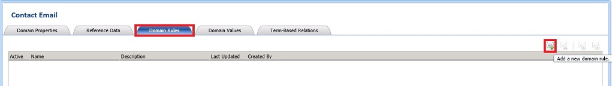
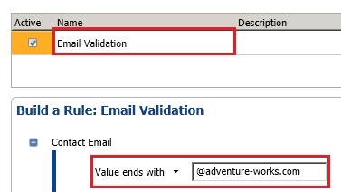
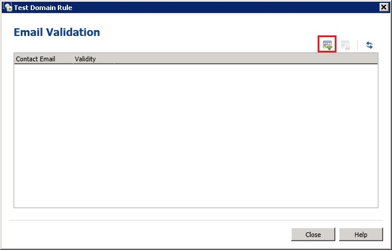
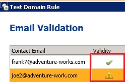

# Task 4: Setting Domain Rules
In this task, you create a rule for the **Contact Email** domain to verify if the email address ends with **@adventure-works.com**. See [Creating a Domain Rule](http://msdn.microsoft.com/library/hh510397.aspx) topic for more details on the page.  
  
1.  Click **Contact Email** in the **Domain list**.  
  
2.  Switch to the **Domain Rules** tab in the right pane.  
  
      
  
3.  In the right pane, click **Add a new domain rule** button on the toolbar (see the image) to add a rule.  
  
4.  Type **Email Validation** for the **rule name** and press **ENTER**. The **Active** check box should be checked by default. This control allows you to deactivate a rule temporarily.  
  
5.  In the **Build a Rule** pane, click **down arrow**, and select **Value ends with**.  
  
6.  Type **@adventure-works.com** in the text box and press **TAB**. You can add more conditions by clicking **Add a new condition to the selected clause** toolbar button in the **Build a Rule** pane.  
  
      
  
7.  Click **Run the selected domain rule on test data** button on the toolbar in the right pane to test the rule against sample data.  
  
      
  
8.  In the **Test Domain Rule** dialog box, click **Adds a new testing term for the domain rule** button on the toolbar.  
  
      
  
9. Type **frank7@adventure-works.com** (a valid value) in the **Contact Email** column.  
  
10. Repeat previous two steps to add **joe2@adventure-work.com** (an invalid value with no ‘s’).  
  
11. Click the last button (**Test the domain rule on all the terms**) on the toolbar to test the input data against the rule.  
  
      
  
12. Notice that the first entry is shown as a valid item and the second one as an invalid item.  
  
      
  
13. Click **Close** to close the **Test Domain Rule** dialog box.  
  
## Next Step  
[Task 5: Setting Term Based Relationships](../a9notintoc/task-5-setting-term-based-relationships.md)  
  
