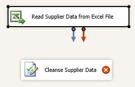
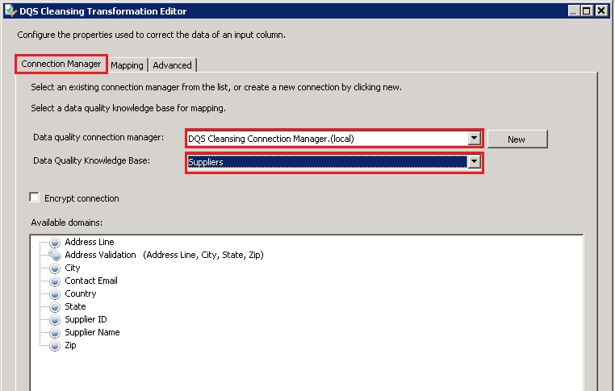
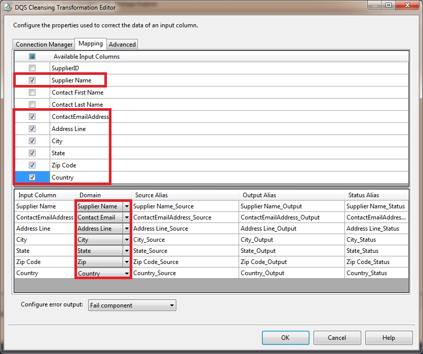

# Task 7: Adding DQS Cleansing Transform to the Data Flow
In this task, you add DQS Cleansing Transform to the data flow to cleanse the input supplier data by using DQS. See **[DQS Cleansing Transform](http://msdn.microsoft.com/library/ee677619.aspx)** for more details about the transform.  
  
1.  Right-click **DQS Cleansing** in the **Data Flow** tab, and click **Rename**. Type **Cleanse Supplier Data**, and press **ENTER**.  
  
2.  Select **Read Supplier Data from Excel File**; drag the blue connector to **Cleanse Supplier Data**. The components are now connected.  
  
      
  
3.  Double-click **Cleanse Supplier Data**.  
  
4.  In the **DQS Cleansing Transformation Editor**, click **New** next to the **Data Quality Connection Manager drop-down list**.  
  
5.  In the **DQS Cleansing Connection Manager** dialog box, type **(local)** or **period** (.) to connect to the local server. This lesson assumes that you have DQS installed on a local server.  
  
6.  Click **Test Connection** to test the connection to DQS server.  
  
7.  Click **OK** to close the dialog box.  
  
8.  Select **Suppliers** for the **Data Quality Knowledge Base**.  
  
      
  
9. Switch to the **Mapping** tab at the top.  
  
10. From **Available Input Columns**, select **Supplier Name**, **ContactEmailAddress**, **Address Line**, **City**, **State**, **Country**, and **Zip Code** by selecting the check boxes.  
  
      
  
11. In the bottom pane, map these columns by using drop-down lists in the **Domain** column:  
  
    |Column|Domain|  
    |----------|----------|  
    |Supplier Name|Supplier Name|  
    |ContactEmailAddress|Contact Email|  
    |Address Line|Address Line|  
    |City|City|  
    |State|State|  
    |Country|Country|  
    |Zip Code|Zip|  
  
12. Click **OK** to close the **DQS Cleansing Transformation Editor** dialog box.  
  
## Next Step  
[Task 8: Adding Conditional Split Transform to Split Cleansing Output](../a9notintoc/task-8-adding-conditional-split-transform-to-split-cleansing-output.md)  
  
