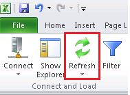
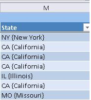

# Task 7: Viewing Updates Made using Master Data Manager in Excel
In this task, you verify that you see the updated data from MDS in Excel.  
  
1.  Now, switch to the excel window that has **Cleansed and Matched Suppliers** spreadsheet open.  
  
2.  Click **Refresh** button on the ribbon.  
  
      
  
3.  Notice that **names** show up (California, New York etc…) for the **State** field along with their **codes**.  
  
      
  
## Next Step  
[Task 8: Adding a New Value for State Entity in Excel](../a9notintoc/task-8-adding-a-new-value-for-state-entity-in-excel.md)  
  
