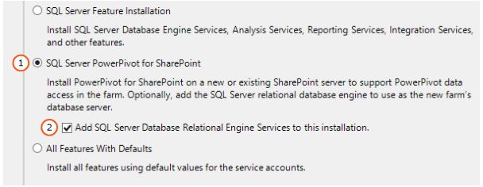
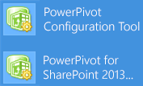

# Install SQL Server BI Features with SharePoint (Power Pivot and Reporting Services)
  [!INCLUDE[ssASnoversion](../a9notintoc/includes/ssasnoversion-md.md)] and [!INCLUDE[ssRSnoversion](../a9notintoc/includes/ssrsnoversion-md.md)] can be integrated with a Microsoft SharePoint farm to enable Business Intelligence (BI) features in SharePoint. The features include [!INCLUDE[ssGeminiShort](../a9notintoc/includes/ssgeminishort-md.md)], [!INCLUDE[ssCrescent](../a9notintoc/includes/sscrescent-md.md)], and [!INCLUDE[ssRSnoversion](../a9notintoc/includes/ssrsnoversion-md.md)]. [!INCLUDE[ssGeminiShort](../a9notintoc/includes/ssgeminishort-md.md)] is used for [!INCLUDE[ssGemini](../a9notintoc/includes/ssgemini-md.md)] data access in a SharePoint farm. [!INCLUDE[ssGeminiShort](../a9notintoc/includes/ssgeminishort-md.md)] is the data engine for workbooks created in [!INCLUDE[ssGemini](../a9notintoc/includes/ssgemini-md.md)] for Excel and accessed from a SharePoint library. Once you save a [!INCLUDE[ssGemini](../a9notintoc/includes/ssgemini-md.md)] workbook to SharePoint, you can use it as a data source for [!INCLUDE[ssCrescent](../a9notintoc/includes/sscrescent-md.md)] reports.  
  
 Some of the installation and configuration steps required for SharePoint 2010 are different than the steps required for SharePoint 2013. Some of the topics in this section apply to both versions of SharePoint.  
  
||  
|-|  
|**[!INCLUDE[applies](../a9retired/includes/applies-md.md)]**  SharePoint 2013 &#124; SharePoint 2010|  
  
  For the current release notes, see [SQL Server 2016 Release Notes](../sql-server/sql-server-2016-release-notes.md).  
  
 **In this topic:**  
  
-   [SQL Server BI Scenarios and SharePoint 2013](#bkmk_bi_scenarios)  
  
-   [Overview of Installation](#bkmk_install_sharepoint2013_overview)  
  
## In This Section  
 In addition to the information in this topic, the following related topics are in this section of content.  
  
 [Deployment Topologies for SQL Server BI Features in SharePoint](../a9retired/deployment-topologies-for-sql-server-bi-features-in-sharepoint.md)  
  
 [Guidance for Using SQL Server BI Features in a SharePoint 2010 Farm](http://msdn.microsoft.com/en-us/5f9a94c4-854b-4577-a8b1-7142f19904e3)  
  
 [Checklists for Installing BI Features with SharePoint](../Topic/Checklists%20for%20Installing%20BI%20Features%20with%20SharePoint.md)  
  
 [Install Reporting Services SharePoint Mode](../reporting-services/install/windows/install-reporting-services-sharepoint-mode.md)  
  
 [Install Analysis Services in Power Pivot Mode](../analysis-services/instances/install/windows/install-analysis-services-in-power-pivot-mode.md)  
  
 [Power Pivot for SharePoint 2010 Installation](http://msdn.microsoft.com/en-us/8d47dde7-c941-4280-a934-e2fe3f9a938f)  
  
##   SQL Server BI Scenarios and SharePoint 2013  
 This section summarizes the different levels of BI features you can choose to install and configure.  
  
 Excel Services in SharePoint 2013 includes data model functionality to enable interaction with a [!INCLUDE[ssGemini](../a9notintoc/includes/ssgemini-md.md)] workbook in the browser. For basic data model functionality you do not need to deploy the [!INCLUDE[ssGeminiShort](../a9notintoc/includes/ssgeminishort-md.md)] 2013 add-in into the farm. You only need to install an [!INCLUDE[ssASnoversion](../a9notintoc/includes/ssasnoversion-md.md)] server in SharePoint mode and register the server within the Excel Services **Data Model** settings.  
  
 Deploying the [!INCLUDE[ssGeminiShort](../a9notintoc/includes/ssgeminishort-md.md)] 2013 add-in enables additional functionality and features in your SharePoint farm. The additional features include [!INCLUDE[ssGemini](../a9notintoc/includes/ssgemini-md.md)] Gallery, Schedule Data Refresh, and the [!INCLUDE[ssGemini](../a9notintoc/includes/ssgemini-md.md)] Management Dashboard. See the table for additional information.  
  
||Level|Features|Install or Configure|  
|-|-----------|--------------|--------------------------|  
|1|SharePoint Only|Native Excel Services Features|Excel Services and other services included with SharePoint Server 2013.|  
|**2**|SharePoint with Analysis Services in SharePoint Mode|Interactive [!INCLUDE[ssGemini](../a9notintoc/includes/ssgemini-md.md)] workbooks in the browser|-Install [!INCLUDE[ssASnoversion](../a9notintoc/includes/ssasnoversion-md.md)] in SharePoint mode.   -Register Analysis Services Server in Excel Services.|  
|**3**|SharePoint with Reporting Services in SharePoint Mode|Power View|-Install [!INCLUDE[ssRSnoversion](../a9notintoc/includes/ssrsnoversion-md.md)] in SharePoint mode.   -Install [!INCLUDE[ssRSnoversion](../a9notintoc/includes/ssrsnoversion-md.md)] add-in **(rsSharePoint.msi)** for SharePoint. For more information, see [Install or Uninstall the Reporting Services Add-in for SharePoint](../reporting-services/install/windows/install-or-uninstall-the-reporting-services-add-in-for-sharepoint.md)|  
|**4**|All [!INCLUDE[ssGemini](../a9notintoc/includes/ssgemini-md.md)] Features|-Access to workbooks as a data source from outside the farm.   -Schedule Data refresh.   -[!INCLUDE[ssGemini](../a9notintoc/includes/ssgemini-md.md)] Gallery.   -BISM link file content type.|Deploy [!INCLUDE[ssGemini](../a9notintoc/includes/ssgemini-md.md)] for SharePoint 2013 add-in **(spPowerPivot.msi)**. For more information, see the following:   [Install or Uninstall the Power Pivot for SharePoint Add-in &#40;SharePoint 2013&#41;](../analysis-services/instances/install/windows/install-or-uninstall-the-power-pivot-for-sharepoint-add-in-sharepoint-2013.md)   [Download SQL Server 2014 Power Pivot for SharePoint](http://go.microsoft.com/fwlink/?LinkID=296473).|  
  
 For additional information on enabling [!INCLUDE[ssASnoversion](../a9notintoc/includes/ssasnoversion-md.md)] features, see [The SQL Server BI Light-Up Story for SharePoint 2013](http://blogs.msdn.com/b/analysisservices/archive/2012/07/27/introducing-the-bi-light-up-story-for-sharepoint-2013.aspx) (http://blogs.msdn.com/b/analysisservices/archive/2012/07/27/introducing-the-bi-light-up-story-for-sharepoint-2013.aspx).  
  
##   Overview of Installation  
 If you want to use both [!INCLUDE[ssGeminiShort](../a9notintoc/includes/ssgeminishort-md.md)] and [!INCLUDE[ssRSnoversion](../a9notintoc/includes/ssrsnoversion-md.md)], run SQL Server Installation Wizard twice. [!INCLUDE[ssRSnoversion](../a9notintoc/includes/ssrsnoversion-md.md)] and [!INCLUDE[ssGemini](../a9notintoc/includes/ssgemini-md.md)] are separate choices on the **Setup Role** page of the SQL Server setup wizard.  
  
 [!INCLUDE[ssGeminiShort](../a9notintoc/includes/ssgeminishort-md.md)] supports both SharePoint 2010 and SharePoint 2013; however a different architecture and installation process is used depending on the version of SharePoint.  
  
 The following is a summary of the installation steps to deploy [!INCLUDE[ssCurrent](../a9notintoc/includes/sscurrent-md.md)] BI Features on a single server:  
  
 **[!INCLUDE[ssGeminiShort](../a9notintoc/includes/ssgeminishort-md.md)] 2013**  
  
 For **SharePoint 2013**, the [!INCLUDE[ssGeminiShort](../a9notintoc/includes/ssgeminishort-md.md)] installation can be run on a server that does not have a SharePoint product installed. The [!INCLUDE[ssGemini](../a9notintoc/includes/ssgemini-md.md)] architecture used for SharePoint 2013, runs **outside** the SharePoint farm and can either be installed on a server that also contains a SharePoint installation or it can be installed a server that does NOT contains a SharePoint installation.  
  
1.  Install SharePoint Server 2013 and enable Excel Services.  
  
2.  Install [!INCLUDE[ssASnoversion](../a9notintoc/includes/ssasnoversion-md.md)] in SharePoint mode, and grant the SharePoint farm and services accounts server administrator rights in [!INCLUDE[ssASnoversion](../a9notintoc/includes/ssasnoversion-md.md)].  
  
     For both versions of SharePoint, the [!INCLUDE[ssGemini](../a9notintoc/includes/ssgemini-md.md)] installation process starts by selecting the setup role of **SQL Server Power Pivot for SharePoint** in the SQL Server Installation wizard or use a SQL Server command prompt installation.  
  
       
  
3.  For SharePoint 2013, you can extend the [!INCLUDE[ssGemini](../a9notintoc/includes/ssgemini-md.md)] features and experience. Download and run **spPowerPivot.msi** to add server-side data refresh processing, collaboration, and management support for [!INCLUDE[ssGemini](../a9notintoc/includes/ssgemini-md.md)] workbook. For more information, see [Microsoft SQL Server 2014 Power Pivot for Microsoft® SharePoint](http://go.microsoft.com/fwlink/?LinkID=324854).  
  
     Run the [!INCLUDE[ssGeminiShort](../a9notintoc/includes/ssgeminishort-md.md)] 2013 installation package **spPowerPivot.msi** on each server in the SharePoint farm to ensure the correct version of the data providers are installed.  
  
4.  To configure [!INCLUDE[ssGemini](../a9notintoc/includes/ssgemini-md.md)] for SharePoint 2013, use **Power Pivot for SharePoint 2013 Configuration** tool.  
  
     The SQL Server installation wizard installs two [!INCLUDE[ssGemini](../a9notintoc/includes/ssgemini-md.md)] Configurations tools. One of the configuration tools supports SharePoint 2013 and the other tool supports SharePoint 2010.  
  
       
  
5.  Configure Excel Services in SharePoint Server 2013 to use the [!INCLUDE[ssASnoversion](../a9notintoc/includes/ssasnoversion-md.md)] instance. For more information, see the section “Configure Basic Analysis Services SharePoint Integration” in [Install Analysis Services in Power Pivot Mode](../analysis-services/instances/install/windows/install-analysis-services-in-power-pivot-mode.md).and [Manage Excel Services data model settings (SharePoint Server 2013)](http://technet.microsoft.com/library/jj219780.aspx) (http://technet.microsoft.com/library/jj219780.aspx).  
  
6.  For more information, see [Install Analysis Services in Power Pivot Mode](../analysis-services/instances/install/windows/install-analysis-services-in-power-pivot-mode.md).  
  
 **[!INCLUDE[ssGeminiShort](../a9notintoc/includes/ssgeminishort-md.md)] 2010**  
  
 For SharePoint 2010, it is required that the [!INCLUDE[ssGemini](../a9notintoc/includes/ssgemini-md.md)] for SharePoint Installation is run on a server that already has SharePoint 2010 installed or will be installed. The [!INCLUDE[ssGemini](../a9notintoc/includes/ssgemini-md.md)] architecture for SharePoint 2010 runs **inside** the farm and requires SharePoint on the server that [!INCLUDE[ssGemini](../a9notintoc/includes/ssgemini-md.md)] for SharePoint is installed.  
  
1.  Install [!INCLUDE[ssASnoversion](../a9notintoc/includes/ssasnoversion-md.md)] in SharePoint mode, and grant the SharePoint farm and services accounts server administrator rights in [!INCLUDE[ssASnoversion](../a9notintoc/includes/ssasnoversion-md.md)].  
  
     A SharePoint 2010 deployment does not support spPowerPivot.msi, and the .msi is **not** required with SharePoint 2010.  
  
     For both versions of SharePoint, the [!INCLUDE[ssGemini](../a9notintoc/includes/ssgemini-md.md)] installation process starts by selecting the setup role of **SQL Server Power Pivot for SharePoint** in the SQL Server Installation wizard or use a SQL Server command prompt installation.  
  
2.  The SQL Server installation wizard installs two [!INCLUDE[ssGemini](../a9notintoc/includes/ssgemini-md.md)] Configurations tools. One of the configuration tools supports SharePoint 2013 and the other tool supports SharePoint 2010.  
  
     To configure [!INCLUDE[ssGemini](../a9notintoc/includes/ssgemini-md.md)] for SharePoint 2010, use the **Power Pivot Configuration Tool** .  
  
3.  For more information, see [Power Pivot for SharePoint 2010 Installation](http://msdn.microsoft.com/en-us/8d47dde7-c941-4280-a934-e2fe3f9a938f).  
  
 **[!INCLUDE[ssRSnoversion](../a9notintoc/includes/ssrsnoversion-md.md)]**  for SharePoint 2010 and 2013  
  
1.  The installation for [!INCLUDE[ssRSnoversion](../a9notintoc/includes/ssrsnoversion-md.md)] in SharePoint mode is unchanged from the previous release.  
  
     The [!INCLUDE[ssRSnoversion](../a9notintoc/includes/ssrsnoversion-md.md)] installation steps for SharePoint 2010 and SharePoint 2013 are very similar. Important notes regarding SharePoint versions are:  
  
    -   See the supported combinations of the following:  
  
        -   The version of [!INCLUDE[ssRSnoversion](../a9notintoc/includes/ssrsnoversion-md.md)].  
  
        -   The [!INCLUDE[ssRSnoversion](../a9notintoc/includes/ssrsnoversion-md.md)] add-in for SharePoint Products.  
  
        -   The version of the SharePoint product.  
  
         [Supported Combinations of SharePoint and Reporting Services Server and Add-in &#40;SQL Server 2016&#41;](../reporting-services/install/windows/dc6a3372-db26-43f0-b7aa-f725acc635c2.md)  
  
    -   [!INCLUDE[ssRSnoversion](../a9notintoc/includes/ssrsnoversion-md.md)] on SharePoint 2010 requires the SharePoint 2010 Service Pack 2 (SP2).  
  
    1.  Install [!INCLUDE[ssRSnoversion](../a9notintoc/includes/ssrsnoversion-md.md)] in SharePoint mode. [Install Reporting Services SharePoint Mode](../reporting-services/install/windows/install-reporting-services-sharepoint-mode.md) and [Install Reporting Services SharePoint Mode for SharePoint 2010](http://msdn.microsoft.com/en-us/47efa72e-1735-4387-8485-f8994fb08c8c).  
  
    2.  Install the [!INCLUDE[ssRSnoversion](../a9notintoc/includes/ssrsnoversion-md.md)] add-in for SharePoint products (rsSharePoint.msi). See [Install or Uninstall the Reporting Services Add-in for SharePoint](../reporting-services/install/windows/install-or-uninstall-the-reporting-services-add-in-for-sharepoint.md). For the current version of the [!INCLUDE[ssRSnoversion](../a9notintoc/includes/ssrsnoversion-md.md)] add-in for SharePoint, see [Where to find the Reporting Services add-in for SharePoint Products](../reporting-services/install/windows/where-to-find-the-reporting-services-add-in-for-sharepoint-products.md).  
  
    3.  Configure the [!INCLUDE[ssRSnoversion](../a9notintoc/includes/ssrsnoversion-md.md)] SharePoint service and at least one [!INCLUDE[ssRSnoversion](../a9notintoc/includes/ssrsnoversion-md.md)] service application. For more information, see the section “Create a Reporting Services Service Application” in [Install The First Report Server in SharePoint Mode](../reporting-services/install/windows/install-the-first-report-server-in-sharepoint-mode.md).  
  
##   Overview of Database-attach Upgrade and SharePoint 2013  
 SharePoint 2013 does not support in-place upgrade. However **database-attach upgrade is supported**.  
  
 If you have an existing [!INCLUDE[ssGemini](../a9notintoc/includes/ssgemini-md.md)] installation integrated with SharePoint 2010, you cannot in-place upgrade the SharePoint server.  However, you can complete the following steps as part of a SharePoint database-attach upgrade:  
  
1.  Install a new SharePoint Server 2013 farm.  
  
2.  Complete a SharePoint database-attach upgrade, and migrate your [!INCLUDE[ssGemini](../a9notintoc/includes/ssgemini-md.md)] related content databases to the SharePoint 2013 farm.  
  
3.  Install an instance of SQL Server Analysis Services in SharePoint mode and grant the SharePoint farm and services accounts, server administrator rights in [!INCLUDE[ssASnoversion](../a9notintoc/includes/ssasnoversion-md.md)].  
  
4.  Install the [!INCLUDE[ssGemini](../a9notintoc/includes/ssgemini-md.md)] for SharePoint 2013 installation package **spPowerPivot.msi** on each server in the SharePoint farm.  
  
5.  In SharePoint 2013 Central Administration, configure Excel Services to use the Analysis Services server running in SharePoint mode created in step 3.  
  
     To migrate refresh schedules, configure the [!INCLUDE[ssGemini](../a9notintoc/includes/ssgemini-md.md)] service application.  
  
> [!NOTE]  
>  For more information on [!INCLUDE[ssGemini](../a9notintoc/includes/ssgemini-md.md)] and SharePoint database-attach upgrade, see the following:  
  
-   [Migrate Power Pivot to SharePoint 2013](../analysis-services/instances/install/windows/migrate-power-pivot-to-sharepoint-2013.md)  
  
-   [Overview of the upgrade process to SharePoint 2013](http://go.microsoft.com/fwlink/p/?LinkId=256688).  
  
-   [Clean up preparations before an upgrade to SharePoint 2013](http://go.microsoft.com/fwlink/p/?LinkId=256689).  
  
-   [Upgrade databases from SharePoint 2010 to SharePoint 2013](http://go.microsoft.com/fwlink/p/?LinkId=256690).  
  
## See Also  
 [Where to find the Reporting Services add-in for SharePoint Products](../reporting-services/install/windows/where-to-find-the-reporting-services-add-in-for-sharepoint-products.md)   
 [Supported Combinations of SharePoint and Reporting Services Server and Add-in &#40;SQL Server 2016&#41;](../reporting-services/install/windows/dc6a3372-db26-43f0-b7aa-f725acc635c2.md)   
 [Install or Uninstall the Reporting Services Add-in for SharePoint](../reporting-services/install/windows/install-or-uninstall-the-reporting-services-add-in-for-sharepoint.md)  
  
  