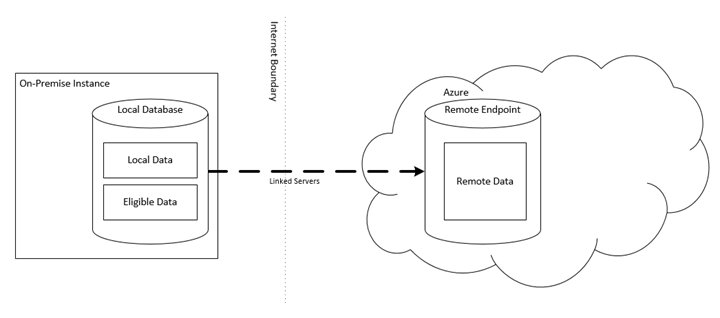
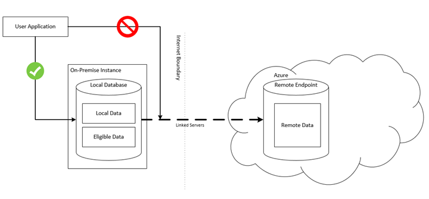
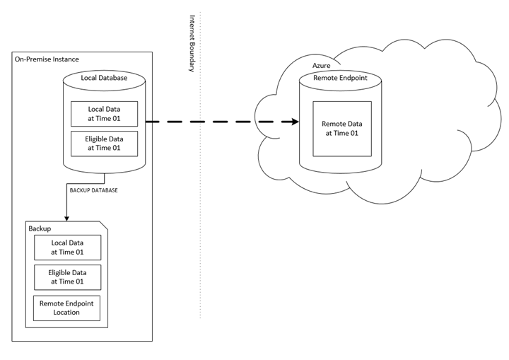
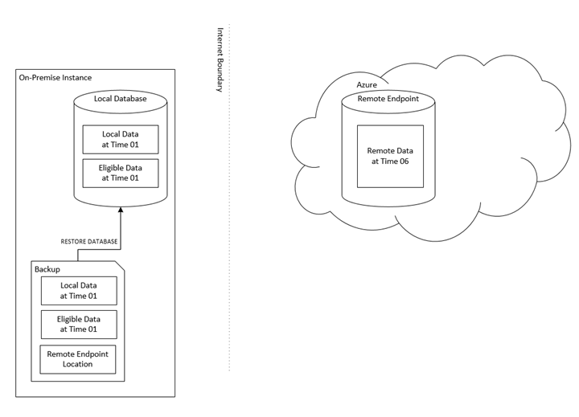
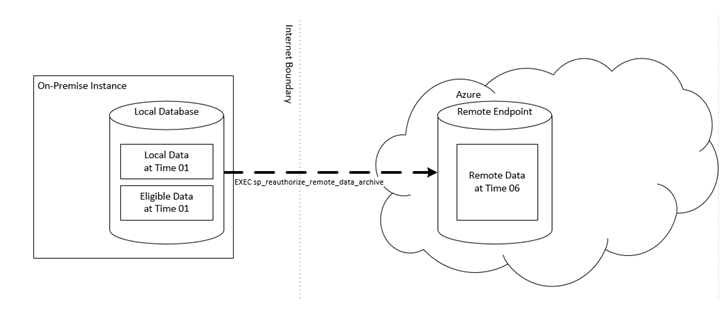
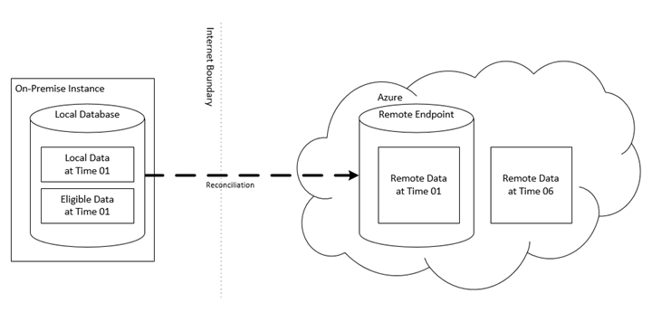

# Concepts and architecture for Stretch Database
    
## Terms  
 **Local database**. The on-premises [!INCLUDE[ssSQL15](../a9notintoc/includes/sssql15-md.md)] database.  
  
 **Remote endpoint**. The location in Microsoft Azure that contains the database’s remote data. In [!INCLUDE[ssSQL15](../a9notintoc/includes/sssql15-md.md)], this is an Azure SQL Database server. This is subject to change in the future.  
  
 **Local data**. Data in a database with Stretch Database enabled that will not be moved to Azure based on the Stretch Database configuration of the tables in the database.  
  
 **Eligible data**. Data in a database with Stretch Database enabled that has not yet been moved, but will be moved to Azure based on the Stretch Database configuration of the tables in the database.  
  
 **Remote data**. Data in a database with Stretch Database enabled that has already been moved to Azure.  
  
## Architecture  
 Stretch Database leverages the resources in Microsoft Azure to offload archival data storage and query processing.  
  
 When you enable Stretch Database on a database, it creates a secure linked server definition in the on-premises SQL Server. This linked server definition has the remote endpoint as the target. When you enable Stretch Database on a table in the database, it provisions remote resources and begins to migrate eligible data, if migration is enabled.  
  
 Queries against tables with Stretch Database enabled automatically run against both the local database and the remote endpoint. Stretch Database leverages processing power in Azure to run queries against remote data by rewriting the query. You can see this rewriting as a "remote query" operator in the new query plan.  
  
   
  
## Security and permissions  
  
### Enabling and disabling Stretch Database for a SQL Server instance  
 To begin configuring databases for Stretch Database, you must first change the "remote data archive" instance-level configuration option using sp_configure. This operation requires sysadmin or serveradmin privileges. With this option enabled, you can configure databases for Stretch Database, migrate data, and query data on the remote endpoint. It's important to note that this option is not a switch that turns the Stretch Database feature on or off, and it's not a permission setting for configuring Stretch Database.  
  
### Enabling and disabling a Stretch Database for a database or table  
 To configure a database for Stretch Database, you must have the CONTROL DATABASE permission. In addition, you have to have administrator permissions on the remote endpoint. (In CTP2, this means that, at configuration time, you have to provide the administrator login and password for the target Azure SQL Database server).  
  
 To configure a table for Stretch Database, you must have ALTER privilege on the table, and the database must already be configured for Stretch Database.  
  
### Data access  
 Only system processes can access the linked server definition behind Stretch Database. User logins can't issue queries through the linked server definition to the remote endpoint.  
  
 Stretch Database does not change the permissions model of an existing database. User logins can query the data in a table with Stretch Database enabled through the local database. The local database performs permission checks for any actions initiated by the user in the same way as it does for any other objects. If you're authorized to access the table with Stretch Database enabled, you have access to all its contents for which you're authorized regardless of where the data physically resides.  
  
   
  
## Backup and restore  
 Backups on a database with Stretch Database enabled contain only local data and eligible data at the point in time when the backup runs. These backups also contain information about the remote endpoint where the database’s remote data resides. This is known as a "shallow backup". Deep backups that contain all data in the database, both local and remote, are not supported in CTP2.  
  
   
  
 When you restore a backup of a database with Stretch Database enabled, this operation restores the local data and eligible data to the database as expected. After the restore operation runs, the database contains local and eligible data from the point when the backup ran, but it does not have the required credentials and artifacts to connect to the remote endpoint.  
  
   
  
 You have to run the stored procedure sys.sp_reauthorize_remote_data_archive to re-establish the connection between the local database and its remote endpoint. Only a db_owner can perform this operation. This stored procedure also requires the remote endpoint’s administrator user name and password. (In CTP2, this means that you have to provide the administrator login and password for the target Azure SQL Database server).  
  
   
  
 After you re-establish the connection, Stretch Database attempts to reconcile eligible data in the local database with remote data by creating a copy of the remote data on the remote endpoint and linking it with the local database. This process is automatic and requires no user intervention. After reconciliation runs, the local database and the remote endpoint are in a consistent state. Then you can delete the previous copy of the remote data.  
  
   
  
  