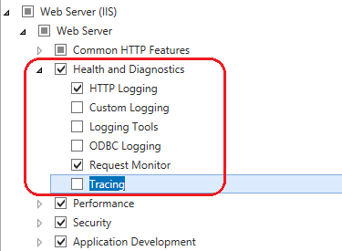
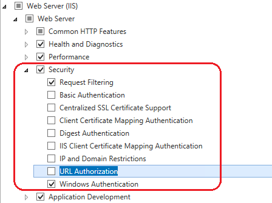
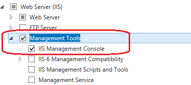
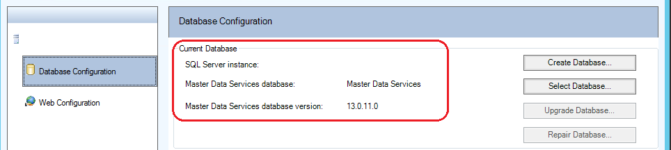
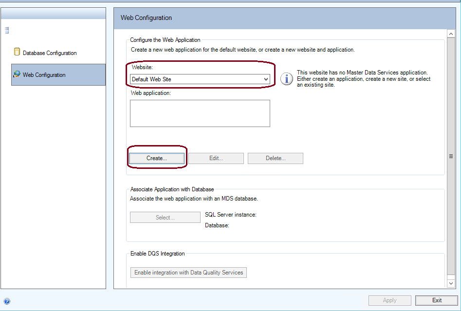
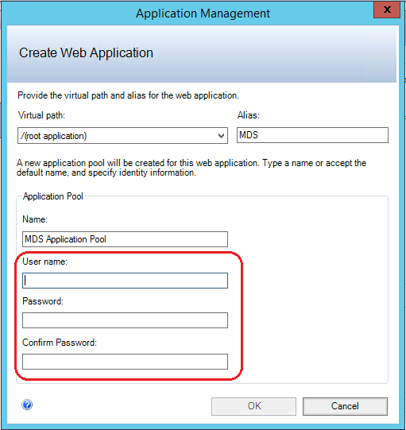
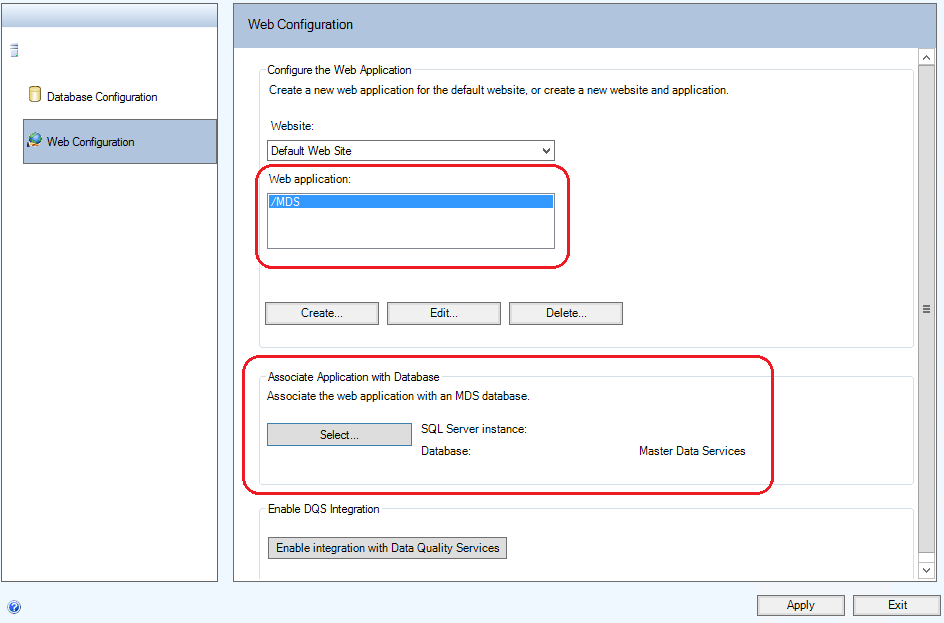
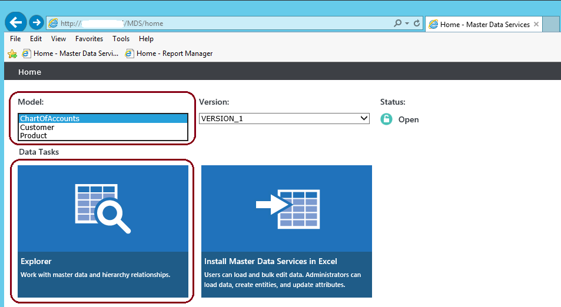

# Get Started with Master Data Services (SQL Server 2016)
  This article covers how to install  [!INCLUDE[ssMDSshort](../a9notintoc/includes/ssmdsshort-md.md)], set up the MDS database and website, and deploy the sample models and data.  
  
 For an overview of the building blocks of [!INCLUDE[ssMDSshort](../a9notintoc/includes/ssmdsshort-md.md)], such as a model and an entity, see [Master Data Services Overview &#40;MDS&#41;](../master-data-services/master-data-services-overview-mds.md).  
  
## Installing Master Data Services, and IIS Roles and Features  
 You use the [!INCLUDE[ssNoVersion](../a9notintoc/includes/ssnoversion-md.md)] setup installation wizard or a command prompt to install [!INCLUDE[ssMDSshort](../a9notintoc/includes/ssmdsshort-md.md)].  
  
 **To install [!INCLUDE[ssMDSshort](../a9notintoc/includes/ssmdsshort-md.md)] using [!INCLUDE[ssNoVersion](../a9notintoc/includes/ssnoversion-md.md)] Setup.**  
  
1.  Double-click Setup.exe, and follow the steps in the installation wizard.  
  
2.  Select [!INCLUDE[ssMDSshort](../a9notintoc/includes/ssmdsshort-md.md)] on the **Feature Selection** page under **Shared Features**.  
  
     This installs [!INCLUDE[ssMDScfgmgr](../a9retired/includes/ssmdscfgmgr-md.md)], assemblies, a Windows PowerShell snap-in, and folders and files for Web applications and services.  
  
       
  
3.  Complete the installation wizard.  
  
4.  In [!INCLUDE[winblue_server_2](../a9retired/includes/winblue-server-2-md.md)], click the **Server Manager** icon on the taskbar on the **Desktop**.  
  
       
  
5.  In **Server Manager**, click, **Add Roles and Features** on the **Manage** menu.  
  
       
  
6.  On the **Installation Type** page of the **Add Roles and Features Wizard**, accept the default value (**Role-based or feature-based installation**) and click **Next**.  
  
7.  Click **Select a server from the server pool**, and then click the server where you installed [!INCLUDE[ssMDSshort](../a9notintoc/includes/ssmdsshort-md.md)].  
  
       
  
8.  In the **Roles** box, click the roles and roles services that are required for [!INCLUDE[ssMDSshort](../a9notintoc/includes/ssmdsshort-md.md)] on [!INCLUDE[winblue_server_2](../a9retired/includes/winblue-server-2-md.md)], and then click **Next**. The following images show the selected, required roles and roles services.  
  
    > [!WARNING]  
    >  Do not install the WebDAV Publishing role service. WebDAV Publishing is not compatible with [!INCLUDE[ssMDSshort](../a9notintoc/includes/ssmdsshort-md.md)].  
  
    > [!IMPORTANT]  
    >  **Dynamic Content Compression** is enabled by default. This significantly reduces the size of the xml response and saves the network I/O, though CPU usage is increased.  For more information, see **[CTP 2.0] Improved Performance** in [What's New in Master Data Services &#40;MDS&#41;](../master-data-services/what-s-new-in-master-data-services-mds.md).  
  
    |Roles and Role Services|Roles and Role Services|  
    |-----------------------------|-----------------------------|  
    |||  
    |||  
    |||  
  
     For a list of the required roles and roles services on various operating systems, see [Web Application Requirements &#40;Master Data Services&#41;](../master-data-services/install/windows/web-application-requirements-master-data-services.md) .  
  
9. In the **Features** box, click the features that are required for [!INCLUDE[ssMDSshort](../a9notintoc/includes/ssmdsshort-md.md)] on [!INCLUDE[winblue_server_2](../a9retired/includes/winblue-server-2-md.md)], and then click **Next**. The following images show the selected, required features.  
  
    |Features|Features|  
    |--------------|--------------|  
    |||  
  
     For a list of the required features on various operating systems, see [Web Application Requirements &#40;Master Data Services&#41;](../master-data-services/install/windows/web-application-requirements-master-data-services.md) .  
  
 For more information about installing [!INCLUDE[ssNoVersion](../a9notintoc/includes/ssnoversion-md.md)] using setup, see [Install SQL Server 2016 from the Installation Wizard &#40;Setup&#41;](../database-engine/install/windows/install-sql-server-from-the-installation-wizard-setup.md).  
  
 For more information about installing [!INCLUDE[ssNoVersion](../a9notintoc/includes/ssnoversion-md.md)] using a command prompt, see [Install SQL Server 2016 from the Command Prompt](../database-engine/install/windows/install-sql-server-2016-from-the-command-prompt.md). When you use a command prompt, [!INCLUDE[ssMDSshort](../a9notintoc/includes/ssmdsshort-md.md)] is available as a feature parameter.  
  
 For a brief description with links to additional information about pre-installation tasks, see [Install Master Data Services](../master-data-services/install/windows/install-master-data-services.md).  
  
##  <a name="SetUpWeb"></a> Setting up the Database and Website  
 **To set up the database and website using the [!INCLUDE[ssMDScfgmgr](../a9retired/includes/ssmdscfgmgr-md.md)]**  
  
1.  Launch the [!INCLUDE[ssMDScfgmgr](../a9retired/includes/ssmdscfgmgr-md.md)], and click **Database Configuration** in the left pane.  
  
2.  Click **Create Database**, and then click **Next** in the **Create Database Wizard**.  
  
3.  On the **Database Server** page, select the **Authentication type** and then click **Test Connection** to confirm that you can connect to the database using the credentials for the authentication type you selected.  
  
    > [!NOTE]  
    >  When you select **Current User – Integrated Security** as the authentication type, **User name** box is read-only and displays the name of the Windows user account that is logged on to the computer.  
  
       
  
4.  Type a name in the **Database name** field. Optionally, to select a Windows collation and specify one or more of the available options such as **Case-sensitive**, clear the **SQL Server default collation** checkbox.  
  
       
  
     For more information about Windows collation, see [Windows Collation Name (Transact-SQL)](https://msdn.microsoft.com/en-us/library/ms188046.aspx).  
  
5.  In the **User name** field, specify  the Windows account of the user that will be the default Super User for Master Data Services. A Super User has access to all functional areas and can add, delete, and update all models.  
  
       
  
6.  Click **Next** to view a summary of the settings for the [!INCLUDE[ssMDSshort](../a9notintoc/includes/ssmdsshort-md.md)]database, and then click **Next** again to create the database.  
  
     For more information about the settings in the **Create Database Wizard**, see [Create Database Wizard &#40;Master Data Services Configuration Manager&#41;](../master-data-services/create-database-wizard-master-data-services-configuration-manager.md).  
  
7.  On the Database Configuration page in the [!INCLUDE[ssMDScfgmgr](../a9retired/includes/ssmdscfgmgr-md.md)],  click Select Database.  
  
8.  Click **Connect**, and then select the [!INCLUDE[ssMDSshort](../a9notintoc/includes/ssmdsshort-md.md)] database that you created in Step 6.  
  
       
  
     You've finished setting up the database. The **Database Configuration** page now displays the [!INCLUDE[ssNoVersion](../a9notintoc/includes/ssnoversion-md.md)] instance that you're connected to for [!INCLUDE[ssMDSshort](../a9notintoc/includes/ssmdsshort-md.md)], the  database you've created and the current database version.  
  
       
  
9. In [!INCLUDE[ssMDScfgmgr](../a9retired/includes/ssmdscfgmgr-md.md)], and click **Web Configuration** in the left pane.  
  
10. In the **Website** list box, click **Default Web Site**, and then click **Create** to create a Web application.  
  
    > [!NOTE]  
    >  When you select **Default Web Site**, you must create a Web application. If you select **Create new website** in the list box, the application is automatically created.  
  
       
  
11. In the **Application Pool** section, do one of the following.  
  
    -   Enter the same user name that you entered in Step 5 for the database **Administrator Account**, enter the password, and then click **OK**.  
  
         **-OR-**  
  
    -   Enter a different user name, enter the password, and then click OK.  
  
         You don't have to use the same account when you create the database and the web application.  
  
       
  
     For more information about the **Create Web Application** dialog box, see [Create Web Application Dialog Box &#40;Master Data Services Configuration Manager&#41;](../master-data-services/create-web-application-dialog-box-master-data-services-configuration-manager.md).  
  
12. On the **Web Configuration** page in the **Web application** box, click the application you've created, and then click **Select** in the  **Associate Application with Database** section.  
  
13. Click **Connect**, select the [!INCLUDE[ssMDSshort](../a9notintoc/includes/ssmdsshort-md.md)] database that you want to associate with the Web application, and then click **OK**.  
  
     You've finished setting up the Website. The **Web Configuration** page now displays the Website you selected,  Web application you created, and the [!INCLUDE[ssMDSshort](../a9notintoc/includes/ssmdsshort-md.md)] database  associated with the application.  
  
       
  
     For more information about the settings on the Web Configuration page, see [Web Configuration Page &#40;Master Data Services Configuration Manager&#41;](../master-data-services/web-configuration-page-master-data-services-configuration-manager.md)  
  
 You can also use [!INCLUDE[ssMDScfgmgr](../a9retired/includes/ssmdscfgmgr-md.md)] to specify other settings for the Web applications and services associated with the [!INCLUDE[ssMDSshort](../a9notintoc/includes/ssmdsshort-md.md)] database. For example, you can specify how frequently data is loaded or how often validation emails are sent. For more information, see [System Settings &#40;Master Data Services&#41;](../master-data-services/system-settings-master-data-services.md).  
  
##  <a name="deploySample"></a> Deploying Sample Models and Data  
 The following three sample model packages are included with  [!INCLUDE[ssMDSshort](../a9notintoc/includes/ssmdsshort-md.md)].   These sample models include data. The default location for the sample model packages is *\<drive>*\Program Files\Microsoft SQL Server\130\Master Data Services\Samples\Packages.  
  
-   chartofaccounts_en.pkg  
  
-   customer_en.pkg  
  
-   product_en.pkg  
  
 You deploy the packages using the MDSModelDeploy tool. The default location for the MDSModelDeploy tool is *\<drive>*\Program Files\Microsoft SQL Server\ 130\Master Data Services\Configuration.  
  
 For information about prerequisites for running this tool, see [Deploy a Model Deployment Package by Using MDSModelDeploy](../master-data-services/deploy-a-model-deployment-package-by-using-mdsmodeldeploy.md).  
  
 For information about updates made to the data to support new features in [!INCLUDE[ssCurrent](../a9notintoc/includes/sscurrent-md.md)][!INCLUDE[ssMDSshort](../a9notintoc/includes/ssmdsshort-md.md)], see [Samples: Model Deployment Packages &#40;Master Data Services&#41;](../Topic/Samples:%20Model%20Deployment%20Packages%20\(Master%20Data%20Services\).md).  
  
 **To deploy the sample models**  
  
1.  Copy the sample model packages to \<drive>\Program Files\Microsoft SQL Server\130\Master Data Services\Configuration.  
  
2.  Open an Administrator: Command Prompt and navigate to MDSModelDeploy.exe, by running the following command.  
  
    ```  
    cd c:\Program Files\Microsoft SQL Server\130\Master Data Services\Configuration  
    ```  
  
3.  Deploy each of the sample models to [!INCLUDE[ssMDSshort](../a9notintoc/includes/ssmdsshort-md.md)] by running each of the following commands.  
  
    > [!IMPORTANT]  
    >  In the examples below, the `MDS1` service value is specified. You use this value if you selected  **Default Web Site** when you set up the [!INCLUDE[ssMDSshort](../a9notintoc/includes/ssmdsshort-md.md)] Web site.  See the [Setting up the Database and Website](#SetUpWeb) section.  
    >   
    >  If you created a new web site or selected another existing web site, run the following command first to determine the correct service value.  
    >   
    >  `MDSModelDeploy listservices`  
    >   
    >  The first service value in the list of values returned, is the one you specify to deploy a model.  
  
     **To deploy the chartofaccounts_en.pkg sample model**  
  
    ```  
    MDSModelDeploy deploynew -package chartofaccounts_en.pkg -model Customer -service MDS1  
    ```  
  
     **To deploy the customer_en.pkg sample model**  
  
    ```  
    MDSModelDeploy deploynew -package customer_en.pkg -model Customer -service MDS1  
    ```  
  
     **To deploy the product_en.pkg sample model**  
  
    ```  
    MDSModelDeploy deploynew -package product_en.pkg -model Customer -service MDS1  
  
    ```  
  
     When a model is successfully deployed, the **MDSModelDeploy operation completed** message is displayed.  
  
     The following image shows the command for deploying the product_en.pkg sample model.  
  
       
  
4.  To view the sample models, do the following.  
  
    1.  Navigate to the [!INCLUDE[ssMDSshort](../a9notintoc/includes/ssmdsshort-md.md)] web site that you set up. See the [Setting up the Database and Website](#SetUpWeb) section.  
  
         The web site address is http://\<server name>/\<web application>/.  
  
    2.  Select a model from the **Model** list box, and click **Explorer**.  
  
           
  
## Next Step  
 Create a new model and entities for your data. See [Create a Model &#40;Master Data Services&#41;](../master-data-services/create-a-model-master-data-services.md) and [Create an Entity &#40;Master Data Services&#41;](../master-data-services/create-an-entity-master-data-services.md).  
  
 For an overview of how you use a model and entities to build a structure for your data in [!INCLUDE[ssMDSshort](../a9notintoc/includes/ssmdsshort-md.md)], see [Master Data Services Overview &#40;MDS&#41;](../master-data-services/master-data-services-overview-mds.md)  
  
## Did this Article Help You? We’re Listening  
 What information are you looking for, and did you find it? We’re listening to your feedback to improve the content. Please submit your comments to [sqlfeedback@microsoft.com](mailto:sqlfeedback@microsoft.com?subject=Get%20Started%20with%20Master%20Data%20Services)  
  
## See Also  
 [Master Data Services Database](../master-data-services/master-data-services-database.md)   
 [Master Data Manager Web Application](../master-data-services/master-data-manager-web-application.md)   
 [Database Configuration Page &#40;Master Data Services Configuration Manager&#41;](../master-data-services/database-configuration-page-master-data-services-configuration-manager.md)   
 [What's New in Master Data Services &#40;MDS&#41;](../master-data-services/what-s-new-in-master-data-services-mds.md)  
  
  