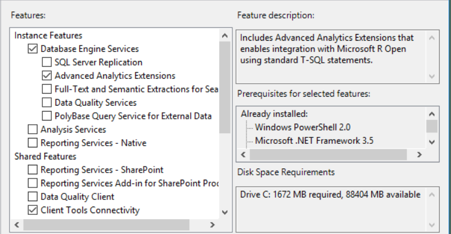
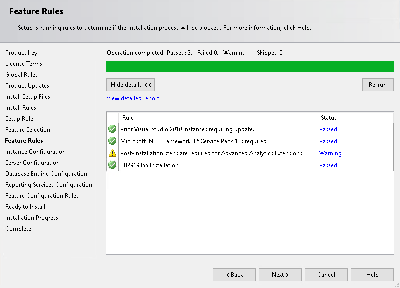
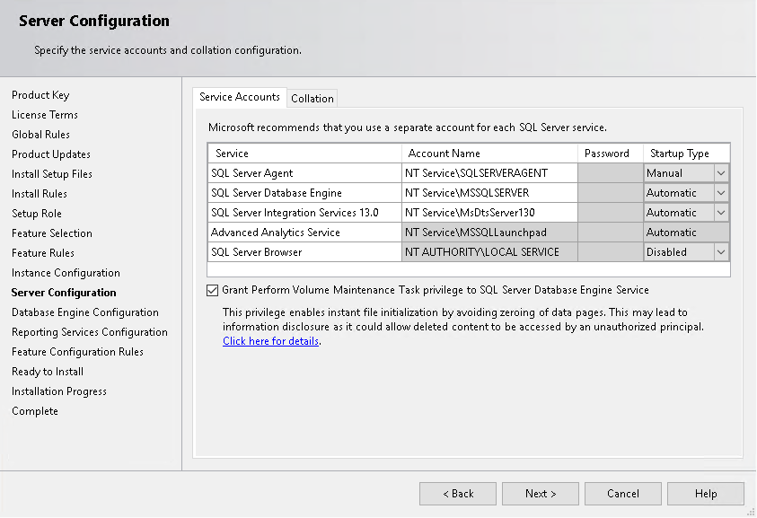

# Install Advanced Analytics Extensions
  [!INCLUDE[rsql_extensions](../a9retired/includes/rsql-extensions-md.md)] is an optional feature of the [!INCLUDE[ssDEnoversion](../a9notintoc/includes/ssdenoversion-md.md)] that lets you  execute scripts written in a supported language, such as R, from [!INCLUDE[tsql](../a9notintoc/includes/tsql-md.md)].  In [!INCLUDE[ssCurrent](../a9notintoc/includes/sscurrent-md.md)],  this feature lets you deploy R packages to [!INCLUDE[ssNoVersion](../a9notintoc/includes/ssnoversion-md.md)], execute R solutions in the context of [!INCLUDE[ssNoVersion](../a9notintoc/includes/ssnoversion-md.md)], and easily work with [!INCLUDE[ssNoVersion](../a9notintoc/includes/ssnoversion-md.md)] data in R.  
  
 If you are a data scientist developing and running R packages on a local workstation, you do not need to install these extensions or connect to a [!INCLUDE[ssNoVersion](../a9notintoc/includes/ssnoversion-md.md)] instance. However,  if you want to run R packages in the context of the server you must connect to an instance where the extensions have been enabled as described here.  
  
 You install the extensions by using [!INCLUDE[ssCurrent](../a9notintoc/includes/sscurrent-md.md)] setup or by using the command line.  
  
## Requirements  
 Microsoft. .NET Framework 3.5 is required. We recommend that you install this feature from Control Panel before beginning SQL Server setup.  
  
## Install Advanced Analytics Extensions using the Setup wizard  
 Run [!INCLUDE[ssCurrent](../a9notintoc/includes/sscurrent-md.md)] Setup and select the [!INCLUDE[rsql_extensions](../a9retired/includes/rsql-extensions-md.md)] option. No further configuration is necessary until after the additional components have been installed.  
  
 The following list shows you which pages in the [!INCLUDE[ssNoVersion](../a9notintoc/includes/ssnoversion-md.md)] Installation wizard are used to install the [!INCLUDE[rsql_extensions](../a9retired/includes/rsql-extensions-md.md)]:  
  
1.  On the **Feature Selection** page, select **Database Engine Services** and [!INCLUDE[rsql_extensions](../a9retired/includes/rsql-extensions-md.md)].  
  
       
  
2.  On the **Feature Rules** page, if you have not already installed Microsoft .Net Framework 3.5, stop setup and do so now.  
  
       
  
3.  On the **Server Configuration** page, verify that the service for [!INCLUDE[rsql_extensions](../a9retired/includes/rsql-extensions-md.md)] starts automatically using the MSSQLLaunchpad account.  
  
       
  
4.  On the **Database Engine Configuration** page, for **Authentication mode**, select **Mixed Mode (SQL Server authentication and Windows authentication)**.  
  
     Note that mixed mode authentication is not needed if you are only using the server to operationalize R code by running ready-made R code in [!INCLUDE[ssNoVersion](../a9notintoc/includes/ssnoversion-md.md)]. However, mixed mode authentication is required in CTP3 if you are supporting data scientists who will be connecting to the server for data exploration and predictive modeling. Specifically, the RevoScaleR functions must use SQL logins to execute R code using the [!INCLUDE[ssNoVersion](../a9notintoc/includes/ssnoversion-md.md)] computer as the compute context.  
  
5.  Click **Install**.  
  
6.  When [!INCLUDE[ssNoVersion](../a9notintoc/includes/ssnoversion-md.md)] setup is complete, continue to the [Next Steps](#bkmk_NextSteps).  
  
## Install Advanced Analytics Extensions Using the Command Line  
 [!INCLUDE[ssCurrent](../a9notintoc/includes/sscurrent-md.md)] Setup includes a parameter that specifies whether the extension is enabled and for which languages.  
  
 The following example illustrates a command line setup that installs the database engine, enables the [!INCLUDE[rsql_extensions](../a9retired/includes/rsql-extensions-md.md)] and the [!INCLUDE[rsql_launchpad](../a9notintoc/includes/rsql-launchpad-md.md)], and changes the  authentication mode of the instance to support SQL authentication.  
  
```  
c:\sqlserver2016Developer\setup.exe   
/Q   
/ACTION=INSTALL   
/FEATURES=SQLENGINE,ADVANCEDANALYTICS, SDK,BOL,SSMS,ADV_SSMS,   
/INSTANCENAME=MSSQLSERVER   
/SECURITYMODE= "Mixed"   
/SAPWD="%password%"         
/SQLSYSADMINACCOUNTS="%userdomain%\%username% "  
/IACCEPTSQLSERVERLICENSETERMS   
/IACCEPTREVOLICENSETERMS  
/PID=<productkey>  
```  
  
 For more information about unattended installation of [!INCLUDE[ssCurrent](../a9notintoc/includes/sscurrent-md.md)], see [Install SQL Server 2016 from the Command Prompt](../database-engine/install/windows/install-sql-server-2016-from-the-command-prompt.md).  
  
##  <a name="bkmk_NextSteps"></a> Next Steps  
 After installing [!INCLUDE[rsql_extensions](../a9retired/includes/rsql-extensions-md.md)], before your users  can begin using R, you must complete the following steps:  
  
-   Install the R  tools and libraries.  
  
     For more information , see [Install R Packages and Providers for SQL Server R Services](../a9retired/install-r-packages-and-providers-for-sql-server-r-services.md).  
  
-   Run [sp_configure &#40;Transact-SQL&#41;](../relational-databases/reference/system-stored-procedures/sp-configure-transact-sql.md) to enable the [!INCLUDE[rsql_extensions](../a9retired/includes/rsql-extensions-md.md)].  
  
     You'll also need to add the required user account pool and roles, register the extensions, and ensure that the required services or user accounts have access to the database where R will be run.  
  
     A script has been provided to complete these steps. For more information , see [Post-Installation Server Configuration &#40;SQL Server R Services&#41;](../a9retired/post-installation-server-configuration-sql-server-r-services.md).  
  
## See Also  
 [SQL Server R Services](../advanced-analytics/r-services/sql-server-r-services.md)  
  
  