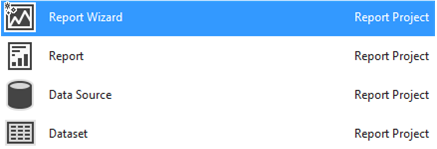

# Report Wizard Help
  This section provides F1 Help for the Report Wizard. The Report Wizard automates the process of creating tabular and matrix reports. The following table describes the topics in this section.  
  
 To open the Report Wizard:
 1. On the **Project** menu, click **Add New Item**. 
 2. Select **Report Projects**.
 3. Select **Report Wizard**.
 4. Click **Add**.
 
  
  
## In This Section  
  
-   [Welcome to the Report Wizard](../a9retired/welcome-to-the-report-wizard.md)  
  
-   [Select the Data Source](../a9retired/select-the-data-source.md)  
  
-   [Design the Query](../a9retired/design-the-query.md)  
  
-   [Query Builder &#40;Report Wizard&#41;](../a9retired/query-builder-report-wizard.md)  
  
-   [Select the Report Type](../a9retired/select-the-report-type.md)  
  
-   [Design the Table &#40;Report Wizard&#41;](../a9retired/design-the-table-report-wizard.md)  
  
-   [Choose the Table Layout](../a9retired/choose-the-table-layout.md)  
  
-   [Choose the Table Style or Choose the Matrix Style](../a9retired/choose-the-table-style-or-choose-the-matrix-style.md)  
  
-   [Design the Matrix](../a9retired/design-the-matrix.md)  
  
-   [Choose the Deployment Location](../a9retired/choose-the-deployment-location.md)  
  
-   [Complete the Report Wizard](../a9retired/complete-the-report-wizard.md)  
  
  