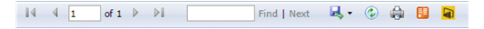

# View Page, Reports (Report Manager)
  Use the View page for reports to view a report. When you first open a report in Report Manager, it is formatted in HTML. HTML reports include a report toolbar that appears at the top of the report so that you can navigate through report pages, search within a report, or export the report to a different format. The following diagram shows the report toolbar.  
  
   
Report toolbar  
  
 In [!INCLUDE[ssRSnoversion](../a9notintoc/includes/ssrsnoversion-md.md)], reports can be configured to run on demand or from a report execution snapshot. If a report is run on demand, all data processing and report processing occur each time you open the report. If you view a report that is configured to run as a report execution snapshot, data processing occurred when the snapshot was created.  
  
## Exporting Reports  
 Not all report features are available in all of the export formats. If you export an HTML report to another format, you can expect to see some differences in how the report appears. Also, if the report includes interactive features (such as hyperlinks, bookmarks, or document maps) those features might not be available or work the same way in the new format.  
  
## Generating Data Feeds from Report Data  
 You can generate data feeds from reports. The [!INCLUDE[ssRSnoversion](../a9notintoc/includes/ssrsnoversion-md.md)] Atom rendering extension generates two Atom-compliant documents: an Atom service document that lists the data feeds the report provides and the data feeds that contains the report data. The data feeds are generated by [!INCLUDE[ssRSnoversion](../a9notintoc/includes/ssrsnoversion-md.md)] in a standardized Atom 1.0 compliant format that it readable and exchangeable with applications that consume Atom compliant data feeds. For example the [!INCLUDE[ssGemini](../a9notintoc/includes/ssgemini-md.md)] client can consume data feeds that are generated from reports.  
  
## Running Parameterized Reports  
 A report that contains input fields and a **View Report** button is a parameterized report. To view a parameterized report, you may need to provide values that are used to run the report.  
  
> [!NOTE]  
>  Report execution snapshots and some export formats are not available in all editions of [!INCLUDE[ssNoVersion](../a9notintoc/includes/ssnoversion-md.md)]. For more information, see [Features Supported by the Editions of SQL Server 2016](../Topic/Features%20Supported%20by%20the%20Editions%20of%20SQL%20Server%202016.md).  
  
## See Also  
 [Report Manager  &#40;SSRS Native Mode&#41;](../a9retired/report-manager-ssrs-native-mode.md)   
 [Report Manager F1 Help](../a9retired/report-manager-f1-help.md)  
  
  