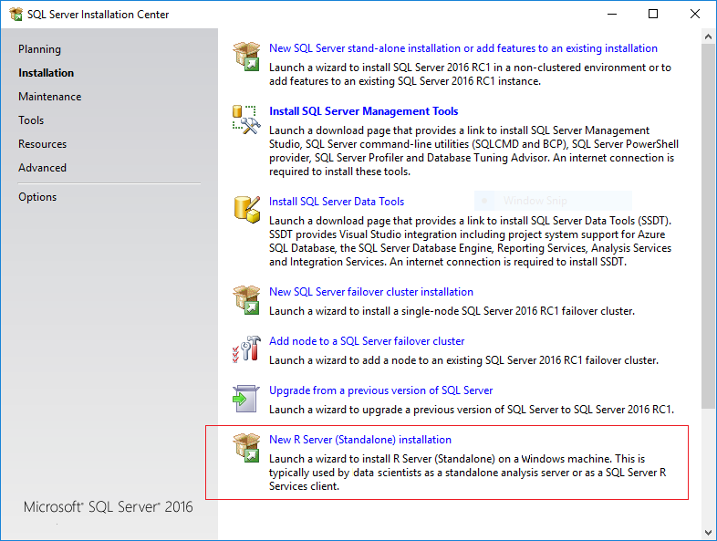

# Create a Standalone R Server
  [!INCLUDE[ssNoVersion](../../advanced-analytics/r-services/includes/ssnoversion-md.md)] setup includes the option to install **Microsoft R Server (Standalone)**. This option lets you develop high performance R solutions on Windows. You can still connect to the database or data source of your choice, and use remote compute contexts. For example, you might use Microsoft R Server (Standalone) to develop an R solution that you run locally, but later decide to deploy it to an instance of SQL Server that is running SQL Server R Services, or run the solution using ScaleR on a Hadoop or Spark cluster. 
  
> [!NOTE]
> Microsoft R Server is available only in Enterprise Edition.  
  
 When you install Microsoft R Server, you get the same enhanced R packages and connectivity tools that are provided in [!INCLUDE[rsql_productname](../../advanced-analytics/r-services/includes/rsql-productname-md.md)], but an instance of [!INCLUDE[ssNoVersion](../../advanced-analytics/r-services/includes/ssnoversion-md.md)] is not required and the execution of R scripts is performed using a separate set of the R binaries, not in database.  
  
Microsoft R Server is now also available through a simplified setup that enrolls the instance in the [Modern Lifecycle](https://support.microsoft.com/help/447912) policy. This support offering ensures that you are always using the most current version of R. For more information about using the new licensing plan and standalone Windows installer, see [Run Microsoft R Server for Windows](https://msdn.microsoft.com/microsoft-r/rserver-install-windows).

When you install Microsoft R Server through the new setup tool, you also have the option to convert specified instance of SQL Server 2016 R Services to use the new support policy and get more frequent updates of the R components, For more information, see [Use sqlBindR.exe to upgrade an instance of R Services](http://www.bing.com).   
  
##   Install Microsoft R Server (Standalone)  
  
1.  If you have installed a previous version of Microsoft R Server, you must uninstall it first.  See [Upgrading from an Older Version of Microsoft R Server](#bkmk_Uninstall). 

2. Run SQL Server setup.  
  
2.  On the **Installation** tab, click **New R Server (Standalone) installation** .  
  
       
  
3.  On the **Feature Selection** page, the following option should be already selected:  
  
    -   **R Server (Standalone)**  
  
         This  option installs shared features, including open source R tools and base packages, and the enhanced R packages and connectivity tools provided by Microsoft R.  
  
     All other options can be ignored.  
  
4.  Accept the license terms for downloading and installing Microsoft R Open. When the **Accept** button becomes unavailable, you can click **Next**. Installation of these components (and any prerequisites they might require) might take a while.   
  
5.  On the **Ready to Install** page, verify your selections, and click **Install**.  
  
> [!TIP]
> For more information about automated or off-line installation, see [Install Microsoft R Server from the Command Line](../../advanced-analytics/r-services/install-microsoft-r-server-from-the-command-line.md).

## How to Upgrade R Server to 9.0.1

If you have already installed Microsoft R Server (Standalone) you can upgrade the instance to use the new Modern Lifecycle Support policy. This allowws the instance to be updated more frequently, separately from the SQL Server support schedule. this upgrade requires that you run the separate Winddows-based installer for R Server 9.0.1.

For more information about the changes in R Server, and where to get the installer, see [Run Microsoft R Server for Windows](https://msdn.microsoft.com/microsoft-r/rserver-install-windows#howtoinstall).
  
## What is Installed and Where to Find R Packages  
 Microsoft R Server includes the R base packages and a set of enhanced R packages that support parallel processing, improved performance, and connectivity to data sources including [!INCLUDE[ssNoVersion](../../advanced-analytics/r-services/includes/ssnoversion-md.md)] and Hadoop.  
  
-   **R  packages**  
  
     The R libraries are installed together with other tools and utilities that are installed with Microsoft SQL Server 2016. Additionally, in this folder you will find documentation for the R base packages, sample data, and documentation of the R tools and runtime.  
  
     `C:\Program Files\Microsoft SQL Server\130\R_SERVER`         
       
     Note that if you install Microsoft R Server using the separate Windows installer -- that is, not using SQL Server setup -- the binaries are installed in a different folder:
     
     `C:\Program Files\Microsoft\R Server\R_SERVER`
      
  
-   **R  tools**  
  
     An R development IDE is not installed as part of setup. Additional tools are not required, as all the standard base R tools are included in `C:\Program Files\Microsoft SQL Server\130\R_SERVER\bin`.  
  
     However, we recommend that you install [!INCLUDE[rsql_rtvs](../../advanced-analytics/r-services/includes/rsql-rtvs-md.md)],  or another preferred development environment, such as RStudio. For more information, see [Setup or Configure R Tools](../../advanced-analytics/r-services/setup-or-configure-r-tools.md).  

> [!IMPORTANT]  
>  If you have installed an instance of SQL Server with R Services (In-Database) on the same computer, the R libraries and tools are installed into a different folder:  `C:\Program Files\Microsoft SQL Server\<instance_name>\R_SERVICES`  
>   
>  Do not directly call the R packages or utilities associated with the [!INCLUDE[ssNoVersion_md](../../advanced-analytics/r-services/includes/ssnoversion-md.md)] instance. Always use the R tools and packages in the R_SERVER folder. 
 
## Troubleshooting  

### Incompatible version of R Client and R Server

If you install the latest version of Microsoft R Client and use it to run R on SQL Server using a remote compute context, you might get the following error:

*You are running version 9.0.0 of Microsoft R client on your computer, which is incompatible with the Microsoft R server version 8.0.3. Download and install a compatible version.*

Typically, the version of R that is installed with SQL Server R Services is updated when service releases are published. To ensure that you always have the most up-to-date versions of R components, install all service packs. For compatibility with Microsoft R Client 9.0.0, you must install the updates that are described in this [support article](https://support.microsoft.com/kb/3210262). 

### Installing Microsoft R Server on an instance of SQL Server installed on Windows Core
In the release version of SQL Server 2016, there was a known issue when adding Microsoft R Server to an instance on Windows Server Core edition. This has been fixed. 

If you encounter this issue, you can applied the fix described in [KB3164398](https://support.microsoft.com/kb/3164398) to add the R feature to the existing instance on Windows Server Core.   For more information, see [Can't install Microsoft R Server Standalone on a Windows Server Core operating system](https://support.microsoft.com/kb/3168691).

###   Upgrading from an Older Version of Microsoft R Server  
 If you installed a pre-release version of Microsoft R Server, you must uninstall it before you can upgrade to a newer version.  
  
**To uninstall R Server (Standalone)**  
  
1.  In **Control Panel**, click **Add/Remove Programs**, and select `Microsoft SQL Server 2016 <version number>`.  
  
2.  In the dialog box with options to **Add**, **Repair**, or **Remove** components, select **Remove**.  
  
3.  On the **Select Features** page, under **Shared Features**, select **R Server (Standalone)**. Click **Next**, and then click **Finish** to uninstall just the selected components.  
   
### Installation fails with error "Only one Revolution Enterprise product can be installed at a time."  
You might encounter this error if you have an older installation of the Revolution Analytics products, or a pre-release version of SQL Server R Services. You must uninstall any previous versions before you can install a newer version of Microsoft R Server. Side-by-side installation with other versions of the Revolution Enterprise tools is not supported.  

However, side-by-side installs are supported when using R Server Standalone with [!INCLUDE[ssSQLv14_md](../../advanced-analytics/r-services/includes/sssqlv14-md.md)] and 
  
### Unable to uninstall older components   
  
If you have problems removing an older version, you might need to edit the registry to remove related keys.  

> [!IMPORTANT]
> This issue applies only if you installed a pre-release version of Microsoft R Server or a CTP version of SQL Server 2016 R Services.
  
1. Open the Windows Registry, and locate this key: `HKLM\Software\Microsoft\Windows\CurrentVersion\Uninstall`.  
2. Delete any of the following entries if present, and if the key contains only the value `sEstimatedSize2`:  
  
    -   E0B2C29E-B8FC-490B-A043-2CAE75634972        (for 8.0.2)  
  
    -   46695879-954E-4072-9D32-1CC84D4158F4        (for 8.0.1)  
  
    -   2DF16DF8-A2DB-4EC6-808B-CB5A302DA91B        (for 8.0.0)  
  
    -   5A2A1571-B8CD-4AAF-9303-8DF463DABE5A        (for 7.5.0)  
  
## See Also  
 [Microsoft R Server](../../advanced-analytics/r-services/r-server-standalone.md)  
  
  