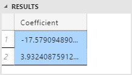

# Create a Predictive Model (R in T-SQL Tutorial)
In this step, you'll learn how to train a model using R, and then save the model to a table in SQL Server. You'll create a simple model that predicts the stopping distance of a car based on speed.

## Create the source data

First, create a table to save the training data. You'll use the `cars` dataset included with R, because it is small and easy to understand. Of course, you could read the `cars` data directly from R, but to demonstrate integration with SQL Server, let's save the data to a table first. 

```
CREATE TABLE CarSpeed ([speed] int not null, [distance] int not null)
INSERT INTO CarSpeed
EXEC sp_execute_external_script
        @language = N'R'
 	    , @script = N'car_speed <- cars;'
        , @input_data_1 = N''
        , @output_data_1_name = N'car_speed'
```
Note that we are not using temporary tables. Some R clients will disconnect sessions between batches, making it difficult to use temporary tables. 

> [!TIP]
> Many datasets, small and large, are included with the R runtime. To get a list of datasets installed with R,  type `library(help="datasets")` from an R command prompt.

## Create a regression model

The car speed data has two columns, both numeric, `dist` and`speed`, with multiple observations of some speeds. Assuming some linear relationship between car speed and the distance required to stop a car, you will create a linear regression model. 

The requirements of a linear model are simple:
+ Define a formula that describes the relationship between the dependent variable `speed` and the independent variable `distance`
+ Provide input data to use in training the model

> [!TIP]
> Need a refresher on linear models? 
>
> This ScaleR tutorial describes the process of fitting a linear models using rxLInMod: [Fitting Linear Models](https://msdn.microsoft.com/microsoft-r/scaler-user-guide-linear-model). 
> 
>  This article covers the concepts well: [R Tutorial Series: Creating a Linear Regression Model](https://www.r-bloggers.com/r-tutorial-series-simple-linear-regression/)

To actually build the model, you define the formula inside your R code, and pass the data as an input parameter.

```sql
DROP PROCEDURE IF EXISTS generate_linear_model;
GO
CREATE PROCEDURE generate_linear_model
AS
BEGIN
    EXEC sp_execute_external_script
    @language = N'R'
    , @script = N'lrmodel <- rxLinMod(formula = distance ~ speed, data = CarsData);
        trained_model <- data.frame(payload = as.raw(serialize(lrmodel, connection=NULL)));'
    , @input_data_1 = N'SELECT [speed], [distance] FROM CarSpeed'
    , @input_data_1_name = N'CarsData'
    , @output_data_1_name = N'trained_model'
    WITH RESULT SETS ((model varbinary(max)));
END;
GO
```
+ The first argument to rxLinMod is the *formula* parameter, which defines distance as dependent on speed.
+ The input data is stored in the variable `CarsData`, which is populated by the SQL query. If you don't assign a specific name to your input data, the default variable name would be _InputDataSet_.


## Create a table for storing the model

Now you'll store the model so you can retrain or use it for prediction. 

The output of an R package that creates a model is usually a **binary object**. Therefore, your table must contain a column of **varbinary** data.

```sql
CREATE TABLE stopping_distance_models (
	model_name varchar(30) not null default('default model') primary key,
	model varbinary(max) not null);
```

To save the model, run the following Transact-SQL statement to call the stored procedure, generate the model, and save it to a table.

```sql
INSERT INTO stopping_distance_models (model)
EXEC generate_linear_model;
```

Note that if you run this a second time, you'll get the error: "Violation of PRIMARY KEY constraint...Cannot insert duplicate key in object dbo.stopping_distance_models"

One way to get around this is to run an UPDATE statement to change the model name, and insert something descriptive about the model, such as the model type, the day you created it, etc.

```sql
UPDATE stopping_distance_models 
SET model_name = 'rxLinMod ' + format(getdate(), 'yyyy.MM.HH.mm', 'en-gb')
WHERE model_name = 'default model'
```


## Output additional variables

In SQL Server 2016, the output of R from the stored procedure [sp_execute_external_script](../../../relational-databases/system-stored-procedures/sp-execute-external-script-transact-sql.md) is limited to a single data frame. (This limitation might be removed in future.)   

However, you can return outputs of other types, such as scalars, in addition to the data frame. 

For example, suppose you want to train a model but immediately view a table of coefficients from the model. You could create the table of coefficients as the main result set, and output the trained model in a SQL variable, to either re-use or save to a table. 


```sql
DECLARE @model varbinary(max), @modelname varchar(30)
EXEC sp_execute_external_script
    @language = N'R'
    , @script = N'
        speedmodel <- rxLinMod(distance ~ speed, CarsData)
        modelbin <- serialize(speedmodel, NULL)
        OutputDataSet <- data.frame(coefficients(speedmodel));'
    , @input_data_1 = N'SELECT [speed], [distance] FROM CarSpeed'
    , @input_data_1_name = N'CarsData'
    , @params = N'@modelbin varbinary(max) OUTPUT'
    , @modelbin = @model OUTPUT
    WITH RESULT SETS (([Coefficient] float not null));

-- Save the generated model
INSERT INTO [dbo].[stopping_distance_models] (model_name, model)
VALUES (' latest model', @model)
```

**Results**




### Summary

Remember these rules for working with SQL parameters and R variables in sp_execute_external_script:

+ All SQL parameters mapped to R script must be listed by name in the _@params_ argument of sp_execute_external_script.
+ To output one of these parameters, add the OUTPUT keyword in the _@params_ list.
+ After listing the mapped parameters, provide the mapping, line by line, of SQL parameters to R variables, immediately after the _@params_ list.


## Next Step

Now that you have a model, in the final step, you'll learn how to generate predictions from it and plot the results.

[Predict and Plot from Model](../../../advanced-analytics/r-services/tutorials/predict-and-plot-from-model-r-in-t-sql-tutorial.md)

