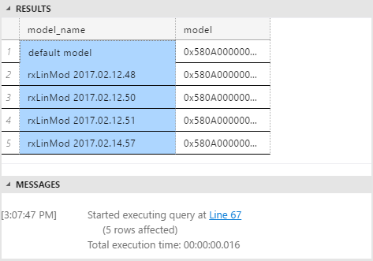
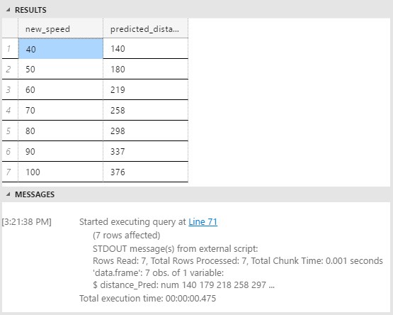
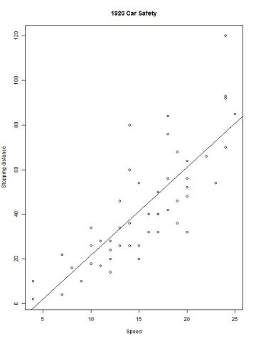

# Predict and Plot from Model (R in T-SQL Tutorial)
To score new data, you'll get one of the trained models from the table, and then call a new set of data on which to base predictions.


## Create the table of new speeds 

Did you notice that the original training data stops at a speed of 25 miles per hour? That's because the original data was based on an experiment from 1920! 

You might wonder, how long would it take an automobile from the 1920s to stop, assuming it could get going as fast as 60 mph or even 100 mph? To answer this question, you will provide some new speed values.

```sql
CREATE TABLE [dbo].[NewCarSpeed]([speed] [int] NOT NULL,
	[distance] [int]  NULL) ON [PRIMARY]
GO
INSERT [dbo].[NewCarSpeed] (speed)
VALUES (40),  (50),  (60), (70), (80), (90), (100)
```

## Predict stopping distance


By now, your table might contain multiple R models, all built using different parameters or algorithms, or trained on different subsets of data.  



To get predictions based on a specific model, you write SQL script that does the following:

1. Gets the model you want
2. Gets the new input data
3. Calls an R prediction function that is compatible with that model

In this example, because your model is based on the rxLinMod algorithm, you should call the rxPredict function rather than the generic R `predict`.

```sql
DECLARE @speedmodel varbinary(max) = (SELECT model FROM [dbo].[stopping_distance_models] WHERE model_name = 'default model');
EXEC sp_execute_external_script 
    @language = N'R'
    , @script = N'
            current_model <- unserialize(as.raw(speedmodel));
			new <- data.frame(NewCarData);
			predicted.distance <- rxPredict(current_model, new);
			str(predicted.distance);
            OutputDataSet <- cbind(new, ceiling(predicted.distance));
			'
    , @input_data_1 = N' SELECT speed FROM [dbo].[NewCarSpeed] '
    , @input_data_1_name = N'NewCarData'
    , @params = N'@speedmodel varbinary(max)'
    , @speedmodel = @speedmodel
WITH RESULT SETS (([new_speed] INT, [predicted_distance] INT))
```
**Notes**

+ Use a SELECT statement to get a single model from the table, and pass it as an input parameter.
+  After retrieving the model from the table, call the `unserialize` function on the model.
+  Apply the **rxPredict** function with appropriate arguments to the model, and provide the new input data.
+ While testing a new stored procedure, use the `str` function as needed to check the schema of data being returned from R. You can always remove the statement later.
+ If you want to return columns from the original dataset together with the prediction, concatenate in your R code, and then return the data frame to SQL Server. 
+ You can add column names to the output data frame as part of your R script, but here we just used the WITH RESULTS clause.

**Results**




## Perform scoring in parallel

The predictions came back fairly fast on this tiny data set. But suppose you needed to make lots of predictions very fast? There are many ways to speed up operations in SQL Server, more so if the operations are parallelizable. For scoring in particular, one easy way is to add the *@parallel* parameter to `sp_execute_external_script` and set the value to **1**. 

> [!NOTE] 
> Parallel execution provides benefits only when working with very large data. Moreover, the SQL query that gets your data must be capable of generating a parallel query plan.

Let's assume that you have obtained a much bigger table of possible car speeds, including hundreds of thousands of values. There are many sample T-SQL scripts from the community to help you generate number tables, so we won't reproduce those here. Let's just say that you have a column containing many integers, and want to use that as input for `speed` in the model.

To do this, just run the same prediction query, but substitute the larger dataset, and add the _@parallel = 1_ parameter.

```sql
DECLARE @speedmodel varbinary(max) = (select model from [dbo].[stopping_distance_models] where model_name = 'default model');
EXEC sp_execute_external_script 
    @language = N'R'
    , @script = N'
            current_model <- unserialize(as.raw(speedmodel));
			new <- data.frame(NewCarData);
			predicted.distance <- rxPredict(current_model, new);
            OutputDataSet <- cbind(new, ceiling(predicted.distance));
			'
    , @input_data_1 = N' SELECT [speed] FROM [dbo].[HugeTableofCarSpeeds] '
    , @input_data_1_name = N'NewCarData'
    , @parallel = 1
    , @params = N'@speedmodel varbinary(max)'
    , @speedmodel = @speedmodel
WITH RESULT SETS (([new_speed] INT, [predicted_distance] INT))
```

**Notes**

+ When using the option for parallel execution, you **must** specify the output results schema in advance, by using the WITH RESULT SETS clause. providing the output schema in advance allows SQL Server to aggregate the results of multiple parallel datasets, which otherwise might have unknown schemas.    
    
+ If you are training a model, however, this parameter often won't have an equivalent effect. The reason is that model creation often requires that all the rows be read before summaries can be created. 

+ To create a model using parallel processing, we recommend that you build your model using one of the **ScaleR** packages. These packages are designed to distribute processing automatically, even if you can't specify *@parallel =1* in the call to sp_execute_external_script.  

> [!NOTE]
> These examples are not intended to be canonical examples or represent best practices; rather, they  are as simple as possible and can include redundant variables and copies of data, to illustrate the interaction of T-SQL and  R. For guidance on how to get the best performance with ScaleR, see [ScaleR Distributed Computing](https://msdn.microsoft.com/microsoft-r/scaler-distributed-computing).
    
## Create an R plot of the model

SQL Server Management Studio cannot directly display plots created using [sp_execute_external_script](../../../relational-databases/reference/system-stored-procedures/sp-execute-external-script-transact-sql.md). Instead, the general process for generating R plots in R Services is to create the plot as part of your R code and then write the image to a file. You can also return the serialized binary plot object to an application, such as Reporting Services, that can display images.

This example demonstrates how to create a simple graphic using a plotting function included by default with R. The image is output to the specified file, and is also output into a SQL variable by the stored procedure.

```sql
 EXECUTE sp_execute_external_script  
 @language = N'R'
 , @script = N' 
     imageDir <- ''C:\\temp\\plots'';
     image_filename = tempfile(pattern = "plot_", tmpdir = imageDir, fileext = ".jpg")  
     print(image_filename); 
     jpeg(filename=image_filename,  width=600, height = 800);  
     print(plot(distance~speed, data=InputDataSet, xlab="Speed", ylab="Stopping distance", main = "1920 Car Safety"));
     abline(lm(distance~speed, data = InputDataSet)); 
     dev.off();
     OutputDataSet <- data.frame(data=readBin(file(image_filename, "rb"), what=raw(), n=1e6));
     '
  , @input_data_1 = N'SELECT speed, distance from [dbo].[CarSpeed]'
  WITH RESULT SETS ((plot varbinary(max)));
```

**Notes**

+ The `tempfile` function returns a string that can be used as a file name, but the file is not actually generated yet. For arguments, you can specify a prefix and file extension, as well as a tmpdir. To verify the file name and path, it is printed as a message using `str()`.
+ The `jpeg` function creates an R device with the specified parameters.
+ After you have created the plot, you can add more visual features to it. In this case, a regression line was added using `abline`.
+ You must always close the graphics device using the `dev.off()` function.
+ The `readBin` function takes a file to read, a format specification, and the number of records. The **rb** keyword indicates that the file is binary rather than containing text.

**Results**



We recommend these articles, which provide examples of how to create more complex graphics using the popular **ggplot2** package.

+ [Loan Classification using SQL Server 2016 R Services](https://blogs.msdn.microsoft.com/microsoftrservertigerteam/2016/09/27/loan-classification-using-sql-server-2016-r-services/): End-to-end scenario based on insurance data. Also requires **reshape**.
+ [Create Graphs and Plots Using R](https://msdn.microsoft.com/library/mt629162.aspx): Lesson 2 in an end-to-end solution, based on the NYC taxi data.


## Conclusion

Integration of R with SQL Server makes it easier to deploy R solutions at scale, leveraging the best features of R and RDBMS, for high-performance data handling and R analytics. 

To continue learning about solutions using R with SQL Server, see the tutorials and end-to-end scenarios created by the Microsoft Data Science team and R Services development teams: 

+  [SQL Server R Services tutorials](../../../advanced-analytics/r-services/tutorials/sql-server-r-services-tutorials.md)

For guidance on using the new RevoScaleR packages, see these resources for [Microsoft R](https://msdn.microsoft.com/microsoft-r/microsoft-r-getting-started):

+ [Explore R and ScaleR in 25 functions](https://msdn.microsoft.com/microsoft-r/microsoft-r-getting-started-tutorial)
+ [Fitting Linear Models](https://msdn.microsoft.com/microsoft-r/scaler-user-guide-linear-model)
+ [Models in RevoScaleR](https://msdn.microsoft.com/microsoft-r/scaler-user-guide-models)
    
    
    


