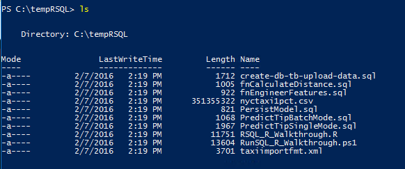

# Step 1: Download the Sample Data (In-Database Advanced Analytics Tutorial)
In this step, you'll download the sample dataset and the [!INCLUDE[tsql](../../../a9notintoc/includes/tsql-md.md)] script files that are used in this walkthrough. Both the data and the script files are shared on Github, but the PowerShell script will download the data and script files to a local directory of your choosing.  
  
## Download the Data and Scripts  
  
1.  Open a Windows PowerShell command console.  
  
    Use the option, **Run as Administrator**, if administrative privileges are needed  to create the destination directory or to write files to the specified destination.  
  
2.  Run the following PowerShell commands, changing the value of the parameter *DestDir* to any local directory.  The default we've used here is **TempRSQL**.  
  
    ```  
    $source = ‘https://raw.githubusercontent.com/Azure/Azure-MachineLearning-DataScience/master/Misc/RSQL/Download_Scripts_SQL_Walkthrough.ps1’  
    $ps1_dest = “$pwd\Download_Scripts_SQL_Walkthrough.ps1”  
    $wc = New-Object System.Net.WebClient  
    $wc.DownloadFile($source, $ps1_dest)  
    .\Download_Scripts_SQL_Walkthrough.ps1 –DestDir ‘C:\tempRSQL’  
  
    ```  
  
    If the folder you specify in *DestDir* does not exist, it will be created by the PowerShell script.  
  
    > [!TIP]  
    > If you get an error, you can temporarily set the policy for  execution of PowerShell scripts to **unrestricted** only for this walkthrough, by using the Bypass argument and scoping the changes to the current session.  
    >   
    >````  
    > Set\-ExecutionPolicy Bypass \-Scope Process  
    >````   
    > Running this command does not result in a configuration change.  
  
    Depending on your Internet connection, the download might take a while.  
  
3.  When all files have been downloaded, the PowerShell script opens to the folder specified by  *DestDir*. In the PowerShell command prompt, run the following command and review the files that have been downloaded.  
  
    ```  
    ls  
    ```  
  
    **Results:**  
  
      
  
## Next Step  
[Step 2: Import Data to SQL Server using PowerShell](../../../advanced-analytics/r-services/tutorials/step-2-import-data-to-sql-server-using-powershell.md)  
  
## Previous Step  
[In-Database Advanced Analytics for SQL Developers &#40;Tutorial&#41;](../../../advanced-analytics/r-services/tutorials/in-database-advanced-analytics-for-sql-developers-tutorial.md)  
  
## See Also  
[SQL Server R Services Tutorials](../../../advanced-analytics/r-services/tutorials/sql-server-r-services-tutorials.md)  
  
  
  
