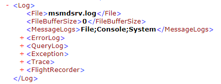
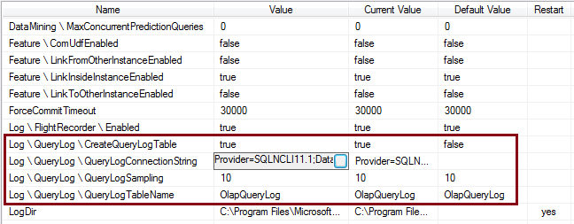

# Log operations in Analysis Services
  An Analysis Services instance will log server notifications, errors, and warnings to the msmdsrv.log file – one for each instance you install. Administrators refer to this log for insights into routine and extraordinary events alike. In recent releases, logging has been enhanced to include more information. Log records now include product version and edition information, as well as processor, memory, connectivity, and blocking events. You can review the entire change list at [Logging improvements](http://support.microsoft.com/kb/2965035).  
  
 Besides the built-in logging feature, many administrators and developers also use tools provided by the Analysis Services community to collect data about server operations, such as **ASTrace**. See [Microsoft SQL Server Community Samples: Analysis Services](https://sqlsrvanalysissrvcs.codeplex.com/) for the download links.  
  
 This topic contains the following sections:  
  
-   [Location and types of logs](#bkmk_location)  
  
-   [General information on log file configuration settings](#bkmk_general)  
  
-   [MSMDSRV service log file](#bkmk_msmdsrv)  
  
-   [Query logs](#bkmk_querylog)  
  
-   [Mini dump (.mdmp) files](#bkmk_mdmp)  
  
-   [Tips and best practices](#bkmk_tips)  
  
> [!NOTE]  
>  If you're looking for information about logging, you might also be interested in tracing operations that show processing and query execution paths. Trace objects for ad hoc and sustained tracing (such as auditing cube access) ─ as well as recommendations on how to best use Flight Recorder, SQL Server Profiler, and xEvents ─ can be found through the links on this page: [Monitor an Analysis Services Instance](../../analysis-services/instances/monitor-an-analysis-services-instance.md).  
  
##  <a name="bkmk_location"></a> Location and types of logs  
 Analysis Services provides the logs described below.  
  
|File name or Location|Type|Used for|On by default|  
|---------------------------|----------|--------------|-------------------|  
|Msmdsrv.log|Error log|Routine monitoring and basic troubleshooting|Yes|  
|OlapQueryLog table in a relational database|Query log|Collect inputs for the Usage Optimization Wizard|No|  
|SQLDmp\<guid>.mdmp files|Crashes and exceptions|Deep troubleshooting|No|  
  
 We highly recommend the following link for additional information resources not covered in this topic: [Initial data collection tips from Microsoft Support](http://blogs.msdn.com/b/as_emea/archive/2012/01/02/initial-data-collection-for-troubleshooting-analysis-services-issues.aspx).  
  
##  <a name="bkmk_general"></a> General information on log file configuration settings  
 You can find sections for each log in the msmdsrv.ini server configuration file, located in the \Program Files\Microsoft SQL Server\MSAS13.MSSQLSERVER\OLAP\Config folder. See [Server Properties in Analysis Services](../../analysis-services/server-properties/server-properties-in-analysis-services.md) for instructions on editing the file.  
  
 Where possible, we suggest that you set logging properties in the server properties page of Management Studio. Although in some cases, you must edit the msmdsrv.ini file directly to configure settings that are not visible in the administrative tools.  
  
   
  
##  <a name="bkmk_msmdsrv"></a> MSMDSRV service log file  
 Analysis Services logs server operations to the msmdsrv.log file, one per instance, located at \program files\Microsoft SQL Server\\<instance\>\Olap\Log.  
  
 This log file is emptied at each service restart. In previous releases, administrators would sometimes restart the service for the sole purpose of flushing the log file before it could grow so large as to become unusable. This is no longer necessary. Configuration settings, introduced in SQL Server 2012 SP2 and later, give you control over the size of the log file and its history:  
  
-   **MaxFileSizeMB** specifies a maximum log file size in megabytes. The default is 256. A valid replacement value must be a positive integer. When **MaxFileSizeMB** is reached, Analysis Services renames the current file as msmdsrv{current timestamp}.log file, and starts a new msmdsrv.log file.  
  
-   **MaxNumberFiles** specifies retention of older log files. The default is 0 (disabled). You can change it to a positive integer to keep versions of the log file. When **MaxNumberFiles** is reached, Analysis Services deletes the file with the oldest timestamp in its name.  
  
 To use these settings, do the following:  
  
1.  Open msmdsrv.ini in NotePad.  
  
2.  Copy the following two lines:  
  
    ```  
    <MaxFileSizeMB>256</MaxFileSizeMB>  
    <MaxNumberOfLogFiles>5</MaxNumberOfLogFiles>  
    ```  
  
3.  Paste the two lines into the Log section of msmdsrv.ini, below the filename for msmdsrv.log. Both settings must be added manually. There are no placeholders for them in the msmdsrv.ini file.  
  
     The changed configuration file should look like the following:  
  
    ```  
    <Log>  
    <File>msmdsrv.log</File>  
    <MaxFileSizeMB>256</MaxFileSizeMB>  
    <MaxNumberOfLogFiles>5</MaxNumberOfLogFiles>  
    <FileBufferSize>0</FileBufferSize>  
  
    ```  
  
4.  Edit the values if those provided differ from what you want.  
  
5.  Save the file.  
  
6.  Restart the service.  
  
##  <a name="bkmk_querylog"></a> Query logs  
 The query log is a bit of a misnomer in that it does not log the MDX or DAX query activity of your users. Instead, it collects data about queries generated by Analysis Services, which is subsequently used as data input in the Usage Based Optimization Wizard. The data collected in the query log is not intended for direct analysis. Specifically, the datasets are described in bit arrays, with a zero or a one indicating the parts of dataset is included in the query. Again, this data is meant for the wizard.  
  
 For query monitoring and troubleshooting, many developers and administrators use a community tool, **ASTrace**, to monitor queries. You can also use SQL Server Profiler, xEvents, or an Analysis Services trace. See [Monitor an Analysis Services Instance](../../analysis-services/instances/monitor-an-analysis-services-instance.md) for tracing-related links.  
  
 When should you use the query log? We recommend enabling the query log as part of a query performance tuning exercise that includes the Usage Based Optimization Wizard. The query log does not exist until you enable the feature, create the data structures to support it, and set properties used by Analysis Services to locate and populate the log.  
  
 To enable the query log, follow these steps:  
  
1.  Create a SQL Server relational database to store the query log.  
  
2.  Grant the Analysis Services service account sufficient permissions on the database. The account needs permission to create a table, write to the table, and read from the table.  
  
3.  In SQL Server Management Studio, right-click **Analysis Services** | **Properties** | **General**, set **CreateQueryLogTable** to true.  
  
4.  Optionally, change **QueryLogSampling** or **QueryLogTableName** if you want to sample queries at a different rate, or use a different name for the table.  
  
 The query log table will not be created until you have run enough MDX queries to meet the sampling requirements. For example, if you keep the default value of 10, you must run at least 10 queries before the table will be created.  
  
 Query log settings are server wide. The settings you specify will be used by all databases running on this server.  
  
   
  
 After the configuration settings are specified, run an MDX query multiple times. If sampling is set to 10, run the query 11 times.Verify the table is created. In Management Studio, connect to the relational database engine, open the database folder, open the **Tables** folder, and verify that **OlapQueryLog** exists. If you do not immediately see the table, refresh the folder to pick up any changes to its contents.  
  
 Allow the query log to accumulate sufficient data for the Usage Based Optimization Wizard. If query volumes are cyclical, capture enough traffic to have a representative set of data. See [Usage Based Optimization Wizard](https://msdn.microsoft.com/library/ms189706.aspx) for instructions on how to run the wizard.  
  
 See [Configuring the Analysis Services Query Log](http://technet.microsoft.com/library/Cc917676) to learn more about query log configuration. Although the paper is quite old, query log configuration has not changed in recent releases and the information it contains still applies.  
  
##  <a name="bkmk_mdmp"></a> Mini dump (.mdmp) files  
 Dump files capture data used for analyzing extraordinary events. Analysis Services automatically generates mini dumps (.mdmp) in response to a server crash, exception, and some configuration errors. The feature is enabled, but does not send crash reports automatically.  
  
 Crash reports are configured through the Exception section in the Msmdsrv.ini file. These settings control memory dump file generation. The following snippet shows the default values:  
  
```  
<Exception>  
<CreateAndSendCrashReports>1</CreateAndSendCrashReports>  
<CrashReportsFolder/>  
<SQLDumperFlagsOn>0x0</SQLDumperFlagsOn>  
<SQLDumperFlagsOff>0x0</SQLDumperFlagsOff>  
<MiniDumpFlagsOn>0x0</MiniDumpFlagsOn>  
<MiniDumpFlagsOff>0x0</MiniDumpFlagsOff>  
<MinidumpErrorList>0xC1000000, 0xC1000001, 0xC102003F, 0xC1360054, 0xC1360055</MinidumpErrorList>  
<ExceptionHandlingMode>0</ExceptionHandlingMode>  
<CriticalErrorHandling>1</CriticalErrorHandling>  
<MaxExceptions>500</MaxExceptions>  
<MaxDuplicateDumps>1</MaxDuplicateDumps>  
</Exception>  
```  
  
 **Configure Crash Reports**  
  
 Unless otherwise directed by Microsoft Support, most administrators use the default settings. This older KB article is still used to provide instruction on how to configure dump files: [How to configure Analysis Services to generate memory dump files](http://support.microsoft.com/kb/919711).  
  
 The configuration setting most likely to be modified is the **CreateAndSendCrashReports** setting used to determine whether a memory dump file will be generated.  
  
|Value|Description|  
|-----------|-----------------|  
|0|Turns off the memory dump file. All other settings under the Exception section are ignored.|  
|1|(Default) Enables, but does not send, the memory dump file.|  
|2|Enables and automatically sends an error report to Microsoft.|  
  
 **CrashReportsFolder** is the location of the dump files. By default, an .mdmp file and associated log records can be found in the \Olap\Log folder.  
  
 **SQLDumperFlagsOn** is used to generate a full dump. By default, full dumps are not enabled. You can set this property to **0x34**.  
  
 The following links provide more background:  
  
-   [Looking Deeper into SQL Server using Minidumps](http://blogs.msdn.com/b/sqlcat/archive/2009/09/11/looking-deeper-into-sql-server-using-minidumps.aspx)  
  
-   [How to create a user mode dump file](http://support.microsoft.com/kb/931673)  
  
-   [How to use the Sqldumper.exe utility to generate a dump file in SQL Server](http://support.microsoft.com/kb/917825)  
  
##  <a name="bkmk_tips"></a> Tips and best practices  
 This section is a recap of the tips mentioned throughout this article.  
  
-   Configure the msmdsrv.log file to control the size and number of msmdsrv log file. The settings are not enabled by default, so be sure to add them as post-installation step. See [MSMDSRV service log file](#bkmk_msmdsrv) in this topic.  
  
-   Review this blog post from Microsoft Customer Support to learn what resources they use to get information about server operations: [Initial Data Collection](http://blogs.msdn.com/b/as_emea/archive/2012/01/02/initial-data-collection-for-troubleshooting-analysis-services-issues.aspx)  
  
-   Use ASTrace2012, rather than a query log, to find out who is querying cubes. The query log is typically used to provide input into the Usage Based Optimization Wizard, and the data it captures is not easy to read or interpret. ASTrace2012 is a community tool, widely used, that captures query operations. See [Microsoft SQL Server Community Samples: Analysis Services](https://sqlsrvanalysissrvcs.codeplex.com/).  
  
## See Also  
 [Analysis Services Instance Management](../../analysis-services/instances/analysis-services-instance-management.md)   
 [Introduction to Monitoring Analysis Services with SQL Server Profiler](../../analysis-services/instances/introduction-to-monitoring-analysis-services-with-sql-server-profiler.md)   
 [Server Properties in Analysis Services](../../analysis-services/server-properties/server-properties-in-analysis-services.md)  
  
  