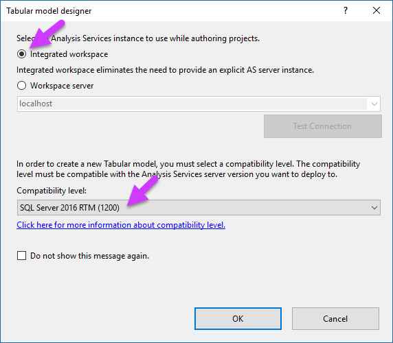

# Lesson 1: Create a New Tabular Model Project
In this lesson, you will create a new, blank tabular model project in [!INCLUDE[ssBIDevStudioFull](../../a9notintoc/includes/ssbidevstudiofull-md.md)]. Once your new project is created, you can begin adding data by using the Table Import Wizard. This lesson also gives you a brief introduction to the tabular model authoring environment in SSDT.  
  
Estimated time to complete this lesson: **10 minutes**  
  
## Prerequisites  
This topic is the first lesson in a tabular model authoring tutorial. To complete this lesson, you must have the AdventureWorksDW sample database installed on a SQL Server instance. To learn more, see [Tabular Modeling &#40;Adventure Works Tutorial&#41;](../../analysis-services/tutorials/tabular-modeling-adventure-works-tutorial.md).  
  
## Create a new tabular model project  
  
#### To create a new tabular model project  
  
1.  In [!INCLUDE[ssBIDevStudio](../../a9notintoc/includes/ssbidevstudio-md.md)], on the **File** menu, click **New**, and then click **Project**.  
  
2.  In the **New Project** dialog box, expand **Installed** > **Business Intelligence** > **Analysis Services**, and then click **Analysis Services Tabular Project**.  
  
3.  In  **Name**, type **AW Internet Sales Tabular Model**, and then specify a location for the project files.  
  
    By default, **Solution Name** will be the same as the project name; however, you can type a different solution name.  
  
4.  Click **OK**.  
  
5.  In the **Tabular model designer** dialog box, select **Integrated workspace**.  
  
    The workspace will host a tabular model database with the same name as the project during model authoring. Integrated workspace means SSDT will use a built-in instance, eliminating the need to install a separate Analysis Services server instance just for model authoring. To learn more, see [Workspace Database](../../analysis-services/tabular-models/workspace-database-ssas-tabular.md).
      
6.  In **Compatibility level**, verify **SQL Server 2016 (1200)** is selected, and then click **OK**.   
 
    
      
    If you don’t see SQL Server 2016 RTM (1200) in the Compatibility level listbox, you’re not using the latest version of SQL Server Data Tools. To get the latest version, see [Install SQL Server Data tools](https://msdn.microsoft.com/hh500335(v=vs.103).aspx).   
      
    Selecting an earlier compatibility level is only recommended if you intend on deploying your completed tabular model to a different Analysis Services instance running an earlier version of SQL Server. Integrated workspace is not supported for earlier compatibility levels. To learn more see, [Compatibility level](../../analysis-services/tabular-models/compatibility-level-for-tabular-models-in-analysis-services.md).   
  
## Understanding the SSDT tabular model authoring environment  
Now that you’ve created a new tabular model project, let’s take a moment to explore the tabular model authoring environment in SSDT.  
  
After your project is created, it opens in SSDT. In **Tabular Model Explorer**, you'll see a tree view of the objects in your model. Since you haven't yet imported data, the folders will be empty. You can right-click an object folder to perform actions, similar you to the menu bar. As you step through this tutorial, you'll use the Tabular Model Explorer to navigate different objects in your project.

Click on the **Solution Explorer** tab, then click **AW Internet Sales Tabular Model**. Notice in the **Properties** window, in **Project File**, you will see **AW Internet Sales Tabular Model.smproj**. This is the project file name, and in **Project Folder**, you will see the project file location. In Solution Explorer, you'll see your **Model.bim** file. If you don’t see the designer (the empty window with the Model.bim tab), in **Solution Explorer**, under **AW Internet Sales Tabular Model**, double click the **Model.bim** file.  
  
In **Solution Explorer**, right-click the **AW Internet Sales Tabular Model** project, and then click **Properties**. The **AW Internet Sales Tabular Model Property Pages** dialog box appears. These are the advanced project properties. You will set some of these properties later when you are ready to deploy your model.  
  
Now, let’s look at the model properties. In **Solution Explorer**, click **Model.bim**. In the **Properties** window, you'll now see the model properties, most important of which is the **DirectQuery Mode** property. This property specifies whether or not the model is deployed in In-Memory mode (Off) or DirectQuery mode (On). For this tutorial, you will author and deploy your model in In-Memory mode.  
  
When you create a new model, certain model properties are set automatically according to the Data Modeling settings that can be specified in the Tools > Options dialog box. Data Backup, Workspace Retention, and Workspace Server properties specify how and where the workspace database (your model authoring database) is backed up, retained in-memory, and built. You can change these settings later if necessary, but for now, just leave these properties as they are.  
  
When you installed SSDT, several new menu items were added to the Visual Studio environment. Let’s look at the new menu items that are specific to authoring tabular models. Click on the **Model** menu. From here, you can launch the Table Import Wizard, view and edit existing connections, refresh workspace data, browse your model in [!INCLUDE[msCoName](../../a9notintoc/includes/msconame-md.md)] Excel with the Analyze in Excel feature, create perspectives and roles, select the model view, and set calculation options.  
  
Click on the **Table** menu. Here, you can create and manage relationships between tables, create and manage, specify date table settings, create partitions, and edit table properties.  
  
Click on the **Column** menu. Here, you can add and delete columns in a table, freeze columns, and specify sort order. You can also use the AutoSum feature to create a standard aggregation measure for a selected column. Other toolbar buttons provide quick access to frequently used features and commands.  
  
Explore some of the dialogs and locations for various features specific to authoring tabular models. While some items will not yet be active, you can get a good idea of the tabular model authoring environment.  

## Additional resources
To learn more about the different types of tabular model projects, see [Tabular Model Projects &#40;SSAS Tabular&#41;](../../analysis-services/tabular-models/tabular-model-projects-ssas-tabular.md). To learn more about the tabular model authoring environment, see [Tabular Model Designer &#40;SSAS&#41;](../../analysis-services/tabular-models/tabular-model-designer-ssas.md).  
  
## Next Steps  
To continue this tutorial, go to the next lesson: [Add data](../../analysis-services/tutorials/lesson-2-add-data.md)
  
  
  
