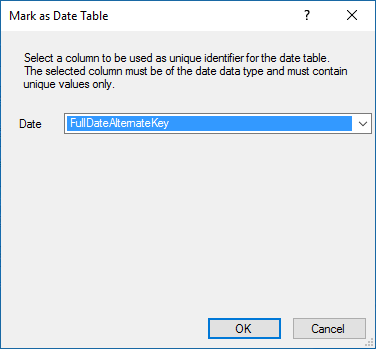

# Lesson 3: Mark as Date Table
In Lesson 2: Add Data, you imported a dimension table named DimDate. While in your model this table is named DimDate, it can also be known as a *Date table*, in that it contains date and time data.  
  
Whenever you use DAX time-intelligence functions in calculations, as you'll do when you create measures a little later, you must specify date table properties, which include a *Date table* and a unique identifier *Date column* in that table.
  
In this lesson, you'll mark the DimDate table as the *Date table* and the FullDateAlternateKey column (in the Date table) as the *Date column* (unique identifier).  
  
Estimated time to complete this lesson: **3 minutes**  
  
## Prerequisites  
This topic is part of a tabular modeling tutorial, which should be completed in order. Before performing the tasks in this lesson, you should have completed the previous lesson: [Add Data](../../analysis-services/tutorials/lesson-2-add-data.md).  
  
### To set Mark as Date Table  
  
1.  In the model designer, click the **Date** table (tab).  
  
2.  Select the **Date** column, and then in the **Properties** window, under **Data Type**, make sure  **Date** is selected.  
  
3.  Click the **Table** menu, then click **Date**, and then click **Mark as Date Table**.  
  
4.  In the **Mark as Date Table** dialog box, in the **Date** listbox, select the **Date** column as the unique identifier.  

    
  
## Next Steps  
To continue this tutorial, go to the next lesson: [Lesson 4: Create Relationships](../../analysis-services/tutorials/lesson-4-create-relationships.md).  
  
  
  
