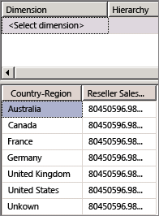
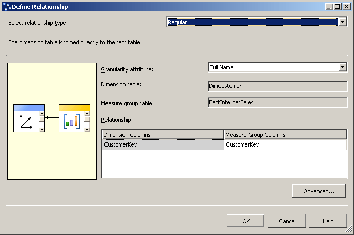
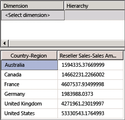

# Lesson 5-1 - Defining a Referenced Relationship
Up to this point in the tutorial, each cube dimension that you defined was based on a table that was directly linked to the fact table for a measure group by a primary key to foreign key relationship. In the tasks in this topic, you link the **Geography** dimension to the fact table for reseller sales through the **Reseller** dimension, which is called a *reference dimension*. This enables users to dimension reseller sales by geography. For more information, see [Define a Referenced Relationship and Referenced Relationship Properties](../../analysis-services/multidimensional-models/define-a-referenced-relationship-and-referenced-relationship-properties.md).  
  
## Dimensioning Reseller Sales by Geography  
  
1.  In Solution Explorer, right-click **Analysis Services Tutorial** in the **Cubes** folder, and then click **Browse**.  
  
2.  Remove all hierarchies from the data pane, and then verify that the **Reseller Sales-Sales Amount** measure appears in the data area of the data pane. Add it to the data pane if it is not already there.  
  
3.  From the **Geography** dimension in the metadata pane, drag the **Geographies** user-defined hierarchy to the **Drop Row Fields Here** area of the data pane.  
  
    Notice that the **Reseller Sales-Sales Amount** measure is not correctly dimensioned by the **Country-Region** attribute members in the **Regions** hierarchy. The value for **Reseller Sales-Sales Amount** repeats for each **Country-Region** attribute member.  
  
      
  
4.  Open Data Source View Designer for the **Adventure Works DW 2012** data source view.  
  
5.  In the **Diagram Organizer** pane, view the relationship between the **Geography** table and the **ResellerSales** table.  
  
    Notice that there is no direct link between these tables. However, there is an indirect link between these tables through either the **Reseller** table or the **SalesTerritory** table.  
  
6.  Double-click the arrow that represents the relationship between the **Geography** table and the **Reseller** table.  
  
    In the **Edit Relationship** dialog box, notice that the **GeographyKey** column is the primary key in the **Geography** table and the foreign key in the **Reseller** table.  
  
7.  Click **Cancel**, switch to Cube Designer for the [!INCLUDE[ssASnoversion](../../analysis-services/includes/ssasnoversion-md.md)] Tutorial cube, and then click the **Dimension Usage** tab.  
  
    Notice that the **Geography** cube dimension does not currently have a relationship with either the **Internet Sales** measure group or the **Reseller Sales** measure group.  
  
8.  Click the ellipsis button (**…**) in the **Full Name** cell at the intersection of the **Customer** dimension and the **Internet Sales** measure group.  
  
    In the **Define Relationship** dialog box, notice that a **Regular** relationship is defined between the **DimCustomer** dimension table and the **FactInternetSales** measure group table based on the **CustomerKey** column in each of these tables. All the relationships that you have defined within this tutorial up to this point have been regular relationships.  
  
    The following image shows the **Define Relationship** dialog box with a regular relationship between the **DimCustomer** dimension table and the **FactInternetSales** measure group table.  
  
      
  
9. Click **Cancel**.  
  
10. Click the ellipsis button (**…**) in the unnamed cell at the intersection of the **Geography** dimension and the **Reseller Sales** measure group.  
  
    In the **Define Relationship** dialog box, notice that no relationship is currently defined between the Geography cube dimension and the Reseller Sales measure group. You cannot define a regular relationship because there is no direct relationship between the dimension table for the Geography dimension and the fact table for the Reseller Sales measure group.  
  
11. In the **Select relationship type** list, select **Referenced**.  
  
    You define a referenced relationship by specifying a dimension that is directly connected to the measure group table, called an *intermediate dimension*, that [!INCLUDE[ssASnoversion](../../analysis-services/includes/ssasnoversion-md.md)] can use to link the reference dimension to the fact table. You then specify the attribute that links the reference dimension to the intermediate dimension.  
  
12. In the **Intermediate dimension** list, select **Reseller**.  
  
    The underlying table for the Geography dimension is linked to the fact table through the underlying table for the Reseller dimension.  
  
13. In the **Reference dimension attribute** list, select **Geography Key**, and then try to select **Geography Key** in the **Intermediate dimension attribute** list.  
  
    Notice that **Geography Key** does not appear in the **Intermediate dimension attribute** list. This is because the **GeographyKey** column is not defined as an attribute in the **Reseller** dimension.  
  
14. Click **Cancel**.  
  
In the next task, you will solve this problem by defining an attribute that is based on the GeographyKey column in the Reseller dimension.  
  
## Defining the Intermediate Dimension Attribute and the Referenced Dimension Relationship  
  
1.  Open Dimension Designer for the **Reseller** dimension, and view the columns in the **Reseller** table in the **Data Source View** pane, and view the defined attributes in the **Reseller** dimension in the **Attributes** pane.  
  
    Notice that although GeographyKey is defined as a column in the Reseller table, no dimension attribute is defined in the Reseller dimension based on this column. Geography is defined as a dimension attribute in the Geography dimension because it is the key column that links the underlying table for that dimension to the fact table.  
  
2.  To add a **Geography Key** attribute to the **Reseller** dimension, right-click **GeographyKey** in the **Data Source View** pane, and then click **New Attribute from Column**.  
  
3.  In the **Attributes** pane, select **Geography Key**, and then, in the Properties window, set the **AttributeHierarchyOptimizedState** property to **NotOptimized**, the **AttributeHierarchyOrdered** property to **False**, and the **AttributeHierarchyVisible** property to **False.**  
  
    The Geography Key attribute in the Reseller dimension will only be used to link the Geography dimension to the Reseller Sales fact table. Because it will not be used for browsing, there is no value in defining this attribute hierarchy as visible. Additionally, ordering and optimizing the attribute hierarchy will only negatively affect processing performance. However, the attribute must be enabled to serve as the link between the two dimensions.  
  
4.  Switch to Cube Designer for the [!INCLUDE[ssASnoversion](../../analysis-services/includes/ssasnoversion-md.md)] Tutorial cube, click the **Dimension Usage** tab, and then click the ellipsis button (**…**) at the intersection of the **Reseller Sales** measure group and the **Geography** cube dimension.  
  
5.  In the **Select relationship type** list, select **Referenced**.  
  
6.  In the **Intermediate dimension** list, select **Reseller**.  
  
7.  In the **Reference dimension attribute** list, select **Geography Key**, and then select **Geography Key** in the **Intermediate dimension attribute** list.  
  
    Notice that the **Materialize** check box is selected. This is the default setting for MOLAP dimensions. Materializing the dimension attribute link causes the value of the link between the fact table and the reference dimension for each row to be materialized, or stored, in the dimension's MOLAP structure during processing. This will have a minor effect on processing performance and storage requirements, but will increase query performance (sometimes significantly).  
  
8.  Click **OK**.  
  
    Notice that the **Geography** cube dimension is now linked to the **Reseller Sales** measure group. The icon indicates that the relationship is a referenced dimension relationship.  
  
9. In the **Dimensions** list on the **Dimension Usage** tab, right-click **Geography**, and then click **Rename**.  
  
10. Change the name of this cube dimension to **Reseller Geography**.  
  
    Because this cube dimension is now linked to the **Reseller Sales** measure group, users will benefit from explicitly defining its use in the cube, to avoid possible user confusion.  
  
## Successfully Dimensioning Reseller Sales by Geography  
  
1.  On the **Build** menu, click **Deploy Analysis Services Tutorial**.  
  
2.  When deployment has successfully completed, click the **Browser** tab in Cube Designer for the [!INCLUDE[ssASnoversion](../../analysis-services/includes/ssasnoversion-md.md)] Tutorial cube, and then click the **Reconnect** button.  
  
3.  In the metadata pane, expand **Reseller Geography**, right-click **Geographies**, and then click **Add to Row Area**.  
  
    Notice that the **Reseller Sales-Sales Amount** measure is now correctly dimensioned by the **Country-Region** attribute of the **Geographies** user-defined hierarchy, as shown in the following image.  
  
      
  
## Next Task in Lesson  
[Defining a Fact Relationship](../Topic/Defining%20a%20Fact%20Relationship.md)  
  
## See Also  
[Attribute Relationships](../../analysis-services/multidimensional-models-olap-logical-dimension-objects/attribute-relationships.md)  
[Define a Referenced Relationship and Referenced Relationship Properties](../../analysis-services/multidimensional-models/define-a-referenced-relationship-and-referenced-relationship-properties.md)  
  
  
  
