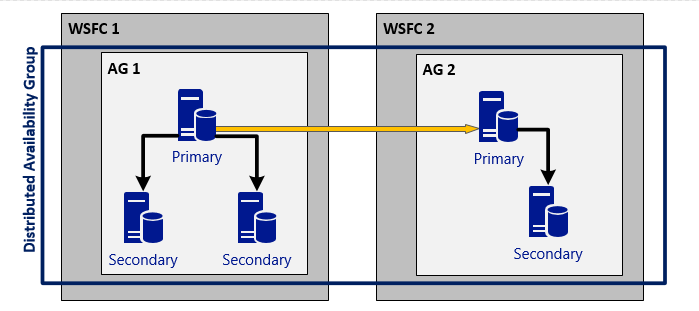
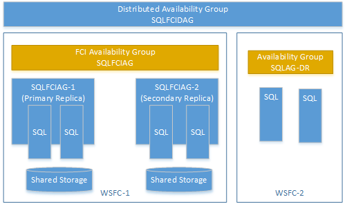

# Distributed Availability Groups (Always On Availability Groups)
[!INCLUDE[tsql-appliesto-ss2016-xxxx-xxxx-xxx_md](../../../database-engine/includes/tsql-appliesto-ss2016-xxxx-xxxx-xxx-md.md)]

  Distributed Availability Groups enable you to associate two availability groups residing on different Windows Server Failover Clusters (WSFC). One of the main uses of Distributed Availability Groups is for disaster recovery where the primary site is geographically dispersed from the DR site. You want the data to continually replicate to the DR site, but you don't want a potential network problem or issue at the DR site to bring down your primary site.  
  
 The following diagram illustrates the architecture of a distributed availability group.  
  
   
  
 In the previous diagram, there are two separate Windows Server Failover Clusters (WFSC 1 and WFSC 2). Each cluster has its own availability group with matching configuration of databases. A distributed availability group can be thought of as an “availability group of availability groups”. AG 1 becomes the primary availability group in this example. Inserts and updates are all made to the primary replica, AG 1, and then replicate to its secondary replicas. But the changes are also replicated once across the network to the secondary availability group on WSFC 2. The AG 2 availability group replicates those changes to its secondary replica(s).  
  
> [!IMPORTANT]  
>  When a distributed availability group relationship is established between two availability groups, the secondary availability group automatically becomes read-only. Updates and inserts can only be made to the primary replica of the primary availability group (in this example the primary replica of AG 1).  
  
 Distributed Availability Groups differ from an availability group on a  single Windows Server Failover Cluster in the following ways:  
  
-   Each WSFC maintains its own quorum mode and node voting configuration. This means that the health of the secondary WSFC does not affect the primary WSFC.  
  
-   The data is sent one time over the network to the secondary WSFC and then replicated within that cluster. In a single WSFC, the data is sent individually to each replica. For a geographically dispersed secondary site, distributed availability groups are more efficient.  
  
-   The operating system version used on the primary and secondary clusters can differ. In a single WSFC, all servers must be on the same version of the OS. This has the potential to use Distributed Availability Groups with rolling updates/upgrades of the operating system.  
  
-   The primary and secondary availability groups must have the same configuration of databases.  
  
-   Automatic failover to the secondary availability group is not supported.  
  
## Create a distributed availability group  
 To create a distributed availability group, you must create an availability group and listener on each WSFC. You then combine these into a distributed availability group. The following steps provide a basic example in Transact-SQL. This example does not cover all of the details of creating availability groups and listeners; instead, it focusses on highlighting the key requirements.  
  
### Create the primary availability group on the first cluster  
 Create an availability group on the first WSFC.   In this example, the availability group is named `ag1` for the database `db1`.  
  
```tsql  
CREATE AVAILABILITY GROUP [ag1]   
FOR DATABASE db1   
REPLICA ON N'server1' WITH (ENDPOINT_URL = N'TCP://server1.contoso.com:5022',  
    FAILOVER_MODE = AUTOMATIC,  
    AVAILABILITY_MODE = SYNCHRONOUS_COMMIT,   
    BACKUP_PRIORITY = 50,   
    SECONDARY_ROLE(ALLOW_CONNECTIONS = NO),   
    SEEDING_MODE = AUTOMATIC),   
N'server2' WITH (ENDPOINT_URL = N'TCP://server2.contoso.com:5022',   
    FAILOVER_MODE = AUTOMATIC,   
    AVAILABILITY_MODE = SYNCHRONOUS_COMMIT,   
    BACKUP_PRIORITY = 50,   
    SECONDARY_ROLE(ALLOW_CONNECTIONS = NO),   
    SEEDING_MODE = AUTOMATIC);   
GO  
  
```  
  
 Note that this example uses direct seeding, where **SEEDING_MODE** is set to **AUTOMATIC** for both the replicas and the distributed availability group. This means that once established, the secondary replicas and secondary availability group will be automatically populated without requiring a manual backup and restore of primary database.  
  
### Join the secondary replicas to the primary availability group  
 Any secondary replicas must be joined to the availability group with **ALTER AVAILABILITY GROUP** with the **JOIN** option. Because direct seeding is used in this example, you must also call  **ALTER AVAILABILITY GROUP** with the **GRANT CREATE ANY DATABASE** option. This allows the availability group to create the database and begin seeding it automatically from the primary replica.  
  
 In this example, the following commands are run on the secondary replica, `server2`, to join the `ag1` availability group. The availability group is then permitted to create databases on the secondary.  
  
```tsql  
ALTER AVAILABILITY GROUP [ag1] JOIN   
ALTER AVAILABILITY GROUP [ag1] GRANT CREATE ANY DATABASE  
GO  
```  
  
### Create a listener for  the primary availability group  
 Next add a listener for the primary availability group on the first WSFC. In this example, the listener is named `ag1-listener`. For detailed instructions on creating a listener, see [Create or Configure an Availability Group Listener &#40;SQL Server&#41;](../../../database-engine/availability-groups/windows/create-or-configure-an-availability-group-listener-sql-server.md).  
  
```  
ALTER AVAILABILITY GROUP [ag1]    
    ADD LISTENER 'ag1-listener' ( WITH IP ( ('2001:db88:f0:f00f::cf3c'),('2001:4898:e0:f213::4ce2') ) , PORT = 60173);    
GO  
```  
  
### Create the secondary availability group on the second cluster  
 Then on the second WSFC, create a second availability group, `ag2`. In this case, the database is not specified, because it will be automatically seeded from the primary availability group.  
  
```tsql  
CREATE AVAILABILITY GROUP [ag2]   
FOR   
REPLICA ON N'server3' WITH (ENDPOINT_URL = N'TCP://server3.contoso.com:5022',   
    FAILOVER_MODE = MANUAL,   
    AVAILABILITY_MODE = SYNCHRONOUS_COMMIT,   
    BACKUP_PRIORITY = 50,   
    SECONDARY_ROLE(ALLOW_CONNECTIONS = NO),   
    SEEDING_MODE = AUTOMATIC),   
N'server4' WITH (ENDPOINT_URL = N'TCP://server4.contoso.com:5022',   
    FAILOVER_MODE = MANUAL,   
    AVAILABILITY_MODE = SYNCHRONOUS_COMMIT,   
    BACKUP_PRIORITY = 50,   
    SECONDARY_ROLE(ALLOW_CONNECTIONS = NO),   
    SEEDING_MODE = AUTOMATIC);   
GO  
```  
  
> [!NOTE]  
>  Note that the secondary availability group must use the same database mirroring endpoint (in this example port 5022). Otherwise, replication will stop after a local failover.  
  
### Join the secondary replicas to the secondary availability group  
 In this example, the following  commands are run on the secondary replica, `server4`, to join the `ag2` availability group. The availability group is then permitted to create databases on the secondary to support direct seeding.  
  
```tsql  
ALTER AVAILABILITY GROUP [ag2] JOIN   
ALTER AVAILABILITY GROUP [ag2] GRANT CREATE ANY DATABASE  
GO  
```  
  
### Create a listener for  the secondary availability group  
 Next add a listener for the secondary availability group on the second WSFC. In this example, the listener is named `ag2-listener`. For detailed instructions on creating a listener, see [Create or Configure an Availability Group Listener &#40;SQL Server&#41;](../../../database-engine/availability-groups/windows/create-or-configure-an-availability-group-listener-sql-server.md).  
  
```  
ALTER AVAILABILITY GROUP [ag2]    
    ADD LISTENER 'ag2-listener' ( WITH IP ( ('2001:db88:f0:f00f::cf3c'),('2001:4898:e0:f213::4ce2') ) , PORT = 60173);    
GO  
```  
  
### Create the distributed availability group on the first cluster  
 On the first WSFC, create a distributed availability group (named `distributedag` in this example). Use the **CREATE AVAILABILITY GROUP** command with the **DISTRIBUTED** option. The **AVAILABILITY GROUP ON** parameter specifies the member availability groups, `ag1` and `ag2`.  
  
```tsql  
CREATE AVAILABILITY GROUP [distributedag]  
   WITH (DISTRIBUTED)   
   AVAILABILITY GROUP ON  
      'ag1' WITH    
      (   
         LISTENER_URL = 'tcp://ag1-listener:5022',    
         AVAILABILITY_MODE = ASYNCHRONOUS_COMMIT,   
         FAILOVER_MODE = MANUAL,   
         SEEDING_MODE = AUTOMATIC   
      ),   
      'ag2' WITH    
      (   
         LISTENER_URL = 'tcp://ag2-listener:5022',   
         AVAILABILITY_MODE = ASYNCHRONOUS_COMMIT,   
         FAILOVER_MODE = MANUAL,   
         SEEDING_MODE = AUTOMATIC   
      );    
GO   
```  
  
> [!NOTE]  
>  The **LISTENER_URL** specifies the listener for each availability group along with the database mirroring endpoint of the availability group. In this example, that is port `5022` (not port `60173` used to create the listener).  
  
### Join the distributed availability group on the second cluster  
 Then join the distributed availability group on the second WSFC.  
  
```tsql  
ALTER AVAILABILITY GROUP [distributedag]   
   JOIN   
   AVAILABILITY GROUP ON  
      'ag1' WITH    
      (   
         LISTENER_URL = 'tcp://ag1-listener:5022',    
         AVAILABILITY_MODE = ASYNCHRONOUS_COMMIT,   
         FAILOVER_MODE = MANUAL,   
         SEEDING_MODE = AUTOMATIC   
      ),   
      'ag2' WITH    
      (   
         LISTENER_URL = 'tcp://ag2-listener:5022',   
         AVAILABILITY_MODE = ASYNCHRONOUS_COMMIT,   
         FAILOVER_MODE = MANUAL,   
         SEEDING_MODE = AUTOMATIC   
      );    
GO  
```  

  
## Failover to a secondary availability group  
 Only manual failover is supported at this time. The following Transact-SQL statement forces failover on the distributed availability group named `distributedag`:  


1. Set the availability mode to synchronous commit for the secondary availability group. 
    
      ```tsql  
      ALTER AVAILABILITY GROUP [distributedag] 
      MODIFY 
      AVAILABILITY GROUP ON
      'ag1' WITH  
         ( 
          LISTENER_URL = 'tcp://ag1-listener:5022',  
          AVAILABILITY_MODE = ASYNCHRONOUS_COMMIT, 
          FAILOVER_MODE = MANUAL, 
          SEEDING_MODE = MANUAL 
          ), 
      'ag2' WITH  
        ( 
        LISTENER_URL = 'tcp://ag2-listener:5022', 
        AVAILABILITY_MODE = SYNCHRONOUS_COMMIT, 
        FAILOVER_MODE = MANUAL, 
        SEEDING_MODE = MANUAL 
        );  
       
      ```  
  
1. Wait until the status of the distributed availability group has changed to `SYNCHRONIZED`. Run the following query on the SQL Server that hosts the primary replica of the primary availability group. 
    
      ```tsql  
      SELECT ag.name
             , drs.database_id
             , drs.group_id
             , drs.replica_id
             , drs.synchronization_state_desc
             , drs.end_of_log_lsn 
        FROM sys.dm_hadr_database_replica_states drs,
        sys.availability_groups ag
          WHERE drs.group_id = ag.group_id;      
      ```  

    Proceed after the availability group **synchronization_state_desc** is `SYNCHRONIZED`. If **synchronization_state_desc** is not `SYNCHRONIZED`, run the command every five seconds until it changes. Do not proceed until the **synchronization_state_desc** = `SYNCHRONIZED`. 

1. On the SQL Server that hostes the primary replica for the primary availability group, set the distributed availability group role to `SECONDARY`. 

      ```tsql
      ALTER AVAILABILITY GROUP distributedag SET (ROLE = SECONDARY); 
      ```  

    Note: at this point, the distributed availability group is not available.

1. Test the failover readiness. Run the following quey:

      ```tsql
      SELECT ag.name, 
             drs.database_id, 
             drs.group_id, 
             drs.replica_id, 
             drs.synchronization_state_desc, 
             drs.end_of_log_lsn 
      FROM sys.dm_hadr_database_replica_states drs, sys.availability_groups ag
      WHERE drs.group_id = ag.group_id; 
      ```  
    The availabilty group is ready to failover when they **synchronization_state_desc** is `SYNCHRONIZED` and the **end_of_log_lsn** is the same for both availability groups. 

1. Failover from the primary availability group to the secondary availability group. Run the following command on the SQL Server that hosts the primary replica for the secondary availability group. 

      ```tsql
      ALTER AVAILABILITY GROUP distributedag FORCE_FAILOVER_ALLOW_DATA_LOSS; 
      ```  
      Note: After this step, the distributed availability group is available.
      
After completing the steps above, the distributed availability group fails over without any data loss. Microsoft recommends changing the availability mode back to ASYNCHRONOUS_COMMIT if the availability groups are across a geographical distance that causes latency. 
  
## Remove a distributed availability group  
 The following Transact-SQL statement removes a distributed availability group named `distributedag`:  
  
```tsql  
DROP AVAILABILITY GROUP [distributedag]  
```  

## Create a Distributed Availability Group with Failover Cluster Instances

You can create a distributed availability group using an availability group on a failover cluster instance (FCI). In this case, you don't need an availability group listener. Use the virtual network name (VNN) for the primary replica of the FCI instance. The following example shows a distributed availability group called SQLFCIDAG. One availability group is SQLFCIAG. SQLFCIAG has 2 FCI replicas. The VNN for the primary FCI replica is SQLFCIAG-1, and the VNN for the secondary FCI replica is SQLFCIAG-2. The distributed availability group also includes SQLAG-DR, for disaster recovery.



 
 
 The following DDL creates this distributed availability group. 

```tsql  
CREATE AVAILABILITY GROUP [SQLFCIDAG]  
   WITH (DISTRIBUTED)   
   AVAILABILITY GROUP ON  
  'SQLFCIAG' WITH    
    (   
        LISTENER_URL = 'tcp://SQLFCIAG-1:5022',    
         AVAILABILITY_MODE = ASYNCHRONOUS_COMMIT,   
         FAILOVER_MODE = MANUAL,   
         SEEDING_MODE = AUTOMATIC
      ),   
  'SQLAG-DR' WITH    
       (   
         LISTENER_URL = 'tcp://SQLAG-DR:5022',   
         AVAILABILITY_MODE = ASYNCHRONOUS_COMMIT,   
         FAILOVER_MODE = MANUAL,   
         SEEDING_MODE = AUTOMATIC
      );   
```  

Note that the listener URL is the VNN of the primary FCI instance.

## Manually Failover FCI in Distributed Availability Group

To manually failover the FCI availability group, update the distributed availability group to reflect the change of listener URL. For example, run the following DDL on both the primary AG and the secondary AG of SQLFCIAG:

```tsql  
ALTER AVAILABILITY GROUP [SQLFCIDAG]  
   MODIFY AVAILABILITY GROUP ON  
 'SQLFCIAG' WITH    
    (   
        LISTENER_URL = 'tcp://SQLFCIAG-2:5022'
    )
```  
  
## See Also  
 [CREATE AVAILABILITY GROUP &#40;Transact-SQL&#41;](../../../t-sql/statements/create-availability-group-transact-sql.md)   
 [ALTER AVAILABILITY GROUP &#40;Transact-SQL&#41;](../../../t-sql/statements/alter-availability-group-transact-sql.md)  
  
  