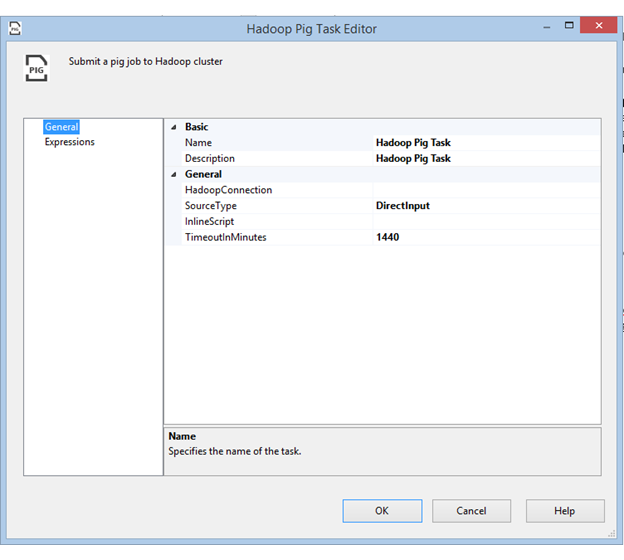

# Hadoop Pig Task
  Use the Hadoop Pig Task to run Pig script on a Hadoop cluster.  
  
 To add a Hadoop Pig Task, drag and drop it to the designer. Then double-click on the task, or right-click and click **Edit**, to see the **Hadoop Pig Task Editor** dialog box.  
  
   
  
## Options  
 Configure the following options in the **Hadoop Pig Task Editor** dialog box.  
  
|Field|Description|  
|-----------|-----------------|  
|**Hadoop Connection**|Specify an existing Hadoop Connection Manager or create a new one. This connection manager indicates  where the WebHCat service is hosted.|  
|**SourceType**|Specify the source type of the query. Available values are **ScriptFile** and **DirectInput**.|  
|**InlineScript**|When the value of **SourceType** is **DirectInput**, specify the pig script.|  
|**HadoopScriptFilePath**|When the value of **SourceType** is **ScriptFile**, specify the script file path on Hadoop.|  
|**TimeoutInMinutes**|Specify a timeout value in minutes. The Hadoop job stops if it has not finished before the timeout elapses. Specify 0 to schedule the Hadoop job to run asynchronously.|  
  
## See Also  
 [Hadoop Connection Manager](../../integration-services/connection-manager/hadoop-connection-manager.md)  
  
  