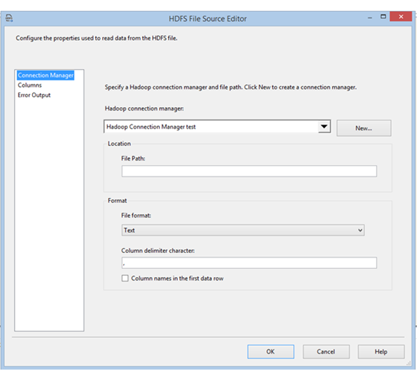

# HDFS File Source
  The HDFS File Source component enables an SSIS package to read data from a HDFS file. The supported file formats are Text and Avro. (ORC sources are not supported.)  
  
 To configure the HDFS File Source, drag and drop the HDFS File Source on the data flow designer and double-click the component to open the editor.  
  
   
  
## Options  
 Configure the following options on the **General** tab of the **Hadoop File Source Editor** dialog box.  
  
|Field|Description|  
|-----------|-----------------|  
|**Hadoop Connection**|Specify an existing Hadoop Connection Manager or create a new one. This connection manager indicates  where the HDFS files are hosted.|  
|**File Path**|Specify the name of the HDFS file.|  
|**File format**|Specify the format for the HDFS file. The available options are Text and Avro. (ORC sources are not supported.)|  
|**Column delimiter character**|If you select Text format, specify the column delimiter character.|  
|**Column  names in the first data row**|If you select Text format, specify whether the first row in the file contains column names.|  
  
 After you configure these options, select the **Columns** tab to map source columns to destination columns in the data flow.  
  
## See Also  
 [Hadoop Connection Manager](../../integration-services/connection-manager/hadoop-connection-manager.md)   
 [HDFS File Destination](../../integration-services/data-flow/hdfs-file-destination.md)  
  
  