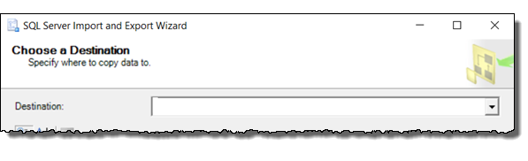

# Choose a Destination (SQL Server Import and Export Wizard)
 After you provide info about the source of your data and about how to connect to it, the [!INCLUDE[ssNoVersion](../../advanced-analytics/r-services/includes/ssnoversion-md.md)] Import and Export Wizard shows **Choose a Destination**. On this page, you provide info about the destination for your data and about how to connect to it.
  
For info about the data destinations that you can use, see [What data sources and destinations can I use?](Import%20and%20Export%20Data%20with%20the%20SQL%20Server%20Import%20and%20Export%20Wizard.md\#wizardSources). 

## Screen shot of the Destination page
The following screen shot shows the first part of the **Choose a Destination** page of the wizard. The rest of the page has a variable number of options which depend on the destination that you choose here.

## Choose a destination
 **Destination**  
 Specify the destination by selecting a data provider that can import data into the destination.
 
-   **The data provider that you need is typically obvious from its name**, because the name of the provider typically contains the name of the data source - for example, SQL Server, Oracle, flat files, Excel, or Access.
-   **If you have an ODBC driver for your data source**, select the .Net Framework Data Provider for ODBC. Then enter the driver-specific info. ODBC drivers aren't listed in the drop-down list of data sources. The .Net Framework Data Provider for ODBC acts as a wrapper around the ODBC driver.  
-   **There may be more than one provider available for your data source.** Typically you can select any provider that works with your source. For example, to connect to Microsoft [!INCLUDE[ssNoVersion](../../advanced-analytics/r-services/includes/ssnoversion-md.md)], you can use the .NET Framework Data Provider for SQL Server or the SQL Server ODBC driver. (Other providers are also still in the list but are no longer supported.) 
-   **You may have to download the data provider** from Microsoft or from a third party. For info about the data sources that you can use, see [What data sources and destinations can I use?](Import%20and%20Export%20Data%20with%20the%20SQL%20Server%20Import%20and%20Export%20Wizard.md\#wizardSources)

The list of available data providers in the **Destination** list depends on the providers installed on your computer. It also depends on whether you're running the 64-bit or the 32-bit wizard. If you're running the 64-bit wizard, for example, you won't see data sources for which only a 32-bit provider is installed.

## After you choose a destination
After you choose a destination, the rest of the **Choose a Destination** page has a variable number of options which depend on the data provider that you choose.

To connect to a commonly used destination, see one of the following pages.
-   [Connect to SQL Server](../../integration-services/import-export-data/connect-to-a-sql-server-data-source-sql-server-import-and-export-wizard.md)
-   [Connect to Oracle](../../integration-services/import-export-data/connect-to-an-oracle-data-source-sql-server-import-and-export-wizard.md)
-   [Connect to flat files (text files)](../../integration-services/import-export-data/connect-to-a-flat-file-data-source-sql-server-import-and-export-wizard.md)
-   [Connect to Excel](../../integration-services/import-export-data/connect-to-an-excel-data-source-sql-server-import-and-export-wizard.md)
-   [Connect to Access](../../integration-services/import-export-data/connect-to-an-access-data-source-sql-server-import-and-export-wizard.md)
-   [Connect with ODBC](../../integration-services/import-export-data/connect-to-an-odbc-data-source-sql-server-import-and-export-wizard.md)
-   [Connect to Azure Blob Storage](../../integration-services/import-export-data/connect-to-azure-blob-storage-sql-server-import-and-export-wizard.md)
-   [Connect to PostgreSQL](../../integration-services/import-export-data/connect-to-a-postgresql-data-source-sql-server-import-and-export-wizard.md)
-   [Connect to MySQL](../../integration-services/import-export-data/connect-to-a-mysql-data-source-sql-server-import-and-export-wizard.md)

## Other data providers and more info
For info about how to connect to a data source that's not listed here, see [The Connection Strings Reference](https://www.connectionstrings.com/). This third-party site contains sample connection strings and more info about data providers and the connection info they require.

## What's next?  
 After you provide info about the destination for your data and about how to connect to it, the next page is **Specify Table Copy or Query**. On this page, you specify whether you want to copy an entire table or only certain rows. For more info, see [Specify Table Copy or Query](../../integration-services/import-export-data/specify-table-copy-or-query-sql-server-import-and-export-wizard.md).  

## See also
[Get started with this simple example of the Import and Export Wizard](../../integration-services/import-export-data/get-started-with-this-simple-example-of-the-import-and-export-wizard.md)
