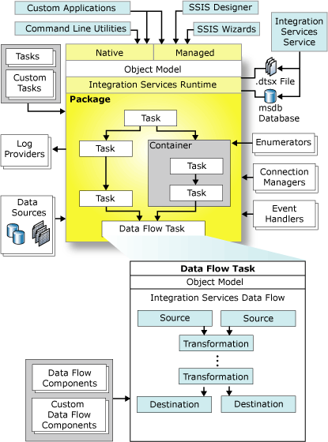

# Integration Services Programming Overview
  [!INCLUDE[ssNoVersion](../a9notintoc/includes/ssnoversion-md.md)] [!INCLUDE[ssISnoversion](../a9notintoc/includes/ssisnoversion-md.md)] has an architecture that separates data movement and transformation from package control flow and management. There are two distinct engines that define this architecture and that can be automated and extended when programming [!INCLUDE[ssISnoversion](../a9notintoc/includes/ssisnoversion-md.md)]. The run-time engine implements the control flow and package management infrastructure that lets developers control the flow of execution and set options for logging, event handlers, and variables. The data flow engine is a specialized, high performance engine that is exclusively dedicated to extracting, transforming, and loading data. When programming [!INCLUDE[ssISnoversion](../a9notintoc/includes/ssisnoversion-md.md)], you will be programming against these two engines.  
  
 The following image depicts the architecture of [!INCLUDE[ssISnoversion](../a9notintoc/includes/ssisnoversion-md.md)].  
  
   
  
## Integration Services Run-time Engine  
 The [!INCLUDE[ssISnoversion](../a9notintoc/includes/ssisnoversion-md.md)] run-time engine controls the management and execution of packages, by implementing the infrastructure that enables execution order, logging, variables, and event handling. Programming the [!INCLUDE[ssISnoversion](../a9notintoc/includes/ssisnoversion-md.md)] run-time engine lets developers automate the creation, configuration, and execution of packages and create custom tasks and other extensions.  
  
 For more information, see [Extending the Package with the Script Task](../integration-services/extending-packages-scripting/task/extending-the-package-with-the-script-task.md), [Developing a Custom Task](../integration-services/extending-packages-custom-objects/task/developing-a-custom-task.md), and [Building Packages Programmatically](../integration-services/building-packages-programmatically/building-packages-programmatically.md).  
  
## Integration Services Data Flow Engine  
 The data flow engine manages the data flow task, which is a specialized, high performance task dedicated to moving and transforming data from disparate sources. Unlike other tasks, the data flow task contains additional objects called data flow components, which can be sources, transformations, or destinations. These components are the core moving parts of the task. They define the movement and transformation of data. Programming the data flow engine lets developers automate the creation and configuration of the components in a data flow task, and create custom components.  
  
 For more information, see [Extending the Data Flow with the Script Component](../integration-services/extending-packages-scripting/data-flow-script-component/extending-the-data-flow-with-the-script-component.md), [Developing a Custom Data Flow Component](../integration-services/extending-packages-custom-objects/data-flow/developing-a-custom-data-flow-component.md), and [Building Packages Programmatically](../integration-services/building-packages-programmatically/building-packages-programmatically.md).  
  
## Supported Languages  
 [!INCLUDE[ssISnoversion](../a9notintoc/includes/ssisnoversion-md.md)] fully supports the [!INCLUDE[msCoName](../a9notintoc/includes/msconame-md.md)] [!INCLUDE[dnprdnshort](../a9retired/includes/dnprdnshort-md.md)]. This lets developers program [!INCLUDE[ssISnoversion](../a9notintoc/includes/ssisnoversion-md.md)] in their choice of .NET-compliant languages. Although both the run-time engine and the data flow engine are written in native code, they are both available through a fully managed object model.  
  
 You can program [!INCLUDE[ssISnoversion](../a9notintoc/includes/ssisnoversion-md.md)] packages, custom tasks, and components in [!INCLUDE[msCoName](../a9notintoc/includes/msconame-md.md)] [!INCLUDE[vsprvs](../a9retired/includes/vsprvs-md.md)] or in another code or text editor. [!INCLUDE[vsprvs](../a9retired/includes/vsprvs-md.md)] offers the developer many tools and features to simplify and accelerate the iterative cycles of coding, debugging, and testing. [!INCLUDE[vsprvs](../a9retired/includes/vsprvs-md.md)] also makes deployment easier. However, you do not need [!INCLUDE[vsprvs](../a9retired/includes/vsprvs-md.md)] to compile and build [!INCLUDE[ssISnoversion](../a9notintoc/includes/ssisnoversion-md.md)] code projects. The [!INCLUDE[dnprdnshort](../a9retired/includes/dnprdnshort-md.md)] SDK includes the [!INCLUDE[vbprvb](../a9retired/includes/vbprvb-md.md)] and [!INCLUDE[csprcs](../a9retired/includes/csprcs-md.md)] compilers and related tools.  
  
> [!IMPORTANT]  
>  By default, the [!INCLUDE[dnprdnshort](../a9retired/includes/dnprdnshort-md.md)] is installed with [!INCLUDE[ssNoVersion](../a9notintoc/includes/ssnoversion-md.md)], but the [!INCLUDE[dnprdnshort](../a9retired/includes/dnprdnshort-md.md)] SDK is not. Unless the SDK is installed on the computer and the SDK documentation is included in the Books Online collection, links to SDK content in this section will not work. After you have installed the [!INCLUDE[dnprdnshort](../a9retired/includes/dnprdnshort-md.md)] SDK, you can add the SDK documentation to the Books Online collection and table of contents by following the instructions in [Add or Remove Product Documentation for SQL Server](../Topic/Add%20or%20Remove%20Product%20Documentation%20for%20SQL%20Server.md).  
  
 The [!INCLUDE[ssISnoversion](../a9notintoc/includes/ssisnoversion-md.md)] Script task and Script component use [!INCLUDE[msCoName](../a9notintoc/includes/msconame-md.md)] [!INCLUDE[vsprvs](../a9retired/includes/vsprvs-md.md)] Tools for Applications (VSTA) as an embedded scripting environment. VSTA supports [!INCLUDE[msCoName](../a9notintoc/includes/msconame-md.md)] Visual Basic and [!INCLUDE[msCoName](../a9notintoc/includes/msconame-md.md)] Visual C#.  
  
> [!NOTE]  
>  The [!INCLUDE[ssISnoversion](../a9notintoc/includes/ssisnoversion-md.md)] application programming interfaces are incompatible with COM-based scripting languages such as VBScript.  
  
## Locating Assemblies  
 In [!INCLUDE[ssCurrent](../a9notintoc/includes/sscurrent-md.md)], the [!INCLUDE[ssISnoversion](../a9notintoc/includes/ssisnoversion-md.md)] assemblies were upgraded to .NET 4.0. There is a separate global assembly cache for .NET 4, located in *\<drive>*:\Windows\Microsoft.NET\assembly. You can find all of the [!INCLUDE[ssISnoversion](../a9notintoc/includes/ssisnoversion-md.md)] assemblies under this path, usually in the GAC_MSIL folder.  
  
 As in previous versions of [!INCLUDE[ssNoVersion](../a9notintoc/includes/ssnoversion-md.md)], the core [!INCLUDE[ssISnoversion](../a9notintoc/includes/ssisnoversion-md.md)] extensibility .dll files are also located at *\<drive>*:\Program Files\Microsoft SQL Server\100\SDK\Assemblies.  
  
## Commonly Used Assemblies  
 The following table lists the assemblies that are frequently used when programming [!INCLUDE[ssISnoversion](../a9notintoc/includes/ssisnoversion-md.md)] using the [!INCLUDE[dnprdnshort](../a9retired/includes/dnprdnshort-md.md)].  
  
|Assembly|Description|  
|--------------|-----------------|  
|Microsoft.SqlServer.ManagedDTS.dll|Contains the managed run-time engine.|  
|Microsoft.SqlServer.RuntimeWrapper.dll|Contains the primary interop assembly (PIA), or wrapper, for the native run-time engine.|  
|Microsoft.SqlServer.PipelineHost.dll|Contains the managed data flow engine.|  
|Microsoft.SqlServer.PipelineWrapper.dll|Contains the primary interop assembly (PIA), or wrapper, for the native data flow engine.|  
  
  