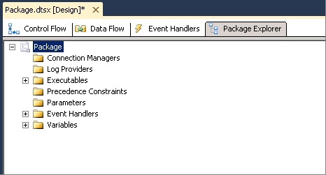

# View Package Objects
  In [!INCLUDE[ssIS](../analysis-services/instances/includes/ssis-md.md)] Designer, the **Package Explorer** tab provides an explorer view of the package. The view reflects the container hierarchy of the [!INCLUDE[ssISnoversion](../advanced-analytics/r-services/includes/ssisnoversion-md.md)] architecture. The package container is at the top of the hierarchy, and you expand the package to view the connections, executables, event handlers, log providers, precedence constraints, and variables in the package.  
  
 The executables, which are the containers and tasks in the package, can include event handlers, precedence constraints, and variables. [!INCLUDE[ssISnoversion](../advanced-analytics/r-services/includes/ssisnoversion-md.md)] supports a nested hierarchy of containers, and the For Loop, Foreach Loop, and Sequence containers can include other executables.  
  
 If a package includes a data flow, the **Package Explorer** lists the Data Flow task and includes a **Components** folder that lists the data flow components.  
  
 From the **Package Explorer** tab, you can delete objects in a package and access the **Properties** window to view object properties.  
  
 The following diagram shows a tree view of a simple package.  
  
   
  
## View the package structure and content  
  
1.  In [!INCLUDE[ssBIDevStudioFull](../analysis-services/includes/ssbidevstudiofull-md.md)], open the [!INCLUDE[ssISnoversion](../advanced-analytics/r-services/includes/ssisnoversion-md.md)] project that contains the package you want to view in **Package Explorer**.  
  
2.  Click the **Package Explorer** tab.  
  
3.  To view the contents of the **Variables**, **Precedence Constraints**, **Event Handlers**, **Connection Managers**, **Log Providers**, or **Executables** folders, expand each folder.  
  
4.  Depending on the package structure, expand any next-level folders.  
  
## View the properties of a package object
  
-   Right-click an object and then click **Properties** to open the **Properties** window.  
  
## Delete an object in a package  
  
-   Right-click an object and then click **Delete**. 
 
## See Also  
 [Integration Services Tasks](../integration-services/control-flow/integration-services-tasks.md)   
 [Integration Services Containers](../integration-services/control-flow/integration-services-containers.md)   
 [Precedence Constraints](../integration-services/control-flow/precedence-constraints.md)   
 [Integration Services &#40;SSIS&#41; Variables](../integration-services/integration-services-ssis-variables.md)   
 [Integration Services &#40;SSIS&#41; Event Handlers](../integration-services/integration-services-ssis-event-handlers.md)   
 [Integration Services &#40;SSIS&#41; Logging](../integration-services/performance/integration-services-ssis-logging.md)  
  
  