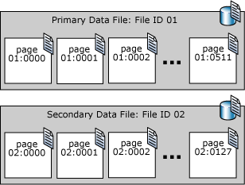
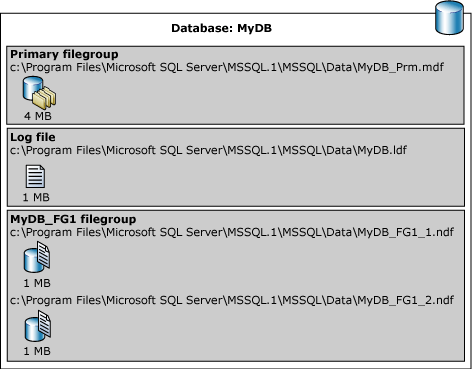

# Database Files and Filegroups
  At a minimum, every [!INCLUDE[ssNoVersion](../../advanced-analytics/r-services/includes/ssnoversion-md.md)] database has two operating system files: a data file and a log file. Data files contain data and objects such as tables, indexes, stored procedures, and views. Log files contain the information that is required to recover all transactions in the database. Data files can be grouped together in filegroups for allocation and administration purposes.  
  
## Database Files  
 [!INCLUDE[ssNoVersion](../../advanced-analytics/r-services/includes/ssnoversion-md.md)] databases have three types of files, as shown in the following table.  
  
|File|Description|  
|----------|-----------------|  
|Primary|The primary data file contains the startup information for the database and points to the other files in the database. User data and objects can be stored in this file or in secondary data files. Every database has one primary data file. The recommended file name extension for primary data files is .mdf.|  
|Secondary|Secondary data files are optional, are user-defined, and store user data. Secondary files can be used to spread data across multiple disks by putting each file on a different disk drive. Additionally, if a database exceeds the maximum size for a single Windows file, you can use secondary data files so the database can continue to grow.<br /><br /> The recommended file name extension for secondary data files is .ndf.|  
|Transaction Log|The transaction log files hold the log information that is used to recover the database. There must be at least one log file for each database. The recommended file name extension for transaction logs is .ldf.|  
  
 For example, a simple database named **Sales** can be created that includes one primary file that contains all data and objects and a log file that contains the transaction log information. Alternatively, a more complex database named **Orders** can be created that includes one primary file and five secondary files. The data and objects within the database spread across all six files, and the four log files contain the transaction log information.  
  
 By default, the data and transaction logs are put on the same drive and path. This is done to handle single-disk systems. However, this may not be optimal for production environments. We recommend that you put data and log files on separate disks.  

### Logical and Physical File Names

SQL Server files have two names: 

**logical_file_name:**  The logical_file_name is the name used to refer to the physical file in all Transact-SQL statements. The logical file name must comply with the rules for SQL Server identifiers and must be unique among logical file names in the database.

**os_file_name:** The os_file_name is the name of the physical file including the directory path. It must follow the rules for the operating system file names.

SQL Server data and log files can be put on either FAT or NTFS file systems. We recommend using the NTFS file system because the security aspects of NTFS. Read/write data filegroups and log files cannot be placed on an NTFS compressed file system. Only read-only databases and read-only secondary filegroups can be put on an NTFS compressed file system.

When multiple instances of SQL Server are run on a single computer, each instance receives a different default directory to hold the files for the databases created in the instance. For more information, see [File Locations for Default and Named Instances of SQL Server](../../sql-server/install/file-locations-for-default-and-named-instances-of-sql-server.md).

### Data File Pages

Pages in a SQL Server data file are numbered sequentially, starting with zero (0) for the first page in the file. Each file in a database has a unique file ID number. To uniquely identify a page in a database, both the file ID and the page number are required. The following example shows the page numbers in a database that has a 4-MB primary data file and a 1-MB secondary data file.



The first page in each file is a file header page that contains information about the attributes of the file. Several of the other pages at the start of the file also contain system information, such as allocation maps. One of the system pages stored in both the primary data file and the first log file is a database boot page that contains information about the attributes of the database. For more information about pages and page types, see Understanding Pages and Extents.

### File Size

SQL Server files can grow automatically from their originally specified size. When you define a file, you can specify a specific growth increment. Every time the file is filled, it increases its size by the growth increment. If there are multiple files in a filegroup, they will not autogrow until all the files are full. Growth then occurs in a round-robin fashion.

Each file can also have a maximum size specified. If a maximum size is not specified, the file can continue to grow until it has used all available space on the disk. This feature is especially useful when SQL Server is used as a database embedded in an application where the user does not have convenient access to a system administrator. The user can let the files autogrow as required to reduce the administrative burden of monitoring free space in the database and manually allocating additional space. 


## Database Snapshot Files

The form of file that is used by a database snapshot to store its copy-on-write data depends on whether the snapshot is created by a user or used internally:

* A database snapshot that is created by a user stores its data in one or more sparse files. Sparse file technology is a feature of the NTFS file system. At first, a sparse file contains no user data, and disk space for user data has not been allocated to the sparse file. For general information about the use of sparse files in database snapshots and how database snapshots grow, see [View the Size of the Sparse File of a Database Snapshot](../../relational-databases/databases/view-the-size-of-the-sparse-file-of-a-database-snapshot-transact-sql.md). 
* Database snapshots are used internally by certain DBCC commands. These commands include DBCC CHECKDB, DBCC CHECKTABLE, DBCC CHECKALLOC, and DBCC CHECKFILEGROUP. An internal database snapshot uses sparse alternate data streams of the original database files. Like sparse files, alternate data streams are a feature of the NTFS file system. The use of sparse alternate data streams allows for multiple data allocations to be associated with a single file or folder without affecting the file size or volume statistics. 


  
## Filegroups  
 Every database has a primary filegroup. This filegroup contains the primary data file and any secondary files that are not put into other filegroups. User-defined filegroups can be created to group data files together for administrative, data allocation, and placement purposes.  
  
 For example, three files, Data1.ndf, Data2.ndf, and Data3.ndf, can be created on three disk drives, respectively, and assigned to the filegroup **fgroup1**. A table can then be created specifically on the filegroup **fgroup1**. Queries for data from the table will be spread across the three disks; this will improve performance. The same performance improvement can be accomplished by using a single file created on a RAID (redundant array of independent disks) stripe set. However, files and filegroups let you easily add new files to new disks.  
  
 All data files are stored in the filegroups listed in the following table.  
  
|Filegroup|Description|  
|---------------|-----------------|  
|Primary|The filegroup that contains the primary file. All system tables are allocated to the primary filegroup.|  
|User-defined|Any filegroup that is specifically created by the user when the user first creates or later modifies the database.|  
  
### Default Filegroup  
 When objects are created in the database without specifying which filegroup they belong to, they are assigned to the default filegroup. At any time, exactly one filegroup is designated as the default filegroup. The files in the default filegroup must be large enough to hold any new objects not allocated to other filegroups.  
  
 The PRIMARY filegroup is the default filegroup unless it is changed by using the ALTER DATABASE statement. Allocation for the system objects and tables remains within the PRIMARY filegroup, not the new default filegroup.  

### File and Filegroup Example

The following example creates a database on an instance of SQL Server. The database has a primary data file, a user-defined filegroup, and a log file. The primary data file is in the primary filegroup and the user-defined filegroup has two secondary data files. An ALTER DATABASE statement makes the user-defined filegroup the default. A table is then created specifying the user-defined filegroup. (This example uses a generic path `c:\Program Files\Microsoft SQL Server\MSSQL.1` to avoid specifying a version of SQL Server.)

```
USE master;
GO
-- Create the database with the default data
-- filegroup and a log file. Specify the
-- growth increment and the max size for the
-- primary data file.
CREATE DATABASE MyDB
ON PRIMARY
  ( NAME='MyDB_Primary',
    FILENAME=
       'c:\Program Files\Microsoft SQL Server\MSSQL.1\MSSQL\data\MyDB_Prm.mdf',
    SIZE=4MB,
    MAXSIZE=10MB,
    FILEGROWTH=1MB),
FILEGROUP MyDB_FG1
  ( NAME = 'MyDB_FG1_Dat1',
    FILENAME =
       'c:\Program Files\Microsoft SQL Server\MSSQL.1\MSSQL\data\MyDB_FG1_1.ndf',
    SIZE = 1MB,
    MAXSIZE=10MB,
    FILEGROWTH=1MB),
  ( NAME = 'MyDB_FG1_Dat2',
    FILENAME =
       'c:\Program Files\Microsoft SQL Server\MSSQL.1\MSSQL\data\MyDB_FG1_2.ndf',
    SIZE = 1MB,
    MAXSIZE=10MB,
    FILEGROWTH=1MB)
LOG ON
  ( NAME='MyDB_log',
    FILENAME =
       'c:\Program Files\Microsoft SQL Server\MSSQL.1\MSSQL\data\MyDB.ldf',
    SIZE=1MB,
    MAXSIZE=10MB,
    FILEGROWTH=1MB);
GO
ALTER DATABASE MyDB 
  MODIFY FILEGROUP MyDB_FG1 DEFAULT;
GO

-- Create a table in the user-defined filegroup.
USE MyDB;
CREATE TABLE MyTable
  ( cola int PRIMARY KEY,
    colb char(8) )
ON MyDB_FG1;
GO
```

The following illustration summarizes the results of the previous example.


  
## Related Content  
 [CREATE DATABASE &#40;SQL Server Transact-SQL&#41;](../../t-sql/statements/create-database-sql-server-transact-sql.md)  
  
 [ALTER DATABASE File and Filegroup Options &#40;Transact-SQL&#41;](../../t-sql/statements/alter-database-transact-sql-file-and-filegroup-options.md)  
  
 [Database Detach and Attach &#40;SQL Server&#41;](../../relational-databases/databases/database-detach-and-attach-sql-server.md)  
  
  