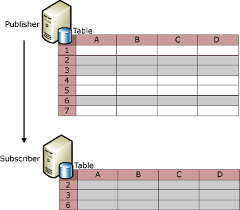
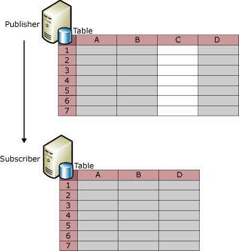
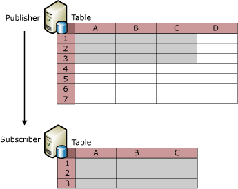

# Filter Published Data
  Filtering table articles enables you to create partitions of data to be published. By filtering published data, you can:  
  
-   Minimize the amount of data sent over the network.  
  
-   Reduce the amount of storage space required at the Subscriber.  
  
-   Customize publications and applications based on individual Subscriber requirements.  
  
-   Avoid or reduce conflicts if Subscribers are updating data, because different data partitions can be sent to different Subscribers (no two Subscribers will be updating the same data values).  
  
-   Avoid transmitting sensitive data. Row filters and column filters can be used to restrict a Subscriber's access to data. For merge replication, there are security considerations if you use a parameterized filter that includes HOST_NAME(). For more information, see the section "Filtering with HOST_NAME()" in [Parameterized Row Filters](../Topic/Parameterized%20Row%20Filters.md).  
  
 Replication offers four types of filters:  
  
-   Static row filters, which are available with all types of replication.  
  
     Using static row filters, you can choose a subset of rows to be published. All Subscribers to a filtered publication receive the same subset of rows for the filtered table. For more information, see the section "Static Row Filters" in this topic.  
  
-   Column filters, which are available with all types of replication.  
  
     Using column filters, you can choose a subset of columns to be published. For more information, see the section "Column Filters" in this topic.  
  
-   Parameterized row filters, which are available only with merge replication.  
  
     Using parameterized row filters, you can choose a subset of rows to be published. Unlike static filters that send the same subset of rows to every Subscriber, parameterized row filters use a data value supplied by the Subscriber to send Subscribers different subsets of rows. For more information, see [Parameterized Row Filters](../Topic/Parameterized%20Row%20Filters.md).  
  
-   Join filters, which are available only with merge replication.  
  
     Using join filters, you can extend a row filter from one published table to another. For more information, see [Join Filters](../../../relational-databases/replication/merge/join-filters.md).  
  
## Static Row Filters  
 The following illustration shows a published table that is filtered so that only rows 2, 3, and 6 are included in the publication.  
  
   
  
 A static row filter uses a WHERE clause to select the appropriate data to be published; you specify the final part of the WHERE clause. Consider the **Product Table** in the Adventure Works sample database, which contains the column **ProductLine**. To publish only the rows with data on products related to mountain bikes, specify `ProductLine = 'M'`.  
  
 A static row filter results in a single set of data for each publication. In the previous example, all Subscribers would receive only the rows with data on products related to mountain bikes. If you have another Subscriber that requires only the rows with data on products related to road bikes:  
  
-   With snapshot or transactional replication, you can create another publication and include the table in both publications (in the filter clause for the article in that publication, specify `ProductLine = 'R')`.  
  
    > [!NOTE]  
    >  Row filters in transactional publications can add significant overhead because the article filter clause is evaluated for each log row written for a published table, to determine whether the row should be replicated. Row filters in transactional publications should be avoided if each replication node can support the full data load, and the overall data set is reasonably small.  
  
-   With merge replication, use parameterized row filters rather than creating multiple publications with static row filters. For more information, see [Parameterized Row Filters](../Topic/Parameterized%20Row%20Filters.md).  
  
 To define or modify a static row filter, see [Define and Modify a Static Row Filter](../../../relational-databases/replication/publish/define-and-modify-a-static-row-filter.md).  
  
## Column Filters  
 The following illustration shows a publication that filters out column C.  
  
   
  
 You can also use row and column filtering together, as illustrated here.  
  
   
  
 After a publication is created, you can use column filtering to drop a column from an existing publication, but retain the column in the table at the Publisher, and also to include an existing column in the publication. For other changes, such as adding a new column to a table and then adding it to the published article, use schema change replication. For more information, see the "Adding Columns" and "Dropping Columns" sections in the topic [Make Schema Changes on Publication Databases](../../../relational-databases/replication/publish/make-schema-changes-on-publication-databases.md).  
  
 The types of columns listed in the following table cannot be filtered out of certain types of publications.  
  
|Column type|Type of publication and options|  
|-----------------|-------------------------------------|  
|Primary key column|Primary key columns are required for all tables in transactional publications. Primary keys are not required for tables in merge publications, but if a primary key column is present, it cannot be filtered.|  
|Foreign key column|All publications created using the New Publication wizard. You can filter foreign key columns using Transact-SQL stored procedures. For more information, [Define and Modify a Column Filter](../../../relational-databases/replication/publish/define-and-modify-a-column-filter.md).|  
|The **rowguid** column|Merge publications*|  
|The **msrepl_tran_version** column|Snapshot or transactional publications that allow updatable subscriptions|  
|Columns that do not allow NULL and do not have default values or the IDENTITY property set.|Snapshot or transactional publications that allow updatable subscriptions|  
|Columns with unique constraints or indexes|Snapshot or transactional publications that allow updatable subscriptions|  
|All columns in a SQL Server 7.0 merge publication|Columns cannot be filtered in SQL Server 7.0 merge publications.|  
|Timestamp|SQL Server 7.0 snapshot or transactional publications that allow updatable subscriptions|  
  
 \*If you are publishing a table in a merge publication and that table already contains a column of data type **uniqueidentifier** with the **ROWGUIDCOL** property set, replication can use this column instead of creating an additional column named **rowguid**. In this case, the existing column must be published.  
  
 To define or modify a column filter, see [Define and Modify a Column Filter](../../../relational-databases/replication/publish/define-and-modify-a-column-filter.md).  
  
## Filtering Considerations  
 Keep the following considerations in mind when filtering data:  
  
-   All columns referenced in row filters must be included in the publication. In other words, you cannot use a column filter to exclude a column that is used in a row filter.  
  
-   If a filter is added or changed after subscriptions have been initialized, the subscriptions must be reinitialized.  
  
-   The maximum number of bytes allowed for a column used in a filter is 1024 for an article in a merge publication and 8000 for an article in a transactional publication.  
  
-   Columns with the following data types cannot be referenced in row filters or join filters:  
  
    -   **varchar(max) and nvarchar(max)**  
  
    -   **varbinary(max)**  
  
    -   **text and ntext**  
  
    -   **image**  
  
    -   **XML**  
  
    -   **UDT**  
  
-   Transactional replication allows you to replicate an indexed view as a view or as a table. If you replicate the view as a table, you cannot filter columns from the table.  
  
 Row filters are not designed to work across databases. [!INCLUDE[ssNoVersion](../../../advanced-analytics/r-services/includes/ssnoversion-md.md)] intentionally restricts the execution of **sp_replcmds** (which filters execute under) to the database owner (**dbo**). The **dbo** does not have cross database privileges. With the addition of CDC (Change Data Capture) in [!INCLUDE[ssKatmai](../../../analysis-services/data-mining/includes/sskatmai-md.md)] the **sp_replcmds** logic populates the change tracking tables with information that the user can return to and query. For security reasons, [!INCLUDE[ssNoVersion](../../../advanced-analytics/r-services/includes/ssnoversion-md.md)] restricts the execution of this logic so that a malicious **dbo** can’t highjack this execution path. For example, a malicious **dbo** could add triggers on CDC tables which would then get executed under the context of the user calling **sp_replcmds**, in this case the logreader agent.  If the account the agent is running under has higher privilege the malicious **dbo** could escalate his privileges.  
  
## See Also  
 [Publish Data and Database Objects](../../../relational-databases/replication/publish/publish-data-and-database-objects.md)  
  
  