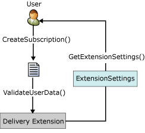

# Implementing the IDeliveryExtension Interface for a Delivery Extension
  Your delivery extension class is used to deliver report notifications to users based on the contents of the notifications. The delivery extension class also provides infrastructure for validating user settings that are passed to the delivery extension. In addition, your delivery extension class should contain specific properties that clients can use to gain information about the name of the extension, the settings that the extension supports, and the rendering formats that are available to the delivery extension.  
  
   
The IDeliveryExtension interface allows validation of user data as well as for clients to learn about the required delivery settings  
  
 To create a delivery extension class, implement <xref:Microsoft.ReportingServices.Interfaces.IDeliveryExtension> and <xref:Microsoft.ReportingServices.Interfaces.IExtension>. The **IDeliveryExtension** interface enables your delivery extension to deliver report notifications using the <xref:Microsoft.ReportingServices.Interfaces.IDeliveryExtension.Deliver%2A> method and to validate incoming extension settings using the <xref:Microsoft.ReportingServices.Interfaces.IDeliveryExtension.ValidateUserData%2A> method. The **IExtension** interface enables your delivery extension to implement a localized extension name and to process extension-specific configuration information stored in the [!INCLUDE[ssNoVersion](../../../advanced-analytics/r-services/includes/ssnoversion-md.md)] configuration file. By implementing **IExtension**, your delivery extension contains the <xref:Microsoft.ReportingServices.Interfaces.Extension.LocalizedName%2A> property. It is strongly recommended that [!INCLUDE[ssRS](../../../database-engine/configure/windows/includes/ssrs-md.md)] delivery extensions support the **LocalizedName** property, so that users encounter a familiar name for the extension in a user interface, such as Report Manager.  
  
 Your delivery extension must also implement the **ExtensionSettings** property of the **IDeliveryExtension** interface. The report server uses the value returned by the <xref:Microsoft.ReportingServices.Interfaces.IDeliveryExtension.ExtensionSettings%2A> property to evaluate the settings that a delivery extension requires. Clients that interact with delivery extensions use the <xref:ReportService2010.ReportingService2010.GetExtensionSettings%2A> method of the Report Server Web service to return a list of settings for the delivery extension.  
  
 You can also use your delivery extension class to retrieve and process custom configuration data stored in the RSReportServer.config file. For more information about processing custom configuration data, see the <xref:Microsoft.ReportingServices.Interfaces.IExtension.SetConfiguration%2A> method.  
  
 For a sample **IDeliveryExtension** class implementation, see [SQL Server Reporting Services Product Samples](http://go.microsoft.com/fwlink/?LinkId=177889).  
  
## See Also  
 [Implementing a Delivery Extension](../../../reporting-services/extensions/delivery-extension/implementing-a-delivery-extension.md)   
 [Reporting Services Extension Library](../../../reporting-services/extensions/reporting-services-extension-library.md)  
  
  