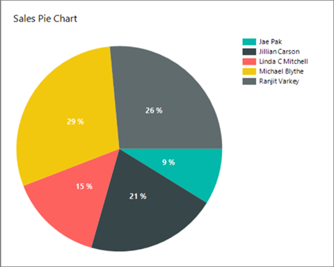
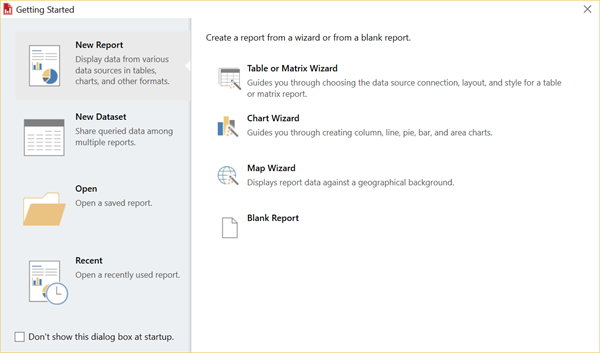
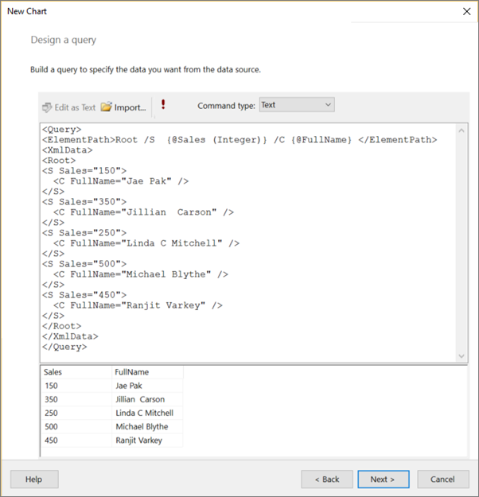

# Tutorial: Create a Quick Chart Report Offline (Report Builder)
  In this tutorial, you use a wizard to create a pie chart in a [!INCLUDE[ssRSnoversion](../../a9notintoc/includes/ssrsnoversion-md.md)] paginated report in [!INCLUDE[ssRBnoversion](../../a9notintoc/includes/ssrbnoversion-md.md)]. Then you add percentages and modify the pie chart a little. 
  
You can do this tutorial two different ways. Both methods have the same outcome—a pie chart like the one in this illustration:  
  
   
  
## Prerequisites  
 Whether you use XML data or a [!INCLUDE[tsql](../../a9notintoc/includes/tsql-md.md)] query, you need to have access to [!INCLUDE[ssCurrent](../../a9notintoc/includes/sscurrent-md.md)][!INCLUDE[ssRBnoversion](../../a9notintoc/includes/ssrbnoversion-md.md)]. You can start [!INCLUDE[ssRBnoversion](../../a9notintoc/includes/ssrbnoversion-md.md)] from  a [!INCLUDE[ssRSnoversion](../../a9notintoc/includes/ssrsnoversion-md.md)] report server in native mode or in SharePoint integrated mode, or you can download [!INCLUDE[ssRBnoversion](../../a9notintoc/includes/ssrbnoversion-md.md)] from the Microsoft Download Center. For more information, see [Install Report Builder](../../reporting-services/install/windows/install-report-builder.md).  
  
##  <a name="TwoWays"></a> Two Ways To Do This Tutorial  
  
-   [Create the pie chart with XML data](#CreatePieChartXML)  
  
-   [Create the pie chart with a Transact-SQL query that contains data](#CreatePieQueryData)  
  
### Using XML data for this tutorial  
 You can use XML data that you copy from this topic and paste into the wizard. You don't need to be connected to a [!INCLUDE[ssRSnoversion](../../a9notintoc/includes/ssrsnoversion-md.md)] report server in native mode or in SharePoint integrated mode, and you don't need access to an instance of [!INCLUDE[ssCurrent](../../a9notintoc/includes/sscurrent-md.md)].  
  
 [Create the pie chart with XML data](#CreatePieChartXML)  
  
### Using a [!INCLUDE[tsql](../../a9notintoc/includes/tsql-md.md)] query that contains data for this tutorial  
 You can copy a query with data included in it from this topic and paste it into the wizard. You will need the name of an instance of [!INCLUDE[ssCurrent](../../a9notintoc/includes/sscurrent-md.md)] and credentials sufficient for read-only access to any database. The dataset query in the tutorial uses literal data, but the query must be processed by an instance of [!INCLUDE[ssCurrent](../../a9notintoc/includes/sscurrent-md.md)] to return the metadata that is required for a report dataset.  
  
 The advantage of using the [!INCLUDE[tsql](../../a9notintoc/includes/tsql-md.md)] query is that all the other [!INCLUDE[ssRBnoversion](../../a9notintoc/includes/ssrbnoversion-md.md)] tutorials use the same method, so when you do the other tutorials, you will already know what to do.  
  
 The [!INCLUDE[tsql](../../a9notintoc/includes/tsql-md.md)] query does require a few other prerequisites. For more information, see [Prerequisites for Tutorials &#40;Report Builder&#41;](../../reporting-services/tutorials/prerequisites-for-tutorials-report-builder.md).  
  
 [Create the pie chart with a Transact-SQL query that contains data](#CreatePieQueryData)  
  
##  <a name="CreatePieChartXML"></a> Creating the pie chart with XML data  
  
1.  [Start Report Builder](../../reporting-services/report-builder/start-report-builder.md) from the [!INCLUDE[ssRSnoversion](../../a9notintoc/includes/ssrsnoversion-md.md)] web portal, or the report server in SharePoint integrated mode, or from your computer.  
  
     The **Getting Started** dialog box appears.  
  
       
  
     If the **Getting Started** dialog box does not appear, click **File** >**New**. The **New Report or Dataset** dialog box has most of the same contents as the **Getting Started** dialog box.  
  
2.  In the left pane, verify that **New Report** is selected.  
  
3.  In the right pane, click **Chart Wizard**, and then click **Create**.  
  
4.  In the **Choose a dataset** page, click **Create a dataset**, and then click **Next**.  
  
5.  In the **Choose a connection to a data source** page, click **New**.  
  
     The **Data Source Properties** dialog box opens.  
  
6.  You can name a data source anything you want. In the **Name** box, type **MyPieChart**.  
  
7.  In the **Select connection type** box, click **XML**.  
  
8.  Click the **Credentials** tab, select **Use current Windows user. Kerberos delegation might be required**, and then click **OK**.  
  
9. In the **Choose a connection to a data source** page, click **MyPieChart**, and then click **Next**.  
  
10. Copy the following text and paste it in the large box in the top of the **Design a query** page.  
  
    ```  
    <Query>  
    <ElementPath>Root /S  {@Sales (Integer)} /C {@FullName} </ElementPath>  
    <XmlData>  
    <Root>  
    <S Sales="150">  
      <C FullName="Jae Pak" />  
    </S>  
    <S Sales="350">  
      <C FullName="Jillian  Carson" />  
    </S>  
    <S Sales="250">  
      <C FullName="Linda C Mitchell" />  
    </S>  
    <S Sales="500">  
      <C FullName="Michael Blythe" />  
    </S>  
    <S Sales="450">  
      <C FullName="Ranjit Varkey" />  
    </S>  
    </Root>  
    </XmlData>  
    </Query>  
    ```  
  
11. (Optional) Click the **Run** button (**!**) to see the data your chart will be based on.  
  
       
  
12. Click **Next**.  
  
13. In the **Choose a chart type** page, click **Pie**, and then click **Next**.  
  
14. In the **Arrange chart fields** page, double-click the **Sales** field in the **Available fields** box.  
  
     Note that it automatically moves to the **Values** box, because it is a numerical value.  
  
       
  
15. Drag the **FullName** field from the **Available fields** box to the **Categories** box (or double-click it; it will go to the **Categories** box), and then click **Next**.  
  
     The Preview page shows your new pie chart with representational data. The legend reads Full Name 1, Full Name 2, etc., rather than the salespeople's names, and the size of the slices of pie are not accurate. This is just to give you an idea of what your report will look like.  
  
       
  
16. Click **Finish**.  
  
     Now you see your new pie chart report in Design View, still with representational data.  
  
       
  
17. To see your actual pie chart, click **Run** on the **Home** tab of the Ribbon.  
  
       
  
18. To continue modifying your pie chart, go to [After You Run the Wizard](#AfterWizard) in this article.  
  
##  <a name="CreatePieQueryData"></a> Creating the pie chart with a [!INCLUDE[tsql](../../a9notintoc/includes/tsql-md.md)] query  
  
1.  [Start Report Builder](../../reporting-services/report-builder/start-report-builder.md) from the [!INCLUDE[ssRSnoversion](../../a9notintoc/includes/ssrsnoversion-md.md)] web portal, from the report server in SharePoint integrated mode, or from your computer.  
  
     The **Getting Started** dialog box appears.  
  
    > [!NOTE]  
    >  If the **Getting Started** dialog box does not appear, click **File** >**New**. The **New Report or Dataset** dialog box has most of the same contents as the **Getting Started** dialog box.  
  
2.  In the left pane, verify that **New Report** is selected.  
  
3.  In the right pane, click **Chart Wizard**, and then click **Create**.  
  
4.  In the **Choose a dataset** page, click **Create a dataset**, and then click **Next**.  
  
5.  In the **Choose a connection to a data source** page, select an existing data source or browse to the report server and select a data source, and then click **Next**. You may need to enter a user name and password.  
  
    > [!NOTE]  
    >  The data source you choose is unimportant, as long as you have adequate permissions. You will not be getting data from the data source. For more information, see [Prerequisites for Tutorials &#40;Report Builder&#41;](../../reporting-services/tutorials/prerequisites-for-tutorials-report-builder.md).  
  
6.  On the **Design a Query** page, click **Edit as Text**.  
  
7.  Paste the following query into the query pane:  
  
    ```  
    SELECT 150 AS Sales, 'Jae Pak' AS FullName   
    UNION SELECT 350 AS Sales, 'Jillian Carson' AS FullName   
    UNION SELECT 250 AS Sales, 'Linda C Mitchell' AS FullName   
    UNION SELECT 500 AS Sales, 'Michael Blythe' AS FullName   
    UNION SELECT 450 AS Sales, 'Ranjit Varkey' AS FullName   
    ```  
  
8.  (Optional) Click the Run button (**!**) to see the data your chart will be based on.  
  
9. Click **Next**.  
  
10. In the **Choose a chart type** page, click **Pie**, and then click **Next**.  
  
11. In the **Arrange chart fields** page, double-click the **Sales** field in the **Available fields** box.  
  
     Note that it automatically moves to the **Values** box, because it's a numerical value.  
  
12. Drag the **FullName** field from the **Available fields** box to the **Categories** box (or double-click it; it will go to the **Categories** box), and then click **Next**.  
  
13. Click **Finish**.  
  
     You're now looking at your new pie chart report on the design surface. What you see is representational. The legend reads Full Name 1, Full Name 2, etc., rather than the salespeople's names, and the size of the slices of pie are not accurate. This is just to give you an idea of what your report will look like.  
  
15. To see your actual pie chart, click **Run** on the **Home** tab of the Ribbon.  
 
##  <a name="AfterWizard"></a> After You Run the Wizard  
 Now that you have your pie chart report, you can play with it. On the **Run** tab of the Ribbon, click **Design**, so you can continue modifying it.  
  
## Make the chart bigger  
 You may want the pie chart to be bigger. 
 
*  Click the chart, but not on any element in the chart, to select it and drag the lower-right corner to resize it.  

Notice the design surface gets larger as you drag.
  
## Add a report title  
1. Select the words **Chart title** at the top of the chart, and then type a title, such as **Sales Pie Chart**.  
2. With the title selected, in the Properties pane, change **Color** to **Black** and **FontSize** to **12pt**.
  
## Add percentages  
 
1.  Right-click the pie chart and select **Show Data Labels**. The data labels appear within each slice on the pie chart.  
  
2.  Right-click the labels and select **Series Label Properties**. The **Series Label Properties** dialog box appears.  
  
3.  In the **Label data** box, type **#PERCENT{P0}**.  
  
     The **{P0}** gives you the percentage without decimal places. If you type just **#PERCENT**, your numbers will have two decimal places. **#PERCENT** is a keyword that performs a calculation or function for you; there are many others.  
     
4. Click **Yes** to confirm you want to set **UseValueAsLabel** to **False**.

5. On the **Font** tab, select **Bold** and change **Color** to **White**.

6. Click **OK**.     
  
 For more information about customizing chart labels and legends, see [Display Percentage Values on a Pie Chart &#40;Report Builder and SSRS&#41;](../../reporting-services/report-design/display-percentage-values-on-a-pie-chart-report-builder-and-ssrs.md) and [Change the Text of a Legend Item &#40;Report Builder and SSRS&#41;](../../reporting-services/report-design/chart-legend-change-item-text-report-builder.md).  
  
##  <a name="WhatsNext"></a> What's Next?  
 Now that you have created your first report in [!INCLUDE[ssRBnoversion](../../a9notintoc/includes/ssrbnoversion-md.md)], you are ready to try the other tutorials and to start creating reports from your own data. To run [!INCLUDE[ssRBnoversion](../../a9notintoc/includes/ssrbnoversion-md.md)], you need permission to access your data sources, such as databases, with a *connection string*, which actually connects you to the data source. Your system administrator will have this information and can set you up.  
  
 To work through the other tutorials, you need the name of an instance of [!INCLUDE[ssCurrent](../../a9notintoc/includes/sscurrent-md.md)] and credentials sufficient for read-only access to any database. Your system administrator can also set that up for you.  
  
 Finally, to save your reports to a report server or a SharePoint site that is integrated with a report server, you need the URL and permissions. You can run any report you create directly from your computer, but reports have more functionality when run from the report server or SharePoint site. You need permissions to run your reports or others from the report server or SharePoint site where they are published. Talk to your system administrator to obtain access.  
  
 It may help to read about some of the concepts and terms before you get started. See [Report Authoring Concepts &#40;Report Builder and SSRS&#41;](../../reporting-services/report-design/report-authoring-concepts-report-builder-and-ssrs.md). Also, spend some time planning, before you create your first report. It will be time well spent. See [Planning a Report &#40;Report Builder&#41;](../../reporting-services/report-design/planning-a-report-report-builder.md).  
   
## See Also  
 [Report Builder Tutorials](../../reporting-services/tutorials/report-builder-tutorials.md)   
 [Report Builder in SQL Server 2016](../../reporting-services/report-builder/report-builder-in-sql-server-2016.md)  
  
  