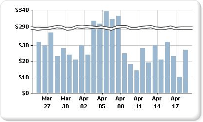

# Add Scale Breaks to a Chart (Report Builder and SSRS)
  A scale break is a stripe drawn across the plotting area of a chart to denote a break in continuity between the high and low values on a value axis (usually the vertical, or y-axis). Use a scale break to display two distinct ranges in the same chart area.  
  
   
  
> [!NOTE]  
>  You cannot specify where to place a scale break on your chart. The chart uses its own calculations based on the values in your dataset to determine whether there is sufficient separation between data ranges to draw a scale break on the value axis (y-axis) at run time.  
  
 An example of a chart with scale breaks is available as a sample report. For more information about downloading this sample report and others, see [!INCLUDE[ssCurrent](../../a9notintoc/includes/sscurrent-md.md)][Report Builder and Report Designer sample reports](http://go.microsoft.com/fwlink/?LinkId=198283).  
  
> [!NOTE]  
>  [!INCLUDE[ssRBRDDup](../../a9retired/includes/ssrbrddup-md.md)]  
  
### To enable scale breaks on the chart  
  
1.  Right-click the vertical axis and then click **Axis Properties**. The **VerticalAxis Properties** dialog box opens.  
  
2.  Select the **Enable scale breaks** check box.  
  
### To change the style of the scale break  
  
1.  Open the Properties pane.  
  
2.  On the design surface, right-click on the y-axis of the chart. The properties for the y-axis object (named Chart Axis by default) are displayed in the Properties pane.  
  
3.  In the **Scale** section, expand the ScaleBreakStyle property.  
  
4.  Change the values for ScaleBreakStyle properties, such as BreakLineType and Spacing. For more information about scale break properties, see [Displaying a Series with Multiple Data Ranges on a Chart &#40;Report Builder and SSRS&#41;](../../reporting-services/report-design/45da3d39-278e-4760-a4b3-9932c9547cf2.md).  
  
## See Also  
 [Charts &#40;Report Builder and SSRS&#41;](../../reporting-services/report-design/charts-report-builder-and-ssrs.md)   
 [Formatting a Chart &#40;Report Builder and SSRS&#41;](../../reporting-services/report-design/formatting-a-chart-report-builder-and-ssrs.md)   
 [Axis Properties Dialog Box, Axis Options &#40;Report Builder and SSRS&#41;](../../a9retired/axis-properties-dialog-box-axis-options-report-builder-and-ssrs.md)  
  
  