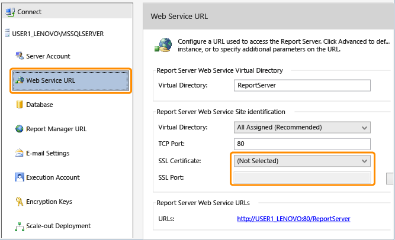

# Configure Reporting Services to Use a Subject Alternative Name
  This topic explains how to configure [!INCLUDE[ssRSnoversion](../../../a9notintoc/includes/ssrsnoversion-md.md)] (SSRS) to use a subject alternative name (SAN) by modifying the rsreportserver.config file and using the Netsh.exe tool.  
  
||  
|-|  
|**[!INCLUDE[applies](../../../a9retired/includes/applies-md.md)]**  [!INCLUDE[ssRSnoversion](../../../a9notintoc/includes/ssrsnoversion-md.md)] Native mode|  
  
 The instructions apply to the Reporting Service URL as well as a Web Service URL.  
  
 To use a SAN, the SSL certificate must be registered on the server, signed, and have the private key. You cannot use a self-signed certificate  
  
 URLs in [!INCLUDE[ssRSnoversion](../../../a9notintoc/includes/ssrsnoversion-md.md)] can be configured to use an SSL certificate. A certificate normally has just a subject name, which allows only one URL for an SSL (Secure Sockets Layer) session. The SAN is an additional field in the certificate that allows an SSL service to listen and be valid for many URLs, and to share the SSL port with other applications. The SAN looks something like the following: www.s2.com.  
  
 For more information about SSL settings for [!INCLUDE[ssRSnoversion](../../../a9notintoc/includes/ssrsnoversion-md.md)], see [Configure SSL Connections on a Native Mode Report Server](../../../reporting-services/security/configure-ssl-connections-on-a-native-mode-report-server.md).  
  
### Configure SSRS to use a subject alternative name for Web Service URL  
  
1.  Start Reporting Services Configuration Manager.  
  
     For more information, see [Reporting Services Configuration Manager &#40;Native Mode&#41;](../../../reporting-services/install/windows/reporting-services-configuration-manager-native-mode.md).  
  
2.  On the **Web Service URL** page, select an SSL port and SSL Certificate.  
  
       
  
     The configuration manager registers the SSL certificate for the port.  
  
3.  Open the rsreportserver.config file.  
  
     For SSRS Native mode, the file is located by default in the following folder.  
  
    ```  
    \Program Files\Microsoft SQL Server\MSRS11.MSSQLSERVER\Reporting Services\ReportServer  
    ```  
  
4.  Copy the URL section for the Report Server Web Service application.  
  
     For example, the following is the original URL section.  
  
    ```  
        <URL>  
         <UrlString>https://localhost:443</UrlString>  
         <AccountSid>S-1-5-20</AccountSid>  
         <AccountName>NT Authority\NetworkService</AccountName>  
        </URL>  
  
    ```  
  
     The following is the modified URL section.  
  
    ```  
    <URL>  
         <UrlString>https://www.s1.com:443</UrlString>  
         <AccountSid>S-1-5-20</AccountSid>  
         <AccountName>NT Authority\NetworkService</AccountName>  
        </URL>  
        <URL>  
         <UrlString>https://www.s2.com:443</UrlString>  
         <AccountSid>S-1-5-20</AccountSid>  
         <AccountName>NT Authority\NetworkService</AccountName>  
        </URL>  
  
    ```  
  
5.  Save the rsreportserver.config file.  
  
6.  Start a command prompt as an administrator, and run the Netsh.exe tool.  
  
    ```  
    C:\windows\system32\netsh  
    ```  
  
7.  Switch to the http context by typing the following.  
  
    ```  
    Netsh>http  
    ```  
  
8.  Show the existing urlacls by typing the following.  
  
    ```  
    Netsh http>show urlacl  
    ```  
  
     An entry such as the following appears.  
  
    ```  
    Reserved URL            : https:// www.s1.com:443/ReportServer/  
        User: NT SERVICE\ReportServer  
            Listen: Yes  
            Delegate: No  
            SDDL: D:(A;;GX;;;S-1-5-80-1234567890-123456789-123456789-123456789-1234567890)  
    ```  
  
     An urlacl is a DACL (Discretionary Access Control List) for a reserved URL.  
  
9. Create a new entry for the subject alternative name, with the same user and SDDL as the existing entry, by typing the following.  
  
    ```  
    netsh http>add urlacl  url=https://www.s2.com:443/ReportServer    
    user="NT Service\ReportServer" sddl=D:(A;;GX;;;S-1-5-80-1234567980-12346579-123456789-123456789-1234567890)  
  
    ```  
  
10. On the **Report Server Status** page of the Reporting Services Configuration Manager, Click **Stop** and then click **Start** to restart the report server.  
  
## See Also  
 [RsReportServer.config Configuration File](../../../reporting-services/report-server/rsreportserver.config-configuration-file.md)   
 [Reporting Services Configuration Manager &#40;Native Mode&#41;](../../../reporting-services/install/windows/reporting-services-configuration-manager-native-mode.md)   
 [Modify a Reporting Services Configuration File &#40;RSreportserver.config&#41;](../../../reporting-services/report-server/modify-a-reporting-services-configuration-file-rsreportserver.config.md)   
 [Configure Report Server URLs  &#40;SSRS Configuration Manager&#41;](../../../reporting-services/install/windows/configure-report-server-urls-ssrs-configuration-manager.md)  
  
  