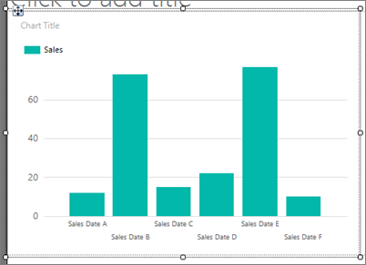
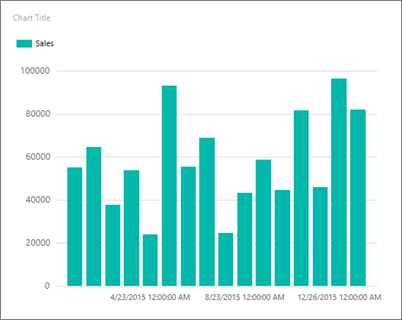
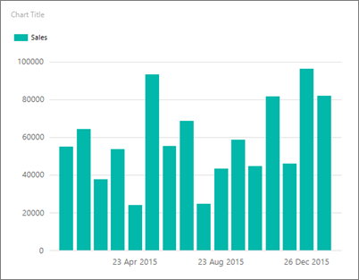
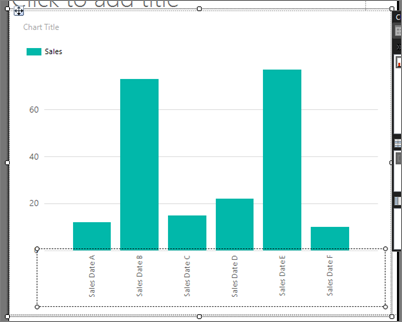
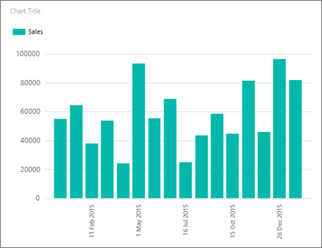
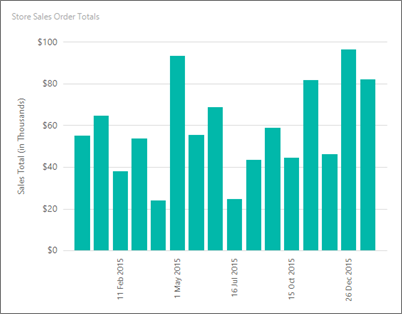
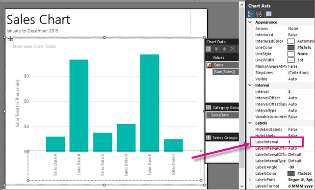
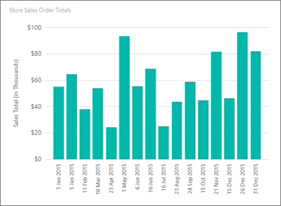
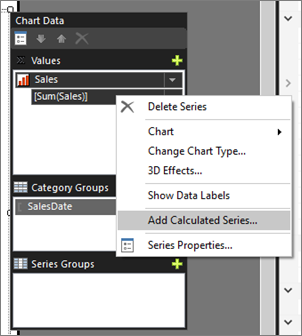
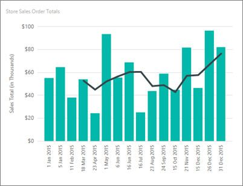

# Tutorial: Add a Column Chart to Your Report (Report Builder)
In this tutorial, you create a [!INCLUDE[ssRSnoversion_md](../../a9notintoc/includes/ssrsnoversion-md.md)] paginated report with a column chart displaying a series as a set of vertical bars grouped by category. 

Column charts are useful to:  
  
-   Show data changes over a period of time.  
-   Compare the relative value of multiple series.  
-   Display a moving average to show trends.  
  
The following illustration shows the column chart you will create, with a moving average.  
  
    
> [!NOTE]  
> In this tutorial, the steps for the wizard are consolidated into one procedure. For step-by-step instructions about how to browse to a report server, choose a data source, and create a dataset, see the first tutorial in this series: [Tutorial: Creating a Basic Table Report &#40;Report Builder&#41;](../../reporting-services/tutorials/tutorial-creating-a-basic-table-report-report-builder.md).  
  
Estimated time to complete this tutorial: 15 minutes.  
  
## Requirements  
For information about requirements, see [Prerequisites for Tutorials &#40;Report Builder&#41;](../../reporting-services/tutorials/prerequisites-for-tutorials-report-builder.md).  
  
## <a name="Chart"></a>1. Create a Chart Report from the Chart Wizard  
In this section, you go through the Chart Wizard to create an embedded dataset, choose a shared data source, and create a column chart.  
  
> [!NOTE]  
> The query in this tutorial contains the data values, so it does not need an external data source. This makes the query quite long. In a business environment, a query would not contain the data. This is for learning purposes only.  
  
### To create a chart report  
  
1.  [Start Report Builder](../../reporting-services/report-builder/start-report-builder.md) either from your computer, the [!INCLUDE[ssRSnoversion_md](../../a9notintoc/includes/ssrsnoversion-md.md)] web portal, or SharePoint integrated mode.  
  
    The **New Report or Dataset** dialog box opens.  
  
    If you don't see the **New Report or Dataset** dialog box, on the **File** menu > **New**.  
  
2.  In the left pane, verify that **New Report** is selected.  
  
3.  In the right pane, click **Chart Wizard**.  
  
4.  On the **Choose a dataset page**, click **Create a dataset**, and then click **Next**.  
  
5.  On the **Choose a connection to a data source** page, select an existing data source or browse to the report server and select a data source, and then click **Next**. You may need to enter a user name and password.  
  
    > [!NOTE]  
    > The data source you choose is unimportant, as long as you have adequate permissions. You will not be getting data from the data source. For more information, see [Alternative Ways to Get a Data Connection &#40;Report Builder&#41;](../../reporting-services/tutorials/alternative-ways-to-get-a-data-connection-report-builder.md).  
  
6.  On the **Design a query** page, click **Edit as Text**.  
  
7.  Paste the following query into the query pane:  
  
    ```  
    SELECT CAST('2015-01-01' AS date) AS SalesDate, CAST(54995.21 AS money) AS Sales  
    UNION SELECT CAST('2015-01-05' AS date) AS SalesDate, CAST(64499.04 AS money) AS Sales  
    UNION SELECT CAST('2015-02-11' AS date) AS SalesDate, CAST(37821.79 AS money) AS Sales  
    UNION SELECT CAST('2015-03-18' AS date) AS SalesDate, CAST(53633.08 AS money) AS Sales  
    UNION SELECT CAST('2015-04-23' AS date) AS SalesDate, CAST(24019.3 AS money) AS Sales  
    UNION SELECT CAST('2015-05-01' AS date) AS SalesDate, CAST(93245.5 AS money) AS Sales  
    UNION SELECT CAST('2015-06-06' AS date) AS SalesDate, CAST(55288.0 AS money) AS Sales  
    UNION SELECT CAST('2015-06-16' AS date) AS SalesDate, CAST(68733.5 AS money) AS Sales  
    UNION SELECT CAST('2015-07-16' AS date) AS SalesDate, CAST(24750.85 AS money) AS Sales  
    UNION SELECT CAST('2015-08-23' AS date) AS SalesDate, CAST(43452.3 AS money) AS Sales  
    UNION SELECT CAST('2015-09-24' AS date) AS SalesDate, CAST(58656. AS money) AS Sales  
    UNION SELECT CAST('2015-10-15' AS date) AS SalesDate, CAST(44583. AS money) AS Sales  
    UNION SELECT CAST('2015-11-21' AS date) AS SalesDate, CAST(81568. AS money) AS Sales  
    UNION SELECT CAST('2015-12-15' AS date) AS SalesDate, CAST(45973. AS money) AS Sales  
    UNION SELECT CAST('2015-12-26' AS date) AS SalesDate, CAST(96357. AS money) AS Sales  
    UNION SELECT CAST('2015-12-31' AS date) AS SalesDate, CAST(81946. AS money) AS Sales  
    ```  
  
8.  (Optional) Click the Run button (**!**) to see the data your chart will be based on.  
  
9. Click **Next**.  
  
## <a name="ChartType"></a>2. Choose the Chart Type  
You can choose from several predefined chart types, and then modify the chart after you complete the wizard.  
  
### To add a column chart  
  
1.  On the **Choose a chart type** page, the column chart is the default chart type. Click **Next**.  
  
2.  On the **Arrange chart fields** page, drag the SalesDate field to **Categories**. Categories display on the horizontal axis.  
  
3.  Drag the Sales field to **Values**. The **Values** box displays Sum(Sales) because the sum of the sales total value is aggregated for each date. Values display on the vertical axis.  
  
4.  Click **Next**.  
 
6.  Click **Finish**.  
  
    The chart is added to the design surface. Note that the new column chart just shows representational data. The legend reads Sales Date A, Sales Date B, etc., just to give an idea of what your report will look like. 
    
    
  
7.  Click the chart to display the chart handles. Drag the bottom-right corner of the chart to increase the size of the chart. Note that the report design surface increases in size to accommodate the chart size.  
  
8.  Click **Run** to preview the report.  

    

Note that the chart does not label every category on the horizontal axis. By default, only labels that fit next to the axis are included. 
  
## <a name="Horizontal"></a>3. Format a Date on the Horizontal Axis  
By default, the horizontal axis displays values in a general format that is automatically scaled to fit the size of the chart.  
  
1.  Switch to report design view.  
  
2.  Right-click the horizontal axis > **Horizontal Axis Properties**.  
  
3.  On the **Number** tab, in **Category**, select **Date**.  
  
5.  In the **Type** box, select **31 Jan 2000**.  
  
6.  [!INCLUDE[clickOK](../../a9notintoc/includes/clickok-md.md)]  
  
7.  On the Home tab, click **Run** to preview the report.  
  
The date displays in the date format that you selected. The chart still does not label every category on the horizontal axis. 


  
You can customize the label display by rotating the labels and specifying the interval.  
  
## 4. Rotate the axis labels on the horizontal axis  
  
1.  Switch to report design view.  
  
2.  Right-click the horizontal axis title, then click **Show Axis Title** to remove the title. Because the horizontal axis displays dates, the title is not needed.  
  
3.  Right-click the horizontal axis > **Horizontal Axis Properties**.  
  
5.  On the **Labels** tab, under **Change axis label auto-fit options**, select **Disable auto-fit**.  
  
7.  In **Label rotation angle**, select **-90**.  
  
8.  [!INCLUDE[clickOK](../../a9notintoc/includes/clickok-md.md)]  
  
    The sample text for the horizontal axis rotates by 90 degrees.  
    
    
  
9. Click **Run** to preview the report.  
  
On the chart, the labels are rotated.  


  
## <a name="Legend"></a>5. Move the Legend  
The legend is automatically created from category and series data. You can move the legend below the chart area of a column chart.  
  
1.  Switch to report design view.  
  
2.  Right-click the legend on the chart > **Legend Properties**.  
  
3.  Under **Layout and Position**, select a different position. For example, select the bottom middle option.  
  
    When the legend is placed at the top or bottom of a chart, the layout of the legend changes from vertical to horizontal. You can select a different layout in the **Layout** box.  
  
4.  [!INCLUDE[clickOK](../../a9notintoc/includes/clickok-md.md)]  
  
5.  (Optional) Because there is only one category in this tutorial, the chart doesn't need a legend. To remove it, right-click the legend > **Delete Legend**.  
  
6.  Click **Run** to preview the report.  
  
## <a name="ChartTitle"></a>6. Title the Chart  
    
1.  Switch to report design view.  
  
2.  Select the words **Chart Title** at the top of the chart, then type **Store Sales Order Totals**.  
  
3.  Click **Run** to preview the report.  
  
## <a name="Vertical"></a>7. Format and Label the Vertical Axis  
By default, the vertical axis displays values in a general format that is automatically scaled to fit the size of the chart.   
  
1.  Switch to report design view.  
  
2. Click the labels on the vertical axis on the left side of the chart to select them.  
  
3.  On the **Home** tab > **Number** group, click the **Currency** button. The axis labels change to show the currency format.  
  
4.  Click the **Decrease Decimal** button two times, to show the number rounded to the nearest dollar.  
  
5.  Right-click the vertical axis > **Vertical Axis Properties**.  
  
6.  On the **Number** tab, note that **Currency** is already selected in the **Category** box, and **Decimal places** is already **0** (zero).  
  
7.  Check **Show Values in**. **Thousands** is already selected.  
  
8.  [!INCLUDE[clickOK](../../a9notintoc/includes/clickok-md.md)]  
  
9. Right-click the vertical axis > **Show Axis Title**. 

10. Right-click the vertical axis title > **Axis Title Properties**.  
  
10. Replace the text in the **Title text** field with **Sales Total (in Thousands)**. You can also specify a variety of options related to how the title is formatted.  
  
11. [!INCLUDE[clickOK](../../a9notintoc/includes/clickok-md.md)]  
  
12. Click **Run** to preview the report.  

    
    
## 8. Show all the labels on the horizontal (x) axis

You notice that only some of the labels on the x axis are showing. In this section, you set a property in the Properties pane to show them all.

1.  Switch to report design view.  
  
2.  Click the chart, then select the horizontal axis labels.

3. In the Properties pane, set LabelInterval to 1.

    

    The chart looks the same in design view. 
    
5.  Click **Run** to preview the report.

    
    
    Now the chart displays all its labels.
  
## <a name="Average"></a>9. Add a Moving Average with a Calculated Series  

A moving average is an average of the data in your series, calculated over time. The moving average can identify trends.
  
1.  Switch to report design view.  
  
2.  Double-click the chart to display the **Chart Data** pane.  
  
3.  Right-click the **[Sum(Sales)]** field in the **Values** area, then click **Add Calculated Series**.  

     
  
4.  In **Formula**, verify that **Moving average** is selected.  
  
5.  In **Set Formula Parameters**, for **Period**, select **4**.  
  
6.  On the **Border** tab, in **Line width**, select **3pt**.  
  
8.  [!INCLUDE[clickOK](../../a9notintoc/includes/clickok-md.md)]  
  
9. Click **Run** to preview the report.  
  
The chart displays a line that shows the moving average for total sales by date, averaged over every four dates. Read more about [adding a moving average to a chart](../../reporting-services/report-design/add-a-moving-average-to-a-chart-report-builder-and-ssrs.md). 


  
## <a name="Title"></a>10. Add a Report Title  
  
1.  Switch to report design view.  
  
2.  On the design surface, click **Click to add title**.  
  
3.  Type **Sales Chart**, press ENTER, and then type **January to December 2015**, so it looks like this:  
  
    **Sales Chart**  
  
    **January to December 2015**  
  
4.  Select **Sales Chart**, and on the **Home** tab > **Font** section > **Bold**.  
  
5.  Select **January to December 2015**, and on the **Home** tab > **Font** section >  set font size to **10**.  
  
6.  (Optional) You may need to make the **Title** text box taller to accommodate the two lines of text. Pull down on the double-headed arrows when you click in the middle of the bottom edge. And you may need to drag the top of the chart so the title doesn't overlap.  
  
    This title appears at the top of the report. When there is no page header defined, items at the top of the report body are the equivalent of a report header.  
  
7.  Click **Run** to preview the report.  
  
## <a name="Save"></a>11. Save the Report  
  
### To save the report  
  
1.  Switch to report design view.  
  
2.  From the Report Builder button, click **Save As**.  

    You can save it either to your computer or to the report server.
  
3.  In **Name**, type **Sales Order Column Chart**.  
  
4.  Click **Save**.  
  
## Next Steps  
You have successfully completed the Adding a Column Chart to Your Report tutorial. To learn more about charts, see [Charts &#40;Report Builder and SSRS&#41;](../../reporting-services/report-design/charts-report-builder-and-ssrs.md) and [Sparklines and Data Bars &#40;Report Builder and SSRS&#41;](../../reporting-services/report-design/sparklines-and-data-bars-report-builder-and-ssrs.md).  
  
## See Also  
-    [Report Builder tutorials](../../reporting-services/tutorials/report-builder-tutorials.md) 
-    [Report Builder in SQL Server 2016](../../reporting-services/report-builder/report-builder-in-sql-server-2016.md)  
  
