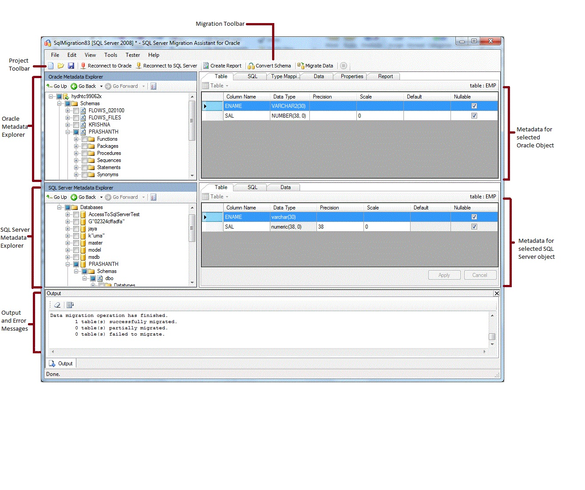

# Getting Started with SSMA for Oracle (OracleToSQL)
SQL Server Migration Assistant (SSMA) for Oracle lets you quickly convert Oracle database schemas to SQL Server schemas, upload the resulting schemas into SQL Server and migrate data from Oracle to SQL Server.  
  
This topic introduces the installation process, and then helps familiarize you with the SSMA user interface.  
  
## Installing SSMA  
To use SSMA, you first must install the SSMA client program on a computer that can access both the source Oracle database and the target instance of SQL Server. You then must install an extension pack and at least one of the Oracle providers (OLE DB or ADO.NET) on the computer that is running SQL Server. These components support data migration and the emulation of Oracle system functions. For installation instructions, see [Installing SSMA  for Oracle &#40;OracleToSQL&#41;](../../ssma/oracle/installing-ssma--for-oracle--oracletosql-.md).  
  
To start SSMA, click **Start**, point to **All Programs**, point to **SQL Server Migration Assistant for Oracle**, and then click **SQL Server Migration Assistant for Oracle**.  
  
## SSMA for Oracle User Interface  
After SSMA is installed, you can use SSMA to migrate Oracle databases to SQL Server. It helps to become familiar with the SSMA user interface before you start. The following diagram shows the user interface for SSMA, including the metadata explorers, metadata, toolbars, output pane, and error list pane:  
  
  
  
To start a migration, you must first create a new project. Then, you connect to an Oracle database. After a successful connection, Oracle schemas will appear in Oracle Metadata Explorer. You can then right-click objects in Oracle Metadata Explorer to perform tasks such as create reports that assess conversions to SQL Server. You can also perform these tasks by using the toolbars and menus.  
  
You must also connect to an instance of SQL Server. After a successful connection, a hierarchy of SQL Server databases will appear in SQL Server Metadata Explorer. After you convert Oracle schemas to SQL Server schemas, select those converted schemas in SQL Server Metadata Explorer, and then synchronize the schemas with SQL Server.  
  
After you synchronize converted schemas with SQL Server, you can return to Oracle Metadata Explorer and migrate data from Oracle schemas into SQL Server databases.  
  
For more information about these tasks and how to perform them, see [Migrating Oracle Databases to SQL Server &#40;OracleToSQL&#41;](../../ssma/oracle/migrating-oracle-databases-to-sql-server--oracletosql-.md).  
  
The following sections describe the features of the SSMA user interface.  
  
### Metadata Explorers  
SSMA contains two metadata explorers to browse and perform actions on Oracle and SQL Server databases.  
  
#### Oracle Metadata Explorer  
Oracle Metadata Explorer shows information about Oracle schemas. By using Oracle Metadata Explorer, you can perform the following tasks:  
  
-   Browse the objects in each schema.  
  
-   Select objects for conversion, and then convert the objects to SQL Server syntax. For more information, see [Converting Oracle Schemas &#40;OracleToSQL&#41;](../../ssma/oracle/converting-oracle-schemas--oracletosql-.md).  
  
-   Select tables for data migration, and then migrate the data from those tables to SQL Server. For more information, see [Migrating Oracle Data into SQL Server &#40;OracleToSQL&#41;](../../ssma/oracle/migrating-oracle-data-into-sql-server--oracletosql-.md).  
  
#### SQL Server Metadata Explorer  
SQL Server Metadata Explorer shows information about an instance of SQL Server. When you connect to an instance of SQL Server, SSMA retrieves metadata about that instance and stores it in the project file.  
  
You can use SQL Server Metadata Explorer to select converted Oracle database objects, and then synchronize those objects with the instance of SQL Server.  
  
For more information, see [Loading Converted Database Objects into SQL Server &#40;OracleToSQL&#41;](../../ssma/oracle/loading-converted-database-objects-into-sql-server--oracletosql-.md).  
  
### Metadata  
To the right of each metadata explorer are tabs that describe the selected object. For example, if you select a table in Oracle Metadata Explorer, six tabs will appear: **Table**, **SQL**, **Type Mapping,Report**, **Properties**, and **Data**. The **Report** tab contains information only after you create a report that contains the selected object. If you select a table in SQL Server Metadata Explorer, three tabs will appear: **Table**, **SQL**, and **Data**.  
  
Most metadata settings are read-only. However, you can alter the following metadata:  
  
-   In Oracle Metadata Explorer, you can alter procedures and type mappings. To convert the altered procedures and type mappings, make changes before you convert schemas.  
  
-   In SQL Server Metadata Explorer, you can alter the Transact-SQL for stored procedures. To see these changes in SQL Server, make these changes before you load the schemas into SQL Server.  
  
Changes made in a metadata explorer are reflected in the project metadata, not in the source or target databases.  
  
### Toolbars  
SSMA has two toolbars: a project toolbar and a migration toolbar.  
  
#### The Project Toolbar  
The project toolbar contains buttons for working with projects, connecting to Oracle, and connecting to SQL Server. These buttons resemble the commands on the **File** menu.  
  
#### Migration Toolbar  
The following table shows the migration toolbar commands:  
  
|||  
|-|-|  
|Button|Function|  
|**Create Report**|Converts the selected Oracle objects to SQL Server syntax, and then creates a report that shows how successful the conversion was.  This command is disabled unless objects are selected in Oracle Metadata Explorer.|  
|**Convert Schema**|Converts the selected Oracle objects to SQL Server objects.  This command is disabled unless objects are selected in Oracle Metadata Explorer.|  
|||  
|**Migrate Data**|Migrates data from the Oracle database to SQL Server. Before you run this command, you must convert the Oracle schemas to SQL Server schemas, and then load the objects into SQL Server.  This command is disabled unless objects are selected in Oracle Metadata Explorer.|  
|**Stop**|Stops the current process.|  
  
### Menus  
The following table shows the SSMA menus.  
  
|||  
|-|-|  
|Menu|Description|  
|**File**|Contains commands for working with projects, connecting to Oracle, and connecting to SQL Server.|  
|**Edit**|Contains commands for finding and working with text in the details pages, such as copying Transact-SQL from the SQL details pane. Also contains the **Manage Bookmarks** option, where you will be able to see a list of existing bookmarks. You can use the buttons on the right side of the dialog to manage the bookmarks.|  
|**View**|Contains the **Synchronize Metadata Explorers** command. That synchronizes the objects between Oracle Metadata Explorer and SQL Server Metadata Explorer. Also contains commands to show and hide the **Output** and **Error List** panes and an option **Layouts** to manage the Layouts.|  
|**Tools**|Contains commands to create reports, and migrate objects and data. Also provides access to the **Global Settings** and **Project Settings** dialog boxes.|  
|**Tester**|Contains commands for creating and working with test cases, repository, and backup management system.|  
|**Help**|Provides access to SSMA Help and to the **About** dialog box.|  
  
### Output Pane and Error List Pane  
The **View** menu provides commands to toggle the visibility of the Output pane and the Error List pane:  
  
-   The output pane shows status messages from SSMA during object conversion, object synchronization, and data migration.  
  
-   The Error List pane shows error, warning, and informational messages in a sortable list.  
  
## See Also  
[Migrating Oracle Data into SQL Server &#40;OracleToSQL&#41;](../../ssma/oracle/migrating-oracle-data-into-sql-server--oracletosql-.md)  
[User Interface Reference &#40;OracleToSQL&#41;](../../ssma/oracle/user-interface-reference--oracletosql-.md)  
  
